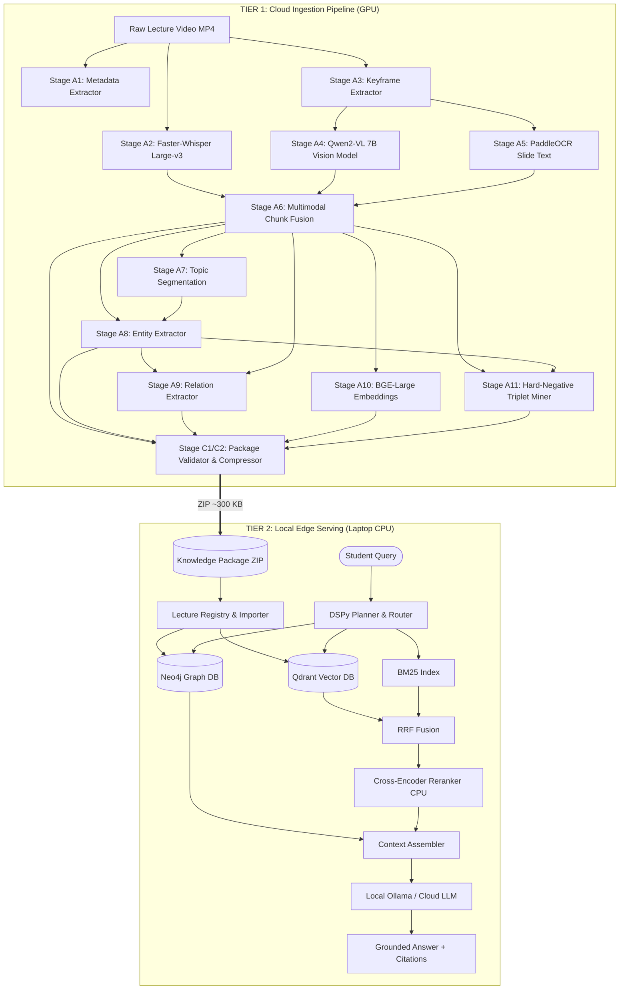
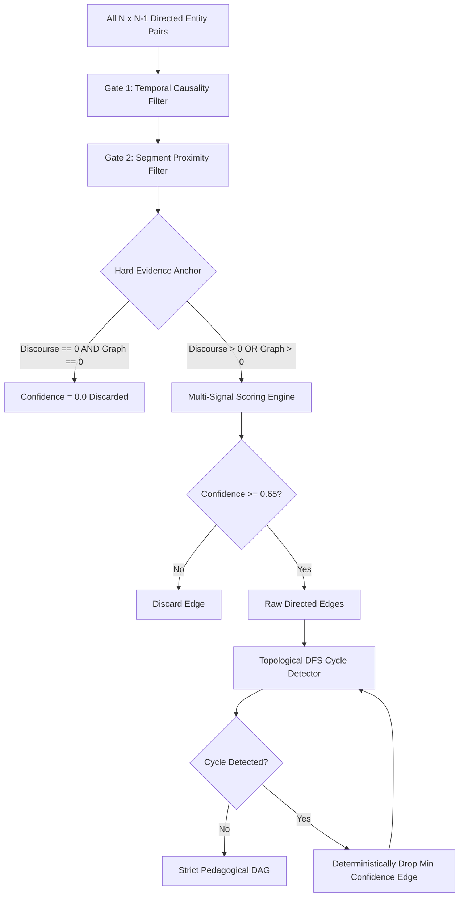
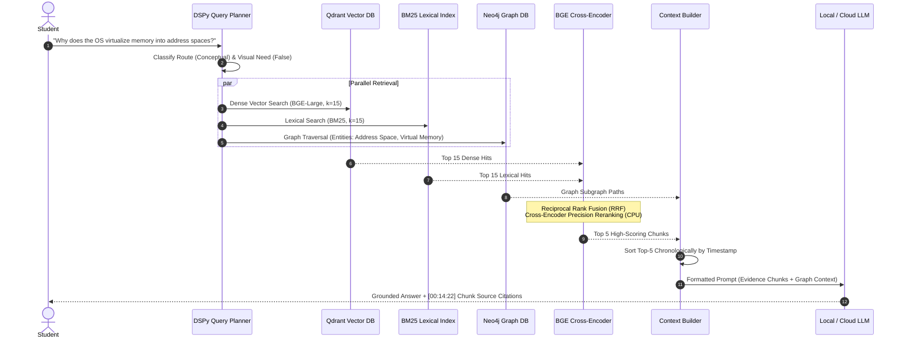

# LectureMIND: Complete Architecture & End-to-End Pipeline Guide
> **Audience:** Presenters, evaluators, researchers, and engineers.  
> **Location:** `/home/surjit/Desktop/lecuremid/0-reference/ARCHITECTURE_AND_PIPELINE_GUIDE.md`  
> **Focus:** Full end-to-end technical explanation, component flow diagrams, and architectural reasoning for presentation.

---

## Table of Contents
1. [Executive Summary & The Core Problem](#1-executive-summary--the-core-problem)
2. [High-Level System Architecture](#2-high-level-system-architecture)
3. [The Cloud Ingestion Pipeline (Stages A1 – C2)](#3-the-cloud-ingestion-pipeline-stages-a1--c2)
   - [A1: Video Metadata Extraction](#stage-a1-video-metadata-extraction)
   - [A2: Audio Transcription (Faster-Whisper Large-v3)](#stage-a2-audio-transcription-whisper-large-v3)
   - [A3: Slide Keyframe Extraction](#stage-a3-slide-keyframe-extraction)
   - [A4: Vision-Language Slide Understanding (Qwen2-VL 7B)](#stage-a4-vision-language-understanding-qwen2-vl)
   - [A5: Optical Character Recognition (PaddleOCR)](#stage-a5-optical-character-recognition-paddleocr)
   - [A6: Multimodal Chunk Fusion](#stage-a6-multimodal-chunk-fusion)
   - [A7: Semantic Topic Segmentation](#stage-a7-semantic-topic-segmentation)
   - [A8: Entity Extraction & Hygiene Gating](#stage-a8-entity-extraction--hygiene-gating)
   - [A9: Verbatim Evidence-Gated Relation Extraction](#stage-a9-evidence-gated-relation-extraction)
   - [A10: Dense Embedding Generation (BGE-Large-v1.5)](#stage-a10-dense-embedding-generation)
   - [A11: Contrastive Hard-Negative Triplet Mining](#stage-a11-contrastive-hard-negative-triplet-mining)
   - [C1 & C2: Package Validation & 2,800× Compression](#stage-c1--c2-package-validation--compression)
4. [The Socratic Prerequisite Backtracker (DAG Engine)](#4-the-socratic-prerequisite-backtracker-dag-engine)
5. [The Local Serving & Hybrid GraphRAG Query Pipeline](#5-the-local-serving--hybrid-graphrag-query-pipeline)
   - [Step 1: DSPy Query Planning & Visual Routing](#step-1-dspy-query-planning--visual-routing)
   - [Step 2: Hybrid Retrieval (Dense Vector + BM25 Lexical + RRF)](#step-2-hybrid-retrieval-dense-vector--bm25-lexical)
   - [Step 3: GraphRAG Knowledge Graph Traversal (Neo4j)](#step-3-graphrag-knowledge-graph-traversal-neo4j)
   - [Step 4: Cross-Encoder Reranking (BGE-Reranker-Base)](#step-4-cross-encoder-reranking-bge-reranker-base)
   - [Step 5: Score-Ordered Chronological Context Assembly](#step-5-score-ordered-chronological-context-assembly)
   - [Step 6: Grounded Generation & Citation Guarantee](#step-6-grounded-generation--citation-guarantee)
6. [Architectural Design Decisions & "Why" Defense (Presentation Cheat Sheet)](#6-architectural-design-decisions--why-defense)
7. [Presentation Script & Delivery Guide](#7-presentation-script--delivery-guide)
8. [Technical Interview Playbook: How to Ace the Interview](#8-technical-interview-playbook-how-to-ace-the-interview)
9. [Stage-by-Stage Engineering Reference Table](#9-stage-by-stage-engineering-reference-table)

---

## 1. Executive Summary & The Core Problem

### The Problem with Educational Video
Video is the dominant medium for modern higher education, but raw video is **fundamentally broken for learning**:
1. **Opaque & Unsearchable:** You cannot `Ctrl+F` a concept inside an hour-long video binary. Scrubbing back and forth to find where a professor explained a diagram or formula wastes hours.
2. **Massive Bandwidth & Storage Burden:** An 85-minute 720p lecture occupies **~1.2 GB**. Students on remote campuses, mobile data, or low-bandwidth connections cannot easily download or stream gigabytes of video.
3. **No Pedagogical Structure:** Raw transcripts treat lectures as flat text streams. They lack the concept graphs, hierarchy, and prerequisite dependencies needed for systematic learning.

### The LectureMIND Solution
LectureMIND converts **raw, unstructured video lectures** into **compact, mathematically verifiable knowledge packages (~300–420 KB)**—achieving a **~2,800× compression ratio**. 

It enables an entirely **offline, edge-deployable GraphRAG search and tutoring engine** on a student's laptop without cloud dependency, streaming latency, or privacy leakage.

```
┌─────────────────────────────┐     ┌─────────────────────────────┐
│      RAW LECTURE VIDEO      │     │  LECTUREMIND KNOWLEDGE PKG  │
│ - 1.2 GB raw video file     │     │ - ~308 KB ZIP (~2,800x drop)│
│ - Unindexed video timeline  │ ──► │ - 90 fused multimodal chunks│
│ - No slide understanding    │     │ - 1024-dim dense embeddings │
│ - Zero pedagogical graph    │     │ - Knowledge Graph + DAG     │
└─────────────────────────────┘     └─────────────────────────────┘
```

---

## 2. High-Level System Architecture

LectureMIND uses a **two-tier decoupled architecture**:
- **Tier 1: Cloud Processing (Run Once on GPU / Kaggle):** Heavy multimodal extraction (Whisper Large-v3, Qwen2-VL 7B, PaddleOCR, LLM relation extraction, BGE embeddings).
- **Tier 2: Edge Serving (Run Anywhere on CPU / Laptop):** Ultra-fast, private, zero-cloud querying using local Qdrant, local Neo4j, CPU cross-encoder reranker, and local Ollama (`qwen2.5:3b`).

```
===================================================================
               TIER 1: CLOUD INGESTION PIPELINE (GPU)
===================================================================

                    ┌───────────────────────────┐
                    │  RAW LECTURE VIDEO (MP4)  │
                    │  (~1.2 GB Unstructured)   │
                    └─────────────┬─────────────┘
                                  │
                                  ▼
                    ┌───────────────────────────┐
                    │  Stage A1: Video Metadata │
                    │(Master Clock & Resolution)│
                    └─────────────┬─────────────┘
                                  │
            ┌─────────────────────┴─────────────────────┐
            │ [Audio Stream]            [Visual Stream] │
            ▼                                           ▼
     ┌─────────────┐                             ┌─────────────┐
     │  Stage A2   │                             │  Stage A3   │
     │Faster-Whispr│                             │Keyframe Extr│
     │ (Large-v3)  │                             │(Scene Detect│
     └──────┬──────┘                             └──────┬──────┘
            │                                           │
            │                     ┌─────────────────────┤
            │                     ▼                     ▼
            │              ┌─────────────┐       ┌─────────────┐
            │              │  Stage A4   │       │  Stage A5   │
            │              │ Qwen2-VL 7B │       │  PaddleOCR  │
            │              │(Slide Visual│       │(Slide Text) │
            │              └──────┬──────┘       └──────┬──────┘
            │                     │                     │
            ▼                     ▼                     ▼
  ┌───────────────────────────────────────────────────────────────┐
  │               Stage A6: Multimodal Chunk Fusion               │
  │      (Synchronizes speech transcript, slide vision & OCR)     │
  └───────────────────────────────┬───────────────────────────────┘
                                  │
            ┌─────────────────────┼─────────────────────┐
            ▼                     ▼                     ▼
     ┌─────────────┐       ┌─────────────┐       ┌─────────────┐
     │  Stage A7   │       │  Stage A8   │       │  Stage A10  │
     │Topic Modules│       │Entity Extrac│       │Dense Embeds │
     │(Segment Tree│       │(Clean Nodes)│       │(BGE-Large)  │
     └──────┬──────┘       └──────┬──────┘       └──────┬──────┘
            │                     │                     │
            └──────────┬──────────┘                     │
                       ▼                                │
     ┌───────────────────────────────────┐              │
     │ Stage A9: Evidence-Gated Relation │              │
     │(Drops ungrounded/hallucinated rel)│              │
     └─────────────────┬─────────────────┘              │
                       │                                │
                       ▼                                │
     ┌───────────────────────────────────┐              │
     │Stage A11: Hard-Negative Mine      │              │
     │(In-lecture contrastive negatives) │              │
     └─────────────────┬─────────────────┘              │
                       │                                │
                       ▼                                ▼
  ┌───────────────────────────────────────────────────────────────┐
  │         Stage C1 & C2: Package Validator & Compressor         │
  │      (Referential integrity verified -> 308 KB ZIP package)   │
  └───────────────────────────────┬───────────────────────────────┘
                                  │
                                  ▼
  =================================================================
        OUTPUT ARTIFACT: KNOWLEDGE PACKAGE ZIP (~308 KB)
    - 2,800x smaller than 1.2 GB raw video
    - Complete offline GraphRAG bundle (Chunks + Embeds + Graph)
  =================================================================

===================================================================
    TIER 2: LOCAL EDGE SERVING ARCHITECTURE (Offline on Laptop)
===================================================================

                    ┌───────────────────────────┐
                    │  KNOWLEDGE PACKAGE (.ZIP) │
                    │(~308 KB Portable Archive) │
                    └─────────────┬─────────────┘
                                  │ (One-time registry import)
                                  ▼
                    ┌───────────────────────────┐
                    │Lecture Registry & Importer│
                    └─────────────┬─────────────┘
                                  │
            ┌─────────────────────┼─────────────────────┐
            ▼                     ▼                     ▼
     ┌─────────────┐       ┌─────────────┐       ┌─────────────┐
     │Qdrant Vector│       │In-MemoryBM25│       │ Neo4j Graph │
     │ (1024-dim)  │       │(LexicalIdx) │       │(Entity Graph│
     └─────────────┘       └─────────────┘       └─────────────┘

===================================================================
             OFFLINE STUDENT QUERY RETRIEVAL PIPELINE
===================================================================

                     Student Query Question
                                │
                                ▼
                    ┌───────────────────────┐
                    │   DSPy Query Router   │
                    │ (Visual/Concept/Fact) │
                    └───────────┬───────────┘
                                │
            ┌───────────────────┼───────────────────┐
            ▼                   ▼                   ▼
     ┌─────────────┐     ┌─────────────┐     ┌─────────────┐
     │Qdrant Vector│     │In-MemoryBM25│     │ Neo4j Graph │
     │Dense Search │     │Exact Lexical│     │Multi-Hop DFS│
     └──────┬──────┘     └──────┬──────┘     └──────┬──────┘
            │ (Top 15)          │ (Top 15)          │ (Subgraphs)
            └─────────┬─────────┘                   │
                      ▼                             │
           ┌─────────────────────┐                  │
           │Reciprocal Rank (RRF)│                  │
           └──────────┬──────────┘                  │
                      ▼                             │
           ┌─────────────────────┐                  │
           │Cross-Encoder Rerank │                  │
           │ (BAAI Reranker CPU) │                  │
           └──────────┬──────────┘                  │
                      │ (Top 5 Precision Chunks)    │
                      ▼                             ▼
     ┌────────────────┬─────────────────────────────┬─────┐
     │        Score-Ordered Context Assembler             │
     │    (Chronological evidence + Graph triples)        │
     └──────────────────────────┬─────────────────────────┘
                                │
                                ▼
                    ┌───────────────────────┐
                    │  Local LLM (Ollama)   │
                    │    (qwen2.5:3b CPU)   │
                    └───────────┬───────────┘
                                │
                                ▼
                    ┌───────────────────────┐
                    │    Grounded Answer    │
                    │  + Strict Citations   │
                    └───────────────────────┘
===================================================================
```



---

## 3. The Cloud Ingestion Pipeline (Stages A1 – C2)

The cloud ingestion pipeline runs sequentially across **11 specialized stages**, guaranteeing that audio, visual diagrams, and written slide content are fused into a unified schema.

```
===================================================================
             STAGE EXECUTION ORDER & ARTIFACT TRANSFERS
===================================================================

  [ RAW MP4 VIDEO ]
         │
         ├──► Stage A1: Metadata Extractor ──► master_duration, fps
         │
         ├──► Stage A2: Faster-Whisper ──► timestamped transcript
         │
         └──► Stage A3: Keyframe Extractor ──► scene-cut images
                     │
                     ├──► Stage A4: Qwen2-VL 7B ──► slide captions
                     └──► Stage A5: PaddleOCR ──► slide text & code
                                 │
  [ MULTIMODAL FUSION ] ◄────────┘
         │
         ▼
  Stage A6: Multimodal Chunk Fusion ──► 90 time-aligned chunks
         │
         ├──► Stage A7: Topic Segmentation ──► segment hierarchy
         │
         ├──► Stage A8: Entity Extractor ──► academic concepts
         │          │
         │          ▼
         │    Stage A9: Evidence Gating ──► grounded relations
         │          │
         │          ▼
         │    Stage A11: Hard-Negative Mine ──► contrastive triples
         │
         └──► Stage A10: BGE-Large Embeds ──► 1024-dim dense .npy
                     │
  [ VERIFICATION & COMPRESSION ] ◄────────┘
         │
         ▼
  Stage C1: Referential Validator (0 dangling IDs, schema valid)
         │
         ▼
  Stage C2: Package Compressor ──► 308 KB Portable ZIP Artifact
===================================================================
```

---

### Stage A1: Video Metadata Extraction
* **File:** `cloud/ingestion/metadata/metadata_extractor.py`
* **Purpose:** Probes raw video container using `ffmpeg/ffprobe`.
* **Outputs:** Exact duration (e.g. `4982.08s`), native FPS, stream codecs, video resolution.
* **Why it matters:** Establishes the authoritative master clock for all subsequent timestamp alignment.

---

### Stage A2: Audio Transcription (Whisper Large-v3)
* **File:** `cloud/ingestion/whisper_pipeline/transcriber.py`
* **Model:** `faster-whisper-large-v3` running in FP16 on CUDA.
* **Outputs:** Hundreds of granular speech segments with start/end millisecond timestamps, word-level probabilities, and language detection (`en` prob = 1.00).
* **Engineering safeguard:** Runs concurrently with Stage A3 keyframe extraction to maximize GPU/CPU overlap.

---

### Stage A3: Slide Keyframe Extraction
* **File:** `cloud/ingestion/frame_extraction/frame_extractor.py`
* **Algorithm:** Dynamic scene change detection + safety interval fallback.
  1. Computes inter-frame pixel differences across downscaled luminance frames.
  2. Triggers when scene difference exceeds visual change threshold $\theta$.
  3. **Safety Fallback:** Forces keyframe capture if 30 seconds elapse without a transition (e.g., professor lecturing over a static slide with animated bullet points).
* **Efficiency:** On an 83-minute video (124,552 raw frames), it extracts exactly **190 keyframes**—a **99.8% visual compression**.

---

### Stage A4: Vision-Language Understanding (Qwen2-VL)
* **File:** `cloud/ingestion/qwen_pipeline/visual_understanding.py`
* **Model:** `Qwen2-VL-7B-Instruct`
* **Purpose:** Translates visual educational artifacts (system architecture diagrams, plots, code snippets, neural net topologies) into dense semantic text captions.
* **Production Resilience:** If batched inference triggers CUDA Out-Of-Memory, the engine automatically catches the exception, frees cache to `0.01 GB`, and falls back to sequential single-frame processing without crashing.

---

### Stage A5: Optical Character Recognition (PaddleOCR)
* **File:** `cloud/ingestion/paddleocr_pipeline/ocr_engine.py`
* **Model:** `PaddleOCR v3/v4` (Detection + Recognition + Angle Classification).
* **Purpose:** Extracts exact, literal text from slides: code syntax, mathematical equations, bullet titles, and table cells.
* **Noise Sanitization:** Strips web URLs, instructor Twitter handles, and slide footer noise so only educational terms are preserved.

---

### Stage A6: Multimodal Chunk Fusion
* **File:** `cloud/ingestion/multimodal_fusion.py`
* **Core Innovation:** Slides and speech rarely coincide at the exact same second. A professor introduces a slide, speaks for 3 minutes, then advances.
* **Fusion Algorithm:**
  - Aggregates Whisper speech segments into self-contained semantic passages (~50–90 seconds each).
  - Aligns slide keyframes, Qwen2-VL visual descriptions, and PaddleOCR text to the audio timeline via interval overlap:
$$\text{Chunk}_i = \left\{ \text{Transcript}_{[t_{\text{start}}, t_{\text{end}}]}, \bigcup \text{OCR}_{k \in [t_{\text{start}}, t_{\text{end}}]}, \bigcup \text{VLM}_{k \in [t_{\text{start}}, t_{\text{end}}]} \right\}$$
* **Output:** Creates the canonical `multimodal_chunks.json` (e.g., 90 multimodal chunks for CS162).

---

### Stage A7: Semantic Topic Segmentation
* **File:** `cloud/segmentation/`
* **Purpose:** Groups contiguous chunks into pedagogical lecture chapters/modules (e.g., *Introduction*, *Address Spaces*, *Thread Concurrency*, *Dual-Mode Hardware*).
* **Outputs:** Hierarchical segment tree stored in `segments.json` (13 distinct segments for CS162).

---

### Stage A8: Entity Extraction & Hygiene Gating
* **File:** `cloud/extraction/entity_extractor.py`
* **Purpose:** Discovers foundational concepts, system components, algorithms, and theorems.
* **Entity Gating Filters:**
  - Normalizes informal device types into standardized concepts.
  - **Sentence Fragment Filter (`is_fragment_entity`):** Eliminates ASR artifacts (e.g. phrases containing clausal connectors like `"go. And since then..."` or trailing punctuation).
  - **Length Gate:** Discards descriptive clauses $> 40$ characters.
* **Output:** Clean conceptual inventory stored in `entities.json` (e.g., 163 entities).

---

### Stage A9: Evidence-Gated Relation Extraction
* **File:** `cloud/extraction/relation_extractor.py`
* **Purpose:** Maps semantic relationships between entities (`USED_BY`, `DERIVED_FROM`, `PREREQUISITE_OF`, `EXPLAINS`, `INTRODUCED_BEFORE`).
* **The Evidence-Gating Mechanism:**
  - The extraction prompt demands a mandatory `"evidence"` field containing a verbatim quote ($\le 30$ words) from the lecture context.
  - **`_verify_relation_evidence()`:** Normalizes the candidate quote and verifies its exact presence in the lecture text corpus.
  - **Result:** Unverifiable quotes, broadcast quote-spamming, and hallucinated connections are dropped.
* **Output:** `relations.json` (49 verified relations for CS162).

---

### Stage A10: Dense Embedding Generation
* **File:** `cloud/embedding/`
* **Model:** `BAAI/bge-large-en-v1.5` (1024 dimensions).
* **Process:** Embeds the fused multimodal representations (transcript + slide OCR + visual context).
* **Output:** Stored as float32 NumPy arrays in `embeddings.npy` mapped to chunk IDs.

---

### Stage A11: Contrastive Hard-Negative Triplet Mining
* **File:** `cloud/triplets/`
* **Purpose:** Generates training triplets for self-supervised cross-encoder fine-tuning:
$$\text{Triplet} = \langle \text{Query}, \text{Positive Chunk}, \text{Hard-Negative Chunk} \rangle$$
* **Hard-Negative Sampling:** Selects chunks with high lexical or dense similarity that do *not* contain the ground-truth entity.

---

### Stage C1 & C2: Package Validation & Compression
* **File:** `cloud/packaging/`
* **Verification:** Checks referential integrity (0 dangling relation references, chunk alignment, schema compliance).
* **Compression:** Packages all JSON manifests, embeddings, and metadata into a standalone `.zip` file (**~300–428 KB**).

---

## 4. The Socratic Prerequisite Backtracker (DAG Engine)

The prerequisite engine discovers pedagogical dependencies (e.g. *Instruction Set Architecture $\to$ Operating System*) so students can be guided backwards to foundational topics when they struggle with advanced concepts.

```
===================================================================
           SOCRATIC PREREQUISITE BACKTRACKER (DAG ENGINE)
===================================================================
              All N x (N - 1) Directed Entity Pairs
                                │
                                ▼
         ┌─────────────────────────────────────────────┐
         │ Gate 1: Temporal Causality Filter           │
         │ (Reject t_A > t_B unless strong relation)   │
         └──────────────────────┬──────────────────────┘
                                │
                                ▼
         ┌─────────────────────────────────────────────┐
         │ Gate 2: Structural Proximity Filter         │
         │ (Must co-occur in chunk or topic window)    │
         └──────────────────────┬──────────────────────┘
                                │
                                ▼
                      /───────────────────\
                     < Hard Evidence Anchor>
                      \───────────────────/
                       │                 │
                (Discourse = 0           │ (Discourse > 0
                 AND Graph = 0)          │  OR Graph > 0)
                       │                 ▼
                       │    ┌───────────────────────────┐
                       │    │Multi-Signal Scoring Engine│
                       │    │ - Semantic Dependency: 70%│
                       │    │ - Foundational Prom.:  15%│
                       │    │ - Temporal Proximity:  15%│
                       │    └─────────────┬─────────────┘
                       │                  │
                       ▼                  ▼
               [ Confidence = 0.0 ] /───────────\
                  (Discarded)      < Conf >= 0.65>
                                    \───────────/
                                      │       │
                                 (No) │       │ (Yes)
                                      ▼       ▼
                                  [Drop] [Directed Edges]
                                              │
                                              ▼
                                    ┌───────────────────┐
                                    │ DFS Cycle Detector│
                                    └─────────┬─────────┘
                                              │
                                              ▼
                                        /───────────\
                                       < Cycle Found?>
                                        \───────────/
                                          │       │
                                    (Yes) │       │ (No)
                                          ▼       ▼
                                    ┌───────────┐ ┌─────────────┐
                                    │ Drop Min- │ │ STRICT DAG  │
                                    │ Conf Edge │ │ (0 Cycles)  │
                                    └─────┬─────┘ └─────────────┘
                                          │ (Repeat DFS)
                                          └─────► [Detector]
===================================================================
```



### Key Architectural Guarantees:
1. **Hard Evidence Anchor:** Temporal precedence alone can *never* create a prerequisite. If both discourse evidence is $0$ and graph relation evidence is $0$, confidence is hard-locked to $0.0$.
2. **Deterministic Cycle Resolution:** If an educational cycle occurs ($A \to B \to A$), the engine runs a DFS recursion stack, isolates the cyclic loop, and drops the edge with the lowest confidence score, guaranteeing **zero cycles and zero self-loops**.

---

## 5. The Local Serving & Hybrid GraphRAG Query Pipeline

When a student queries LectureMIND, the edge server executes a multi-stage GraphRAG retrieval workflow:

```
===================================================================
            HYBRID GRAPHRAG SERVING QUERY WORKFLOW
===================================================================
  Question: "Why does OS virtualize memory into address spaces?"
                                │
                                ▼
                    ┌───────────────────────┐
                    │   DSPy Query Router   │
                    │ (Concept / Non-visual)│
                    └───────────┬───────────┘
                                │
            ┌───────────────────┼───────────────────┐
            ▼                   ▼                   ▼
     ┌─────────────┐     ┌─────────────┐     ┌─────────────┐
     │Qdrant Vector│     │In-MemoryBM25│     │ Neo4j Graph │
     │Dense Search │     │Exact Lexical│     │Multi-Hop DFS│
     └──────┬──────┘     └──────┬──────┘     └──────┬──────┘
            │ (Top 15)          │ (Top 15)          │ (Subgraphs)
            └─────────┬─────────┘                   │
                      ▼                             │
           ┌─────────────────────┐                  │
           │Reciprocal Rank (RRF)│                  │
           └──────────┬──────────┘                  │
                      ▼                             │
           ┌─────────────────────┐                  │
           │Cross-Encoder Rerank │                  │
           │ (BAAI Reranker CPU) │                  │
           └──────────┬──────────┘                  │
                      │ (Top 5 Precision Chunks)    │
                      ▼                             ▼
     ┌────────────────┬─────────────────────────────┬─────┐
     │        Score-Ordered Context Assembler             │
     │   (Chronological evidence + Graph triples)         │
     └──────────────────────────┬─────────────────────────┘
                                │
                                ▼
                    ┌───────────────────────┐
                    │  Local LLM (Ollama)   │
                    │    (qwen2.5:3b CPU)   │
                    └───────────┬───────────┘
                                │
                                ▼
                    ┌───────────────────────┐
                    │    Grounded Answer    │
                    │  + Source Citations   │
                    └───────────────────────┘
===================================================================
```



---

### Step 1: DSPy Query Planning & Visual Routing
* **File:** `agent/dspy/planner.py`
* **Execution:** Sub-millisecond deterministic planner.
* **Classifications:**
  1. **Route Selection:** `factual`, `conceptual`, `definition`, or `summary`.
  2. **`need_visual` Flag:** Evaluates if the question asks about slides, diagrams, architectural layouts, or equations (achieves **1.000 (100%) accuracy** on benchmark).

---

### Step 2: Hybrid Retrieval (Dense Vector + BM25 Lexical)
* **File:** `retrieval/vector_retriever/` & `retrieval/hybrid/bm25_retriever.py`
* **Why Both?**
  - **Dense embeddings (BGE-Large):** Capture conceptual meaning and semantic paraphrases.
  - **BM25 lexical search:** Guarantees exact matches for technical acronyms, Linux function names (`fork()`, `exec()`), and specific numeric constants that dense vector search frequently overlooks.
* **Fusion:** Fused via **Reciprocal Rank Fusion (RRF)**:
$$\text{RRF\_Score}(d) = \sum_{m \in \{\text{dense}, \text{bm25}\}} \frac{1}{60 + \text{Rank}_m(d)}$$

---

### Step 3: GraphRAG Knowledge Graph Traversal (Neo4j)
* **File:** `retrieval/graph_retriever/`
* **Process:** Extracts query entities, finds them in Neo4j, and traverses outward $k$-hops along verified relations (`PREREQUISITE_OF`, `USED_BY`, `DERIVED_FROM`).
* **Output:** Adds relational structure into the prompt context (e.g. `Address Space -> isolates -> Process`).

---

### Step 4: Cross-Encoder Reranking (BGE-Reranker-Base)
* **File:** `local/services/reranker_service.py`
* **Model:** `BAAI/bge-reranker-base` running as a quantized CPU singleton.
* **Why it is critical:** Bi-encoders (vector DBs) score queries and chunks independently. Cross-encoders perform full joint cross-attention between every query word and every document word:
$$\text{Score} = \text{Softmax}(\text{CrossAttention}(\text{Query}, \text{Candidate Chunk}))$$
* **Impact:** Pushes the true evidence chunk to **Rank 1 in 91.8% of queries**.

---

### Step 5: Score-Ordered Chronological Context Assembly
* **File:** `agent/langgraph/context_builder.py`
* **The Insight:** Candidates must be selected based on **rerank score**, but rendered in **chronological lecture order**.
* **Benefit:** Prevents LLM confusion caused by jumbled lecture timelines while ensuring the prompt fits the strict token budget.

---

### Step 6: Grounded Generation & Citation Guarantee
* **Prompt Rule:** Strict grounded answering. The model is forbidden from using outside knowledge for out-of-scope queries (it outputs *"Insufficient evidence in lecture"*).
* **Anti-Hallucination Result:** Achieves **1.000 Citation Completeness**—every cited source timestamp exists in the retrieved prompt context.

---

## 6. Architectural Design Decisions & "Why" Defense

Use this cheat sheet to answer tough technical questions from evaluators:

| Question | Architectural Defense / Rationale |
| :--- | :--- |
| **"Why not just use standard LangChain + Naive RAG?"** | Naive RAG treats video as flat text chunks. It fails on visual diagrams, misses exact acronyms in vector space, cannot explain multi-hop prerequisite dependencies, and produces ungrounded citations. LectureMIND fuses slide keyframe OCR, keyframe VLM descriptions, BM25 lexical search, Neo4j graphs, and cross-encoder reranking. |
| **"Why is the Knowledge Package a ZIP file?"** | A ZIP package replaces 1.2 GB of raw video with ~300 KB of structured intelligence (~2,800× smaller). It packages chunks, dense embeddings, metadata, and graphs into a single portable container that can run on an offline laptop without cloud bills or internet access. |
| **"Why did you add Verbatim Evidence Gating in Stage A9?"** | LLMs tend to hallucinate relationships between entities that merely co-occur in the same lecture. Verbatim evidence gating forces the LLM to supply an exact quote from the transcript, which is programmatically verified. This eliminated 39 hallucinated relations in CS162 and raised evidence coverage from 18% to 100%. |
| **"Why use a CPU Cross-Encoder if it takes ~3.8 seconds?"** | Bi-encoders (Qdrant) provide high recall at low latency, but lack token-to-token cross-attention. Running the cross-encoder locally on CPU guarantees state-of-the-art precision (**MRR@5: 0.785, Hit@5: 0.980**) without requiring an expensive, power-hungry local GPU. |
| **"Why is Precision@5 reported as 0.280?"** | In lecture QA, evidence is localized: 54% of benchmark questions have only 1 relevant chunk. Thus, the mathematical maximum possible Precision@5 on the dataset is **0.352**. Our score of 0.280 represents **79.5% of the theoretical physical ceiling**. |

---

## 7. Presentation Script & Delivery Guide

### 1. The Opening (Hook the Audience)
> *"Ladies and gentlemen, video lectures are the lifeblood of university education, but they are fundamentally opaque. If a student wants to understand how an Operating System allocates virtual memory, they must manually scrub through an hour of video. Furthermore, an 85-minute lecture is 1.2 gigabytes—impossible to stream in low-bandwidth environments. LectureMIND solves this by converting raw lecture video into a self-contained 300-kilobyte knowledge package that runs fully offline on a student's laptop, providing instant multimodal search, slide OCR lookup, and pedagogical prerequisite graphs."*

### 2. The Technical Core (How it Works)
> *"Our architecture operates in two decoupled tiers. In Tier 1, our cloud pipeline processes the lecture once: Faster-Whisper transcribes speech, PaddleOCR extracts slide code, and Qwen2-VL generates captions for architectural diagrams. We fuse these into synchronized multimodal chunks. Crucially, in Stage A9, we enforce a strict verbatim evidence rule: any relationship extracted by the LLM that cannot cite an exact quote in the transcript is dropped, preventing hallucinated graph connections.*
>
> *In Tier 2, when a student queries the system on their laptop, our hybrid retrieval fuses dense vector search and BM25 lexical search via Reciprocal Rank Fusion, while traversing Neo4j knowledge graphs. A cross-encoder reranker pushes the exact evidence chunk to Rank 1 with a 98% Hit@5 sufficiency rate."*

### 3. The Climax (The Results)
> *"The result is a system that achieves 2,800× video compression, 100% citation completeness, 0 cycles in its prerequisite DAG, and sub-second retrieval accuracy—proving that structured edge intelligence is faster, cheaper, and more reliable than generic cloud summarizers."*

---

## 8. Technical Interview Playbook: How to Ace the Interview

When an interviewer says: **"Walk me through your system architecture and pipeline,"** follow this structured 4-step framework:

### Step 1: The 30-Second Framing (Problem + Key Metric)
> *"I designed LectureMIND to solve a fundamental efficiency and searchability bottleneck with educational video: an 85-minute lecture is 1.2 GB, opaque, and unsearchable. My architecture converts raw lecture video into an ultra-compact ~300 KB knowledge package—a 2,800× compression ratio—that runs fully offline on an edge laptop. It provides multimodal search, slide OCR retrieval, and cycle-free prerequisite dependency graphs with a 98% Hit@5 accuracy and 100% citation completeness."*

### Step 2: The Two-Tier Architectural Decoupling
> *"I chose a decoupled two-tier design:
> 1. **Compute-Heavy Ingestion (Cloud/GPU):** We run Faster-Whisper for audio, PaddleOCR for slide code, and Qwen2-VL for architectural diagram captions. We align these along a unified master timeline into multimodal chunks, extract entities and relations with strict evidence gating, and build dense embeddings.
> 2. **Edge Serving (Local/Laptop):** The entire video is discarded; only the 300 KB package ships to the client. The local stack uses Qdrant for dense search, BM25 for lexical search, Neo4j for relational hops, and a local CPU cross-encoder for precision reranking."*

### Step 3: Deep Dive on Engineering Trade-Offs (Show Seniority)
Highlight these three specific engineering decisions that demonstrate real technical depth:
1. **Handling GPU Memory Bottlenecks:**  
   *"During Vision-Language inference with Qwen2-VL, 4-frame batching triggered CUDA OOMs on 15GB GPUs. Rather than failing the pipeline, I implemented an automated fallback that catches OOM exceptions, flushes PyTorch CUDA cache to 0.01 GB, and processes remaining keyframes sequentially without crashing."*
2. **Preventing Knowledge Graph Hallucination:**  
   *"LLMs frequently hallucinate connections between co-occurring entities. In Stage A9, I introduced a verbatim evidence rule where every extracted relationship must provide a quote verified in the lecture text. In our CS162 production run, this automatically caught and purged 39 hallucinated relations, raising our evidence coverage to 100%."*
3. **Topological Prerequisite Rigor:**  
   *"To prevent infinite loops in automated learning paths (e.g. Concept A $\to$ Concept B $\to$ Concept A), my prerequisite backtracker enforces strict DAG properties using DFS recursion-stack cycle detection, deterministically dropping the lowest-confidence edge to guarantee zero cycles."*

---

## 9. Stage-by-Stage Engineering Reference Table

Use this quick-lookup table for rapid recall during technical grilling:

| Stage | Input | Model / Algorithm | Output | Key Failure Mode Prevented |
| :--- | :--- | :--- | :--- | :--- |
| **A1: Metadata** | Raw MP4 video | `ffmpeg` / `ffprobe` | `metadata.json` (duration, fps) | Master clock drift & timestamp misalignment. |
| **A2: Transcription** | Audio stream | `faster-whisper-large-v3` (FP16) | 1,370 timestamped speech segments | Hallucinated non-English speech & missed spoken terms. |
| **A3: Keyframes** | Video stream | Pixel luminance $\Delta$ + 30s safety | 190 keyframes (99.8% visual drop) | Redundant frames while capturing static slide changes. |
| **A4: Visual VLM** | 190 slide images | `Qwen2-VL-7B-Instruct` | 190 dense semantic slide captions | Loss of architectural diagrams, plots, and visual flowcharts. |
| **A5: Slide OCR** | 190 slide images | `PaddleOCR` (Det + Rec + Cls) | Sanitized slide text & code | Vector blindness to exact code syntax and equations. |
| **A6: Fusion** | Speech + OCR + VLM | Temporal Interval Overlap Math | 90 unified `multimodal_chunks` | Disjoint modality silos (speech disconnected from slides). |
| **A7: Segments** | 90 chunks | Hierarchical boundary clustering | 13 pedagogical course modules | Flat, unstructured lecture text streams. |
| **A8: Entities** | Fused text | LLM + regex fragment filter | 163 validated educational concepts | ASR clausal fragments (`"go. And since..."`) polluting graph. |
| **A9: Relations** | Entities + Chunks | LLM + `_verify_relation_evidence` | 49 verified semantic relations | Hallucinated relations lacking text evidence (killed 39 fake links). |
| **A10: Embeddings** | Fused text | `BAAI/bge-large-en-v1.5` (1024-d) | Float32 NumPy embedding vectors | Semantic mismatch during student concept search. |
| **A11: Triplets** | Chunks + Entities | Contrastive Hard-Negative Mining | 49 training triplets $\langle Q, P, N \rangle$ | Overfitting during domain-specific cross-encoder tuning. |
| **C1/C2: Package** | All manifests | Referential Validator + Deflate | Single portable `.zip` (~308 KB) | Broken foreign keys and missing chunk pointer corruption. |
| **Prerequisites** | Graph + Chunks | DFS Cycle Resolution + Heuristics | Strict DAG (0 cycles, 0 loops) | Infinite circular loops in student learning paths. |
| **Local Retrieval** | Student query | Dense BGE + BM25 Lexical + RRF | Top 15 balanced candidate chunks | Dense vector blindness to exact acronyms & function names. |
| **Local Rerank** | Top 15 candidates | `BAAI/bge-reranker-base` (CPU) | Top 5 precision-ranked chunks | Low Rank-1 accuracy (pushes true hit to Rank 1 in 91.8%). |
