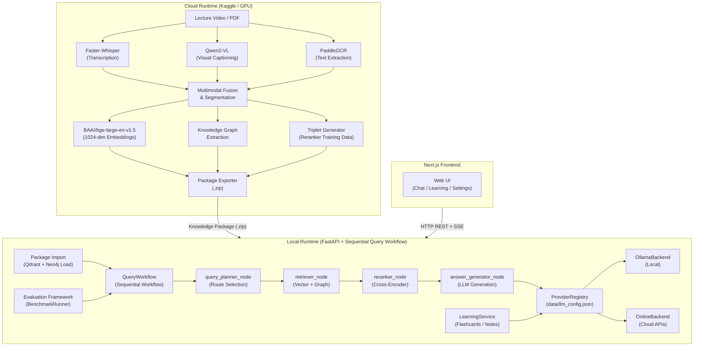

# LectureMIND

> **AI-powered GraphRAG learning platform** that transforms lecture recordings and PDFs into interactive, queryable knowledge bases.

---

## Overview

LectureMIND converts lecture videos into structured, AI-queryable knowledge bases that students can interact with through natural language. During processing, the system automatically extracts speech, visual slide content, and on-screen text to build a multimodal representation of the lecture. Once a lecture is processed, students can ask questions, generate flashcards, produce structured notes, and receive grounded, citation-backed answers—all running locally on a standard laptop.

The system is built around **GraphRAG (Graph-augmented Retrieval-Augmented Generation)**, combining dense semantic vector search with knowledge graph traversal to answer both factual and relational questions grounded in the lecture content.

---

## Motivation

Traditional lecture recordings are difficult to revisit effectively. Students must scrub through hours of video to find specific information, with no way to ask follow-up questions or verify what they remember. LectureMIND addresses this by:

- **Making lectures searchable** at a semantic level — ask a question, get an answer from the lecture content.
- **Separating expensive computation from the learning interface** — heavy AI processing happens once on cloud GPU infrastructure; students interact with a lightweight local server.
- **Supporting multiple learning modes** — conversational Q&A, flashcard generation, structured notes — all grounded in the actual lecture content.
- **Preserving privacy** — students can run the entire inference pipeline locally using Ollama, with no data leaving their machine after the initial package import.

---

## Features

- **Multimodal Ingestion** — Processes lecture video (audio transcription via Faster-Whisper, visual analysis via Qwen2-VL, OCR via PaddleOCR)
- **GraphRAG Query Pipeline** — Hybrid vector + knowledge graph retrieval with cross-encoder reranking
- **Conversational Q&A** — Real-time streaming answers grounded in lecture content with source citations
- **Active Learning** — Auto-generated flashcards and structured notes from active lecture content
- **Flexible LLM Backends** — Seamlessly switch between local Ollama models and cloud APIs (OpenAI, Gemini, Anthropic) without server restart
- **Knowledge Packages** — Portable ZIP archives that fully encapsulate a processed lecture for distribution and import
- **Evaluation Framework** — Offline benchmark runner measuring retrieval precision, reranking quality, answer similarity, citation coverage, and latency
- **Offline-First** — Full query capability with no internet connection once packages are imported
- **Reranker Training Data** — Automatically generates training triplets for offline fine-tuning of the cross-encoder

---

## High-Level Architecture

LectureMIND operates on a strict two-phase architecture. Expensive processing happens once in the cloud; all subsequent student interactions happen locally.



---

## System Components

| Component | Location | Role |
|---|---|---|
| **Cloud Ingestion Pipeline** | `cloud/` | Multi-stage lecture processing: transcription, OCR, chunking, embedding, graph extraction |
| **Knowledge Package** | `data/packages/lecture_{id}/` | Self-contained processed lecture archive (embeddings, graph, chunks) |
| **FastAPI Server** | `serving/fastapi/app.py` | Local HTTP server; routes, lifespan, SSE streaming |
| **QueryWorkflow** | `agent/langgraph/workflow.py` | Sequential query orchestration pipeline responsible for planning, retrieval, reranking, and answer generation. The workflow is designed to be compatible with future LangGraph integration. |
| **Vector Retriever** | `retrieval/vector_retriever.py` | Qdrant ANN search using 1024-dim bi-encoder embeddings |
| **Graph Retriever** | `retrieval/graph_retriever.py` | Neo4j Cypher traversal over extracted entity-relationship graph |
| **Global Reranker** | `serving/fastapi/rerank_service.py` | BAAI/bge-reranker-base cross-encoder; loaded eagerly at startup |
| **Provider Registry** | `local/llm/provider_registry.py` | JSON-backed factory for LLM backend selection |
| **Provider Manager** | `local/llm/provider_manager.py` | Runtime health checker for configured providers |
| **Learning Service** | `serving/fastapi/learning_service.py` | Flashcard and note generation using active lecture context |
| **Evaluation Framework** | `evaluation/benchmark_runner.py` | Offline RAG quality benchmark; bypasses HTTP layer |
| **Frontend** | `frontend/` | Next.js 14 + React 18 + TypeScript + Tailwind UI |

---

## Processing Pipeline

The cloud pipeline processes a raw lecture file through 11 sequential stages:

| Stage | Name | Input | Output | Model Used |
|---|---|---|---|---|
| A1 | Metadata Extraction | Video file | `metadata.json` | FFprobe |
| A2 | Audio Transcription | Audio track | `transcript.json` | Faster-Whisper |
| A3 | Frame Extraction | Video file | `frames/*.jpg` | OpenCV / FFmpeg |
| A4 | Visual Captioning | Keyframes | `vlm_output.jsonl` | Qwen2-VL |
| A5 | OCR Extraction | Keyframes | `ocr_output.jsonl` | PaddleOCR (subprocess) |
| A6 | Multimodal Fusion | Transcript + VLM + OCR | `multimodal_chunks.json` | Rule-based fusion |
| A7 | Topic Segmentation | Chunks | `segments.json` | Semantic clustering |
| A8 | Graph Extraction | Segments + Chunks | `entities.json`, `relations.json`, `graph.graphml` | LLM / NER |
| A9 | Embedding | Chunk texts | `embeddings.npy`, `embedding_ids.json` | BAAI/bge-large-en-v1.5 |
| A10 | Triplet Generation | Segments + Chunks | `triplets.json` | Qwen2.5-7B-Instruct |
| A11 | Package Export | All output files | `lecture_{id}.zip` | — |

> Stages A2 and A3 run **concurrently**. Stage A5 runs PaddleOCR in a **subprocess** to prevent CUDA context contamination.

---

## Retrieval Pipeline

Every student query passes through a 6-stage retrieval and generation pipeline:

```
User Question
    ↓
[1] Query Planning     — LLM classifies route: vector_only / graph_only / hybrid
    ↓
[2] Retrieval          — Qdrant ANN (vector) + Neo4j Cypher (graph) based on route
    ↓
[3] Fusion & Dedup     — Merge results from both stores, deduplicate by chunk_id
    ↓
[4] Cross-Encoder Reranking — BAAI/bge-reranker-base scores all candidates;
                              filter score < 0.3; keep top-K
    ↓
[5] Context Assembly   — Concatenate top-K chunks as [Source: chunk_id] blocks
    ↓
[6] LLM Generation     — Stream answer via OllamaBackend or OnlineBackend
    ↓
Streamed Answer + Source Citations
```

**Why this design?** The bi-encoder retrieves broadly (fast, high recall); the cross-encoder reranks precisely (slow, high precision). Neither alone achieves both goals. See [RETRIEVAL_SYSTEM.md](./RETRIEVAL_SYSTEM.md) for the complete algorithmic detail.

---

## Folder Structure

```
lecturemind/
│
├── cloud/                          # Cloud ingestion pipeline
│   ├── orchestration/
│   │   └── run_ingestion_pipeline.py   # Main cloud orchestrator (stages A1–A11)
│   ├── ingestion/                  # Per-stage ingestion modules
│   ├── packaging/
│   │   ├── exporter.py             # Builds the Knowledge Package ZIP
│   │   ├── manifest_builder.py     # Creates manifest.json with checksums
│   │   └── validator.py            # Cloud-side package validation
│   └── training/
│       └── triplet_generator.py    # Generates reranker training triplets
│
├── agent/                          # Sequential reasoning pipeline
│   ├── dspy/
│   │   ├── planner.py              # Query Planner (DSPy)
│   │   └── query_plan.py           # QueryPlan Pydantic model
│   └── langgraph/
│       ├── workflow.py             # QueryWorkflow definition
│       ├── state.py                # QueryPipelineState definition
│       └── nodes/
│           ├── vector_retriever.py # Qdrant ANN retrieval node
│           ├── graph_retriever.py  # Neo4j Cypher retrieval node
│           ├── reranker.py         # Cross-encoder reranking node
│           └── answer_generator.py # LLM generation node
│
├── retrieval/                      # Retrieval client implementations
│   ├── vector_retriever.py         # Qdrant ANN search client
│   └── graph_retriever.py          # Neo4j Cypher traversal client
│
├── local/                          # Local-side business logic
│   ├── llm/
│   │   ├── base.py                 # LLMBackend abstract base class
│   │   ├── ollama_backend.py       # Ollama local daemon wrapper
│   │   ├── online_backend.py       # Unified cloud provider wrapper
│   │   ├── provider_registry.py    # JSON-backed factory (data/llm_config.json)
│   │   └── provider_manager.py     # Runtime health checker (ProviderStatus)
│   ├── loaders/
│   │   ├── package_validator.py    # Local package validation (REQUIRED_FILES list)
│   │   ├── package_loader.py       # Orchestrates Qdrant + Neo4j loading
│   │   ├── qdrant_loader.py        # Upserts embeddings.npy into Qdrant
│   │   ├── neo4j_loader.py         # Loads graph.graphml into Neo4j
│   │   └── ollama_loader.py        # Checks Ollama model availability
│   └── docker/
│       └── local_runtime/
│           ├── qdrant_data/        # Qdrant Docker volume mount
│           └── neo4j_data/         # Neo4j Docker volume mount
│
├── serving/                        # FastAPI HTTP layer
│   └── fastapi/
│       ├── app.py                  # App object, lifespan, router registration
│       ├── rerank_service.py       # Global reranker singleton
│       ├── learning_service.py     # Flashcard and note generation
│       └── routes/
│           ├── lectures.py         # Package import and activation routes
│           ├── query.py            # Conversational query + SSE streaming
│           └── settings.py         # Provider config and status routes
│
├── evaluation/                     # Offline evaluation framework
│   ├── benchmark_runner.py         # Main orchestrator
│   ├── dataset_loader.py           # Dataset parsing and validation
│   ├── datasets/
│   │   └── sample_dataset.json     # Example benchmark dataset
│   ├── metrics/
│   │   ├── planner_metrics.py      # routing_accuracy
│   │   ├── retrieval_metrics.py    # precision@5, recall@5, hit@5, MRR, NDCG
│   │   ├── reranker_metrics.py     # ranking_quality, avg_cross_encoder_score
│   │   ├── answer_metrics.py       # answer_similarity, keyword_recall, lengths
│   │   ├── citation_metrics.py     # citation_coverage, citation_count, chunk_coverage
│   │   └── latency_metrics.py      # per-node and total latency
│   ├── reports/
│   │   └── report_generator.py     # Aggregates and writes CSV/JSON/Markdown reports
│   └── outputs/                    # Generated evaluation reports
│
├── frontend/                       # Next.js web UI
│   ├── package.json
│   └── src/
│
├── schemas/                        # Shared Pydantic data models
├── data/
│   ├── llm_config.json             # Active LLM provider configuration
│   └── packages/                   # Imported Knowledge Package directories
├── config.py                       # SharedSettings, LocalSettings, CloudSettings
├── requirements.txt                # Full cloud + local dependencies
├── local_requirements.txt          # Local-only (no cloud/GPU libs)
└── run_kaggle.py                   # Cloud pipeline entry point
```

---

## Technologies Used

### Backend
| Technology | Version | Role |
|---|---|---|
| Python | 3.12 | Primary language |
| FastAPI | Latest | Local HTTP server |
| uvicorn | Latest | ASGI server |
| Pydantic / pydantic-settings | v2 | Data models, env config |

### AI / ML
| Technology | Role |
|---|---|
| BAAI/bge-large-en-v1.5 | Chunk embedding (1024-dim dense vectors) |
| BAAI/bge-reranker-base | Cross-encoder reranking (post-retrieval precision) |
| Faster-Whisper | GPU ASR — lecture audio transcription |
| Qwen2-VL | Vision-Language Model — slide visual captioning |
| Qwen2.5-7B-Instruct | Cloud-side LLM — triplet query synthesis |
| PaddleOCR | OCR — raw text extraction from slide frames |
| sentence-transformers | Reranker model loader |
| Ollama (`qwen2.5:3b` default) | Local offline LLM inference |
| OpenAI / Gemini / Anthropic | Cloud LLM inference (via unified OnlineBackend) |

### Databases & Infrastructure
| Technology | Role |
|---|---|
| Qdrant | Vector database — semantic ANN search |
| Neo4j | Graph database — knowledge graph traversal |
| Docker | Containerizes Qdrant and Neo4j for local deployment |
| Kaggle | Cloud GPU environment for lecture ingestion |

### Frontend
| Technology | Role |
|---|---|
| Next.js 14 | React framework with SSR |
| React 18 | UI component library |
| TypeScript | Type-safe frontend code |
| Tailwind CSS | Utility-first styling |
| @tanstack/react-query | Server state synchronization |
| reactflow | Knowledge graph visualization |
| react-markdown | Markdown answer rendering |

---

## Installation

### Prerequisites
- Docker and Docker Compose
- Python 3.12 with `pip`
- Node.js 18+ and npm
- Ollama (for offline inference) — [install guide](https://ollama.ai)

### 1. Clone the Repository
```bash
git clone https://github.com/your-org/lecturemind.git
cd lecturemind
```

### 2. Start Databases (Docker)
```bash
docker compose -f local/docker/docker-compose.yml up -d
```
This starts Qdrant (port 6333) and Neo4j (port 7474/7687) with bind mounts to `local/docker/local_runtime/`.

### 3. Create Python Virtual Environment
```bash
python3 -m venv .venv
source .venv/bin/activate
pip install -r local_requirements.txt
```
> **Note:** Use `requirements.txt` only when running the **cloud ingestion pipeline** on GPU infrastructure. `local_requirements.txt` strips out PaddleOCR, PaddlePaddle-GPU, and other cloud-only heavy dependencies.

### 4. Install Frontend Dependencies
```bash
cd frontend
npm install
cd ..
```

### 5. Configure Environment
```bash
cp .env.example .env
# Edit .env — see Configuration section below
```

### 6. Pull Ollama Model (for offline inference)
```bash
ollama pull qwen2.5:3b
```

---

## Configuration

Edit `.env` in the project root:

```env
# ── Infrastructure ─────────────────────────────────────────────────
NEO4J_URI=bolt://localhost:7687
NEO4J_USER=neo4j
NEO4J_PASSWORD=your_password

QDRANT_URL=http://localhost:6333

# ── Embedding (do not change — must match cloud pipeline) ───────────
EMBEDDING_DIMENSION=1024

# ── Ollama (offline inference) ──────────────────────────────────────
OLLAMA_MODEL=qwen2.5:3b
OLLAMA_HOST=http://localhost:11434

# ── Cloud API Keys (online inference) ──────────────────────────────
# Set via the /settings UI at runtime — do not commit to version control
OPENAI_API_KEY=
GEMINI_API_KEY=
ANTHROPIC_API_KEY=
```

> **Important:** `EMBEDDING_DIMENSION` is hard-enforced at `1024` by a Pydantic `field_validator`. This must match the embedding model used during cloud ingestion (`BAAI/bge-large-en-v1.5`). Changing this value causes a startup error.

LLM provider selection is managed at runtime via `data/llm_config.json` (written by `ProviderRegistry`). Do not edit this file manually; use the `/settings` API or UI instead.

---

## Running the Project

### Start the Backend
```bash
source .venv/bin/activate
uvicorn serving.fastapi.app:app --reload
```
Server starts at `http://localhost:8000`. The startup sequence:
1. Validates the Knowledge Package registry (filesystem audit).
2. Loads the Global Reranker (`BAAI/bge-reranker-base`) into memory.
3. Attempts to restore the previously active lecture (reconnects to Qdrant and Neo4j).

### Start the Frontend
```bash
cd frontend
npm run dev
```
Frontend available at `http://localhost:3000`.

### Import a Knowledge Package
Use the web UI to upload a `.zip` package, or call the API directly:
```bash
curl -X POST http://localhost:8000/lectures/import \
  -F "file=@lecture_abc12345.zip" \
  -F "display_name=Introduction to Photosynthesis"
```

### Query the Active Lecture
```bash
curl -N -X POST http://localhost:8000/query \
  -H "Content-Type: application/json" \
  -d '{"question": "What is the role of chlorophyll in photosynthesis?"}'
```
The response streams as Server-Sent Events (SSE).

### Check Provider Status
```bash
curl http://localhost:8000/settings/status
```

---

## Evaluation

The evaluation framework measures RAG pipeline quality offline — no running server required.

### Run Benchmark
```bash
source .venv/bin/activate
python -c "
from evaluation.benchmark_runner import BenchmarkRunner
runner = BenchmarkRunner(
    dataset_path='evaluation/datasets/sample_dataset.json',
    output_dir='evaluation/outputs'
)
runner.setup()
runner.run()
"
```

Reports are written to `evaluation/outputs/` in CSV, JSON, and Markdown formats.

### Metrics Computed

| Metric | Type | Description |
|---|---|---|
| `routing_accuracy` | Planner | Fraction of queries routed to the correct retrieval strategy |
| `precision@5` | Retrieval | Fraction of top-5 retrieved chunks that are relevant |
| `recall@5` | Retrieval | Fraction of relevant chunks that appear in top-5 |
| `hit@5` | Retrieval | Binary — did any relevant chunk appear in top-5? |
| `mrr` | Retrieval | Mean Reciprocal Rank of first relevant chunk |
| `ndcg_at_5` | Retrieval | Normalized Discounted Cumulative Gain at rank 5 |
| `ranking_quality` | Reranker | MRR of reranked list |
| `avg_cross_encoder_score` | Reranker | Mean cross-encoder relevance score of top-K chunks |
| `answer_similarity` | Answer | Jaccard token overlap vs. ground truth answer |
| `context_length` | Answer | Character count of assembled context |
| `answer_length` | Answer | Character count of generated answer |
| `citation_coverage` | Citation | Fraction of expected chunks cited in the answer |
| `citation_count` | Citation | Number of unique chunks cited |
| `chunk_coverage` | Citation | Fraction of reranked chunks cited |
| `*_latency` | Latency | Per-node and total pipeline latency (seconds) |

> **Benchmark Dataset Format:** See `evaluation/datasets/sample_dataset.json`. Each sample requires `query`, `expected_route`, `expected_chunk_ids`, and `ground_truth_answer`.

---

## Design Decisions

The following table summarizes the key architectural decisions. See [DESIGN_DECISIONS.md](./DESIGN_DECISIONS.md) for the full rationale and trade-off analysis.

| Decision | Rationale |
|---|---|
| Cloud/Local split | GPU hardware should not be required for student interaction |
| GraphRAG over vanilla RAG | Relational queries require graph traversal, not just semantic similarity |
| Two-stage retrieval (bi-encoder + cross-encoder) | Balances retrieval recall (fast ANN) with generation precision (slow cross-encoder) |
| LangGraph for orchestration | Typed, inspectable state machine; independently testable nodes; evaluation-friendly |
| Strategy + Factory for LLM backends | Zero-restart provider switching; clean abstraction for Ollama  cloud APIs |
| Lazy LLM / eager reranker | Reranker is lecture-agnostic and query-critical — load once; LLM config changes at runtime |
| Decoupled startup | Server must boot cleanly with zero providers configured |
| SSE streaming | Sub-second perceived latency for student queries |
| Knowledge Package format | Offline-first, portable, open standards (NumPy, JSON, GraphML, ZIP) |

---

## Current Limitations

| Limitation | Impact |
|---|---|
| `POST /settings/ollama/download` blocks the event loop | Server becomes unresponsive during model downloads |
| No file locking on `data/llm_config.json` | Concurrent provider settings updates risk JSON corruption |
| `answer_similarity` uses Jaccard token overlap | Semantically equivalent answers with different wording score zero |
| Single-user design (singleton state) | Multi-user deployment is not supported |
| Each query is stateless (no multi-turn context) | Conversation history is not preserved across queries |
| No API authentication | Any local network client can access all endpoints |
| Package sizes of 50–500 MB | Large lectures produce unwieldy distribution packages |

---

## Future Improvements

- [ ] Offload Ollama model download to a background thread (`BackgroundTasks`)
- [ ] Add file locking to `ProviderRegistry` for concurrent write safety
- [ ] Replace Jaccard similarity with semantic embedding similarity for `answer_similarity`
- [ ] Implement multi-turn conversation context via `QueryState` accumulation
- [ ] Add bearer token authentication to FastAPI routes
- [ ] Quantize embedding storage (int8) to reduce package size 4×
- [ ] Add a knowledge graph visualization panel to the frontend
- [ ] Implement live lecture streaming via Kafka ingestion pipeline

---

## Documentation Index

| File | Contents |
|---|---|
| [ARCHITECTURE.md](./ARCHITECTURE.md) | System overview, Cloud/Local split, Mermaid diagram, design patterns |
| [FOLDER_STRUCTURE.md](./FOLDER_STRUCTURE.md) | Module-by-module directory analysis |
| [TECH_STACK.md](./TECH_STACK.md) | Full technology inventory with versions and roles |
| [PIPELINE.md](./PIPELINE.md) | Step-by-step execution flows for all major pipelines |
| [RETRIEVAL_SYSTEM.md](./RETRIEVAL_SYSTEM.md) | Complete retrieval algorithm documentation |
| [EVALUATION.md](./EVALUATION.md) | Evaluation framework, all metric implementations, known issues |
| [KNOWLEDGE_PACKAGE.md](./KNOWLEDGE_PACKAGE.md) | Package format, schemas, creation, and loading lifecycle |
| [DESIGN_DECISIONS.md](./DESIGN_DECISIONS.md) | Architectural decisions, trade-offs, limitations, future improvements |

---

## References

- [LangGraph Documentation](https://langchain-ai.github.io/langgraph/)
- [Qdrant Documentation](https://qdrant.tech/documentation/)
- [Neo4j Cypher Manual](https://neo4j.com/docs/cypher-manual/current/)
- [BAAI/bge-large-en-v1.5](https://huggingface.co/BAAI/bge-large-en-v1.5) — Embedding model
- [BAAI/bge-reranker-base](https://huggingface.co/BAAI/bge-reranker-base) — Cross-encoder reranker
- [Faster-Whisper](https://github.com/guillaumekln/faster-whisper) — ASR engine
- [Qwen2-VL](https://huggingface.co/Qwen/Qwen2-VL-7B-Instruct) — Vision-Language Model
- [Ollama](https://ollama.ai) — Local LLM inference daemon
- [FastAPI](https://fastapi.tiangolo.com) — Python HTTP framework
- [GraphML Specification](http://graphml.graphdrawing.org/)
- [pydantic-settings](https://docs.pydantic.dev/latest/concepts/pydantic_settings/) — Environment configuration

---

<div align="center">
<sub>Built with GraphRAG — combining the depth of knowledge graphs with the flexibility of neural retrieval.</sub>
</div>
