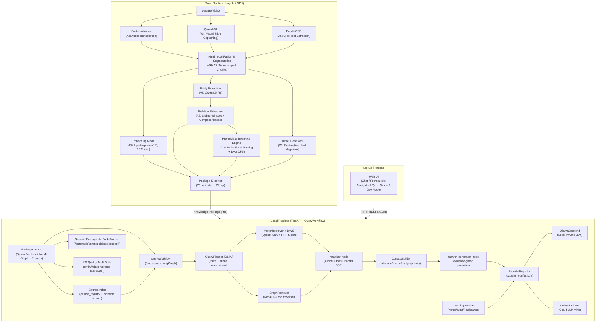
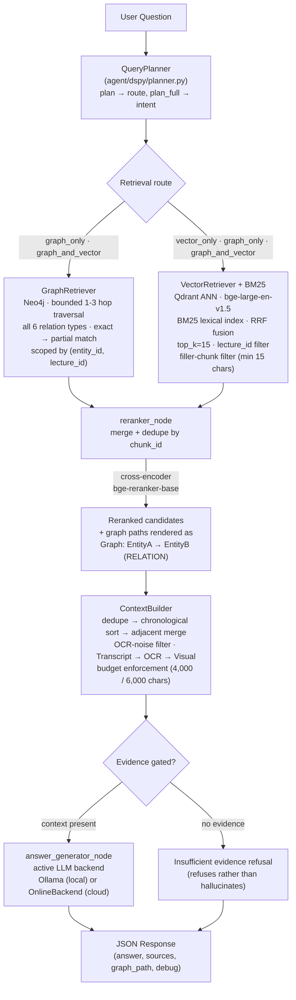

# LectureMIND

> **AI-powered GraphRAG learning platform** that transforms lecture videos into interactive, queryable knowledge bases.

---

## Contents

- [Overview](#overview) · [Motivation](#motivation) · [Features](#features)
- [High-Level Architecture](#high-level-architecture) · [System Components](#system-components)
- [Processing Pipeline](#processing-pipeline) · [Retrieval Pipeline](#retrieval-pipeline) · [Folder Structure](#folder-structure)
- [Technologies Used](#technologies-used) · [Installation](#installation) · [Configuration](#configuration) · [Running the Project](#running-the-project)
- [Evaluation](#evaluation) · [Design Decisions](#design-decisions) · [Production Architecture](#production-architecture)
- [Future Improvements](#future-improvements) · [Documentation Index](#documentation-index)

---

## Overview

LectureMIND converts lecture videos into structured, AI-queryable knowledge bases that students can interact with through natural language. During processing, the system automatically extracts speech, visual slide content, and on-screen text to build a multimodal representation of the lecture. Once a lecture is processed, students can ask questions, generate flashcards, produce structured notes, and receive grounded, citation-backed answers—all running locally on a standard laptop.

The system is built around **GraphRAG (Graph-augmented Retrieval-Augmented Generation)**, combining dense semantic vector search with knowledge graph traversal to answer both factual and relational questions grounded in the lecture content.

---

## Motivation

Traditional lecture recordings are difficult to revisit effectively. Students must scrub through hours of video to find specific information, with no way to ask follow-up questions or verify what they remember. LectureMIND addresses this by:

- **Making lectures searchable** at a semantic level — ask a question, get an answer from the lecture content.
- **Compressing gigabytes of video into kilobytes of structured data** — an 83-minute 720p lecture (~1.2 GB) becomes a ~436 KB knowledge package (~2,800× smaller), because the video is replaced by transcripts, slide text, embeddings, and a knowledge graph.
- **Separating expensive computation from the learning interface** — heavy AI processing happens once on cloud GPU infrastructure; students interact with a lightweight local server.
- **Supporting multiple learning modes** — conversational Q&A, flashcard generation, structured notes — all grounded in the actual lecture content.
- **Preserving privacy** — students can run the entire inference pipeline locally using Ollama, with no data leaving their machine after the initial package import.

---

## Features

- **Multimodal Ingestion** — Audio transcription (Faster-Whisper), slide visual captioning (Qwen2-VL), and OCR (PaddleOCR), fused into timestamped multimodal chunks at slide keyframes; semantic chunk merging combines whisper segments into self-contained passages
- **GraphRAG Query Pipeline** — Hybrid retrieval: dense vectors + BM25 lexical scores fused via Reciprocal Rank Fusion (RRF) + knowledge-graph traversal, cross-encoder reranking, and evidence-gated generation
- **Socratic Prerequisite Back-Tracker** — Deterministic DAG prerequisite inference engine; traces foundational knowledge gaps backwards when students struggle with advanced concepts, surfacing specific timestamps and chunks
- **Knowledge Graph Quality Audit Suite** — Automated evaluation layer auditing entity fragment/orphan rates, relation referential integrity (0.0% dangling relations), strict 1-to-1 bipartite prerequisite matching (73.7% F1, 0 cycles), and GraphRAG downstream retrieval
- **Conversational Q&A** — Grounded JSON answers with timestamped source citations; refuses to answer when the lecture lacks evidence
- **Active Learning** — Auto-generated notes, flashcards, quizzes, and learning paths from lecture context
- **Course Index** — Lightweight course layer (pure metadata) that queries across lectures via per-lecture fan-out, without ever merging knowledge graphs
- **Retrieval Explainability** — Per-query pipeline trace (route, planner intent, per-stage scores, timings, selected evidence) surfaced in Developer Mode
- **QA Evaluation** — Grounded benchmark sets with keyword-verified ground-truth chunks across factual, conceptual, definition, summary, and visual (`need_visual`) query types
- **Cross-Lecture Isolation** — Hard per-`lecture_id` guards in Qdrant and Neo4j; nodes/edges scoped by `(entity_id, lecture_id)`; no data leaks between lectures or across re-imports
- **Fine-tunable Global Reranker** — `cloud/reranker_training/` builds training data from `triplets.json` shipped inside knowledge packages and fine-tunes the cross-encoder; hot-reloadable via API
- **Flexible LLM Backends** — Seamlessly switch between local Ollama models and cloud APIs (OpenAI, Gemini, Groq, OpenRouter, Anthropic) without server restart; per-provider rate limiting with exponential backoff
- **Knowledge Packages** — Portable ZIP archives encapsulating processed lectures; long 90-minute lectures (~1.2 GB video) compress into **~428 KB packages** (~2,800× smaller than source video)
- **Offline-First** — Full query and prerequisite navigation capability with no internet connection once packages are imported

---

## High-Level Architecture

LectureMIND operates on a strict two-phase architecture. Expensive processing happens once in the cloud; all subsequent student interactions happen locally.



---

## System Components

| Component | Location | Role |
|---|---|---|
| **Cloud Ingestion Pipeline** | `cloud/` | Multi-stage lecture processing: transcription, OCR, fusion, segmentation, entity/relation extraction, prerequisite inference, embeddings, triplets |
| **Prerequisite Inference Engine (A10)** | `cloud/extraction/prerequisite_inference.py` | Multi-signal semantic scoring ($S_{\text{discourse}} + S_{\text{graph}} + S_{\text{prominence}} + S_{\text{temporal}}$), temporal causality + pedagogical inversion gates, deterministic DFS DAG cycle resolution |
| **Socratic Prerequisite Back-Tracker** | `serving/fastapi/routes/prerequisites.py` | Bounded Neo4j backward prerequisite dependency traversal, timestamped concept anchoring |
| **KG Quality Audit Suite** | `evaluation/knowledge_graph/` | Full audit suite: entity fragment/orphan rate, relation referential integrity (0.0% dangling), strict bipartite prerequisite matching (73.7% F1), GraphRAG downstream retrieval |
| **Relation Extraction (A9)** | `cloud/extraction/relation_extractor.py` | Sliding-window token management with compact entity alias remapping (`E1, E2...`), 8192-token retry cap, strict pedagogical exclusion rules |
| **Global Training Orchestration** | `scripts/train_global_reranker.py` | Local: merge package triplets → fine-tune → install into `GLOBAL_RERANKER_DIR` → hot-reload |
| **Reranker Training Pipeline (B)** | `cloud/reranker_training/` | Independent pipeline: discover packages → extract `triplets.json` → merge/dedupe → fine-tune → evaluate → version → export `global_reranker_v{N}.zip`. Never touches videos |
| **Knowledge Package** | `data/packages/lecture_{id}/` | Self-contained processed lecture archive (embeddings, graph, prerequisites, chunks, triplets) |
| **FastAPI Server** | `serving/fastapi/app.py` | Local HTTP server; lifespan, model recovery, router registration |
| **QueryWorkflow** | `agent/langgraph/workflow.py` | Single-pass query orchestration: planner → conditional retrieval → rerank → evidence-gated answer |
| **QueryPlanner** | `agent/dspy/planner.py` | Heuristic route selection (`graph_only`/`vector_only`/`graph_and_vector`) + 10-intent `plan_full()` |
| **Vector Retriever** | `retrieval/vector_retriever/qdrant_retriever.py` | Qdrant ANN search (1024-dim) + lecture-wide timeline sampling; **raises without `lecture_id`** |
| **Graph Retriever** | `retrieval/graph_retriever/neo4j_retriever.py` | Neo4j bounded 1–3-hop traversal, all 6 relation types, exact→partial match; **raises without `lecture_id`** |
| **Course Retriever** | `retrieval/course_retriever.py` | Course fan-out: queries only member lectures through the lecture-scoped retrievers, dedupes on `(lecture_id, chunk_id)` |
| **Context Builder** | `retrieval/context_builder.py` | Dedupe, chronological order, adjacent-merge, OCR-noise filter, transcript>OCR>visual priority, budget enforcement |
| **Global Reranker** | `retrieval/reranker/rerank_service.py` + `local/services/reranker_service.py` | BAAI/bge-reranker-base cross-encoder singleton; loaded once at startup; hot-reloadable |
| **Lecture Registry** | `local/storage/lecture_registry.py` | JSON-backed knowledge-package metadata + active-lecture lifecycle + startup audit |
| **Course Registry** | `local/storage/course_registry.py` | JSON-backed course metadata (name + lecture_ids); never writes to Qdrant/Neo4j |
| **Provider Registry** | `local/llm/provider_registry.py` | JSON-backed factory for LLM backend selection |
| **Provider Manager** | `local/llm/provider_manager.py` | Runtime health checker for configured providers |
| **Learning Service** | `serving/fastapi/learning_service.py` | Notes, flashcards, quiz, and learning-path generation reusing the retrieval pipeline |
| **Evaluation Framework** | `evaluation/benchmark_runner.py` | Offline RAG quality benchmark over a QA dataset, bypassing HTTP |
| **RAGAS Eval** | `evaluation/ragas/eval_ragas.py` | Faithfulness, Answer Relevancy, Context Precision scores |
| **Load Testing** | `evaluation/load_testing/load_test.py` | 100/500/1000 concurrent users; avg/p95 latency + RPS |
| **Frontend** | `frontend/` | Next.js 14 + React 18 + TypeScript + custom CSS design system; Student/Developer modes |

---

## Processing Pipeline

The cloud pipeline processes a raw lecture video through sequential stages (orchestrated by `cloud/orchestration/run_ingestion_pipeline.py`):

| Stage | Name | Input | Output | Model Used |
|---|---|---|---|---|
| A1 | Metadata Extraction | Video file | `metadata.json` | FFprobe |
| A2+A3 | Transcription + Frame Extraction (concurrent) | Audio + Video | `transcript.json`, `frames/*.jpg` | Faster-Whisper, OpenCV / FFmpeg |
| A4 | Visual Captioning | Keyframes | `vlm_output.jsonl` | Qwen2-VL |
| A5 | OCR Extraction | Keyframes | `ocr_output.jsonl` | PaddleOCR (dedicated subprocess) |
| A6 | Multimodal Fusion | Transcript + VLM + OCR | `multimodal_chunks.json` | Rule-based fusion (±2 s window) |
| A7 | Topic Segmentation | Chunks | `segments.json`, `chunk_segment_map.json` | Qwen2.5-7B-Instruct |
| A8 | Entity Extraction | Segments + Chunks | `entities.json` | Qwen2.5-7B-Instruct |
| A9 | Relation Extraction | Entities + Chunks | `relations.json` | Qwen2.5-7B (Sliding-window + compact aliases) |
| A10 | Prerequisite Inference | Entities + Relations + Chunks | `prerequisites.json` | Multi-Signal Fuser + DFS Cycle Breaker |
| B0 | Embeddings | Chunks | `embeddings.npy`, `embedding_ids.json` | BAAI/bge-large-en-v1.5 (1024-dim) |
| B1 | Triplet Generation | Segments + Chunks | `triplets.json` | Qwen2.5-7B-Instruct |
| B2 | Reranker Fine-tune *(optional)* | `triplets.json` | `reranker_model/`, `training_metrics.json` | BAAI/bge-reranker-base |
| C1 | Validation | All outputs | validation report | Comprehensive Schema Validator |
| C2 | Package Export | All outputs | `lecture_{id}_knowledge_package.zip` | ZIP Deflate level 9 |

> Stages A2 and A3 run **concurrently**. Stage A5 (PaddleOCR) runs inside the cloud pipeline's dedicated subprocess, so its CUDA context never contaminates the parent process.
>
> B2 is **off by default** (`ENABLE_PIPELINE_RERANKER_TRAINING=False`). Reranker fine-tuning is intended to run offline via `scripts/train_global_reranker.py`; inference only ever loads from `local_runtime/models/global_reranker/`.

---

## Retrieval Pipeline

Every query passes through a single-pass pipeline (`agent/langgraph/workflow.py`):



**Pipeline stages:**

1. **Query Planning** — `QueryPlanner.plan` → retrieval route (`graph_only` / `vector_only` / `graph_and_vector`); `plan_full` → intent, `is_lecture_wide`, `top_k`, `context_budget`, `need_visual`.
2. **Retrieval** — Conditional: `graph_retriever` (Neo4j bounded 1–3-hop traversal, all 6 relation types, exact→partial match) and `vector_retriever` (Qdrant ANN). With hybrid retrieval enabled (default), BM25 lexical results are fused with the dense candidates via Reciprocal Rank Fusion (RRF) before reranking, recovering exact entity names and numeric facts that dense similarity misses. `graph_only` routes **always** also retrieve vectors — the graph supplies structure, vectors supply the text the answer must be grounded in. Every call is lecture-scoped.
3. **Fusion & Rerank** — `reranker_node` merges + dedupes by `chunk_id`, then the global CrossEncoder (`bge-reranker-base`, optionally int8-quantized) scores pairs.
4. **Context Assembly** — `ContextBuilder`: dedupe → chronological sort → merge adjacent chunks → OCR-noise filter → priority Transcript > OCR > Visual → budget enforcement; lecture-wide intents sample 8 timeline buckets.
5. **LLM Generation** — `answer_generator_node` via the active LLM backend (Ollama or online): evidence-gated, language-pinned, falls back to `"Insufficient evidence found in lecture."` when context is empty; sources built only from retrieved chunks.

**Why this design?** The bi-encoder retrieves broadly (fast, high recall); the cross-encoder reranks precisely (slow, high precision). Neither alone achieves both goals. `debug` is an additive pipeline trace (route, planner intent, per-stage scores, timings) consumed only by the frontend's Developer Mode — normal responses are unchanged.

**Course queries** follow the same flow with one extra step: `POST /courses/query` fans out to each member lecture through the lecture-scoped retrievers (isolation guards apply per call), merges with `(lecture_id, chunk_id)` dedup, then reuses the global reranker and answer generator.

See [RETRIEVAL_SYSTEM.md](./docs/RETRIEVAL_SYSTEM.md) for the complete algorithmic detail.

---

## Folder Structure

```
lecturemind/
│
├── cloud/                          # Cloud ingestion pipeline (Kaggle)
│   ├── orchestration/
│   │   └── run_ingestion_pipeline.py   # Main cloud orchestrator (A1–C2)
│   ├── training/
│   │   ├── triplet_generator.py    # B1 — reranker training triplets
│   │   └── reranker_trainer.py     # B2 — CrossEncoder fine-tuning (not run by default)
│   ├── reranker_training/          # Pipeline B — INDEPENDENT reranker training
│   │   ├── package_discovery.py    # discover packages, extract ONLY triplets.json
│   │   ├── dataset_builder.py      # merge / dedupe / filter / train-dev split
│   │   ├── versioning.py           # v1/ v2/ … best/ latest/ + index.json
│   │   ├── export.py               # global_reranker_v{N}.zip
│   │   └── pipeline.py             # orchestrator + CLI (python -m …)
│   └── packaging/                  # validator / exporter / manifest_builder
│
├── agent/                          # Query reasoning pipeline
│   ├── dspy/
│   │   ├── planner.py              # QueryPlanner (route + 10-intent plan_full)
│   │   └── query_plan.py           # QueryPlan dataclass
│   └── langgraph/
│       ├── workflow.py             # QueryWorkflow (single-pass orchestrator)
│       ├── state.py                # GraphState (frozen QueryPipelineState)
│       └── nodes/
│           ├── vector_retriever.py # Qdrant retrieval node
│           ├── graph_retriever.py  # Neo4j retrieval node
│           ├── reranker.py         # Cross-encoder rerank + ContextBuilder node
│           └── answer_generator.py # Evidence-gated LLM node
│
├── retrieval/                      # Retrieval layer (packages)
│   ├── vector_retriever/qdrant_retriever.py   # Qdrant ANN + lecture-wide sampling
│   ├── graph_retriever/neo4j_retriever.py     # Neo4j bounded traversal (lecture-scoped)
│   ├── reranker/rerank_service.py             # Global CrossEncoder singleton + rerank()
│   ├── course_retriever.py                    # Course fan-out (Feature 1)
│   └── context_builder.py                     # Context assembly (dedupe/merge/budget)
│
├── local/                          # Local-side business logic
│   ├── llm/                         # LLMBackend, Ollama/online backends, provider registry
│   ├── loaders/                     # package_validator, qdrant_loader, neo4j_loader,
│   │                                #   reranker_loader, manifest_validator
│   ├── storage/                     # lecture_registry.py, course_registry.py,
│   │                                #   registry_provider.py
│   ├── services/                    # reranker_service.py, llm_service.py
│   └── docker/                      # docker-compose (Qdrant + Neo4j)
│
├── serving/fastapi/                 # FastAPI HTTP layer
│   ├── app.py                       # App object, lifespan, model recovery, routers
│   ├── learning_service.py          # Notes / flashcards / quiz / learning path
│   └── routes/
│       ├── lectures.py              # POST /upload, lecture CRUD, learning endpoints
│       ├── query.py                 # POST /query (JSON + debug trace)
│       ├── courses.py               # Course CRUD + POST /courses/query (Feature 1)
│       ├── reranker.py              # Global reranker upload/status/reload/settings
│       ├── settings.py              # Provider config and status routes
│       └── debug.py                 # Debug endpoints
│
├── evaluation/                     # Offline evaluation framework
│   ├── benchmark_runner.py          # QA benchmark over the real workflow
│   ├── ragas/eval_ragas.py          # Faithfulness / Answer Relevancy / Context Precision
│   ├── load_testing/load_test.py    # 100/500/1000 concurrent users
│   ├── dashboard/dashboard_generator.py  # HTML dashboard from existing outputs
│   ├── metrics/                     # 6 metric families (planner/retrieval/reranker/…)
│   ├── reports/report_generator.py  # JSON/CSV/Markdown reports
│   └── outputs/                     # Generated benchmark reports
│
├── scripts/                         # Operational scripts
│   └── train_global_reranker.py     # Merge triplets → fine-tune → install → reload
│
├── frontend/                        # Next.js web UI (chat, learning, settings, dev mode)
├── schemas/                         # Frozen Pydantic models + closed enums
├── data/
│   ├── llm_config.json              # Active LLM provider configuration
│   ├── lecture_registry.json        # Imported lecture metadata
│   ├── courses.json                 # Course index (metadata only)
│   └── packages/                    # Imported Knowledge Package directories
├── config.py                        # SharedSettings / CloudSettings / LocalSettings
├── METRICS_MATRIX.md                # Measured metrics + comparison matrix
├── requirements.txt                 # Cloud (Kaggle) dependencies
└── local_requirements.txt           # Local-only dependencies
```

---

## Technologies Used

### Backend
| Technology | Version | Role |
|---|---|---|
| Python | 3.12 | Primary language |
| FastAPI | Latest | Local HTTP server |
| uvicorn | Latest | ASGI server |
| Pydantic / pydantic-settings | v2 | Data models, env config |

### AI / ML
| Technology | Role |
|---|---|
| BAAI/bge-large-en-v1.5 | Chunk embedding (1024-dim dense vectors) |
| BAAI/bge-reranker-base | Cross-encoder reranking (post-retrieval precision) |
| Faster-Whisper | GPU ASR — lecture audio transcription |
| Qwen2-VL | Vision-Language Model — slide visual captioning |
| Qwen2.5-7B-Instruct | Cloud-side LLM — segmentation, entity/relation extraction, triplet synthesis |
| PaddleOCR | OCR — raw text extraction from slide frames |
| sentence-transformers | Reranker model loader |
| Ollama (`qwen2.5:3b` default) | Local offline LLM inference (optionally GPU-accelerated via `docker-compose.gpu.yml`) |
| OpenAI / Gemini / Groq / OpenRouter / Anthropic | Cloud LLM inference (via unified OnlineBackend) |

### Databases & Infrastructure
| Technology | Role |
|---|---|
| Qdrant | Vector database — semantic ANN search |
| Neo4j | Graph database — knowledge graph traversal |
| Docker | Containerizes Qdrant and Neo4j for local deployment |
| Kaggle | Cloud GPU environment for lecture ingestion |

### Frontend
| Technology | Role |
|---|---|
| Next.js 14 | React framework with SSR |
| React 18 | UI component library |
| TypeScript | Type-safe frontend code |
| Custom CSS design system | `globals.css` CSS-variable theming + CSS modules |
| @tanstack/react-query | Server state synchronization |
| reactflow | Knowledge graph visualization |
| react-markdown | Markdown answer rendering |

---

## Installation

### Prerequisites
- Docker and Docker Compose
- Python 3.12 with `pip`
- Node.js 18+ and npm
- Ollama (for offline inference) — [install guide](https://ollama.ai)

### 1. Clone the Repository
```bash
git clone https://github.com/your-org/lecturemind.git
cd lecturemind
```

### 2. Start Databases (Docker)
```bash
docker compose -f local/docker/docker-compose.yml up -d
```
This starts Qdrant (port 6333) and Neo4j (port 7474/7687) with bind mounts to `local/docker/local_runtime/`.

### 3. Create Python Virtual Environment
```bash
python3 -m venv .venv
source .venv/bin/activate
pip install -r local_requirements.txt
```
> **Note:** Use `requirements.txt` only when running the **cloud ingestion pipeline** on GPU infrastructure. `local_requirements.txt` strips out PaddleOCR, PaddlePaddle-GPU, and other cloud-only heavy dependencies.

### 4. Install Frontend Dependencies
```bash
cd frontend
npm install
cd ..
```

### 5. Configure Environment
```bash
cp .env.example .env
# Edit .env — see Configuration section below
```

### 6. Pull Ollama Model (for offline inference)
```bash
ollama pull qwen2.5:3b
```

> **Optional — GPU acceleration for Ollama (recommended if an NVIDIA GPU is available).**
> By default Ollama runs on CPU inside Docker, which makes answer generation slow
> (tens of seconds per query). To run the model on an NVIDIA GPU instead:
>
> 1. Install the NVIDIA container toolkit (host-level, one-time, ~8 MB download):
>    ```bash
>    sudo apt-get install -y nvidia-container-toolkit
>    sudo nvidia-ctk runtime configure --runtime=docker
>    sudo systemctl restart docker
>    ```
> 2. Recreate only the ollama container with the GPU override (base compose file stays CPU-safe):
>    ```bash
>    docker compose -f local/docker/docker-compose.yml -f local/docker/docker-compose.gpu.yml up -d ollama
>    ```
> 3. Verify: `docker exec lecturemind-ollama ollama ps` should show `100% GPU` (or a CPU/GPU split) instead of `100% CPU`.
>
> **Revert anytime** (no data loss): `docker compose -f local/docker/docker-compose.yml up -d ollama`.
> Smaller models (e.g. `qwen2.5:1.5b`) fit entirely in VRAM and are faster on small GPUs.
> See `local/docker/docker-compose.gpu.yml` for full instructions.

---

## Configuration

Edit `.env` in the project root:

```env
# ── Infrastructure ─────────────────────────────────────────────────
NEO4J_URI=bolt://localhost:7687
NEO4J_USER=neo4j
NEO4J_PASSWORD=your_password

QDRANT_URL=http://localhost:6333

# ── Embedding (do not change — must match cloud pipeline) ───────────
EMBEDDING_DIMENSION=1024

# ── Ollama (offline inference) ──────────────────────────────────────
OLLAMA_MODEL=qwen2.5:3b
OLLAMA_HOST=http://localhost:11434

# ── Cloud API Keys (online inference) ──────────────────────────────
# Set via the /settings UI at runtime — do not commit to version control
OPENAI_API_KEY=
GEMINI_API_KEY=
ANTHROPIC_API_KEY=
```

> **Important:** `EMBEDDING_DIMENSION` is hard-enforced at `1024` by a Pydantic `field_validator`. This must match the embedding model used during cloud ingestion (`BAAI/bge-large-en-v1.5`). Changing this value causes a startup error.

LLM provider selection is managed at runtime via `data/llm_config.json` (written by `ProviderRegistry`). Do not edit this file manually; use the `/settings` API or UI instead.

### Cloud vs. local inference

Answer generation runs through a pluggable `LLMBackend` selected by `ProviderRegistry` at runtime:

- **Offline mode (default):** local Ollama model (e.g. `qwen2.5:3b`) — fully private, no internet needed.
- **Online mode:** a cloud API keyed provider (OpenAI, Google Gemini, Groq, OpenRouter, Anthropic, or any OpenAI-compatible `base_url`).

Add a provider and switch modes via the settings UI or directly:

```bash
# Add a provider (key is stored locally in data/llm_config.json, masked in API responses)
curl -X POST http://localhost:8000/settings/providers \
  -H 'Content-Type: application/json' \
  -d '{"provider":"groq","model":"llama-3.3-70b-versatile","api_key":"gsk_...","display_name":"Groq"}'

# Switch to online inference
curl -X POST http://localhost:8000/settings/inference-mode \
  -H 'Content-Type: application/json' -d '{"mode":"online"}'

# Validate a key without saving it
curl -X POST http://localhost:8000/settings/providers/test \
  -H 'Content-Type: application/json' \
  -d '{"provider":"groq","api_key":"gsk_..."}'
```

Cloud inference is dramatically faster than local CPU and higher quality than a small local
model — measured: a lecture-wide summary query dropped from ~180 s (local CPU) to ~8 s total
(2.5 s generation) with Groq `llama-3.3-70b-versatile`. If a provider fails at runtime, the
registry automatically falls back to the local Ollama backend.

> **Security:** API keys live only in `data/llm_config.json`, which is `.gitignore`d and never
> returned through the API (always masked as `***`). Never commit this file.

---

## Running the Project

### Start the Backend
```bash
source .venv/bin/activate
uvicorn serving.fastapi.app:app --reload
```
Server starts at `http://localhost:8000`. The startup sequence:
1. Validates the Knowledge Package registry (filesystem audit).
2. Loads the Global Reranker (`BAAI/bge-reranker-base`) into memory.
3. Attempts to restore the previously active lecture (reconnects to Qdrant and Neo4j).

### Start the Frontend
```bash
cd frontend
npm run dev
```
Frontend available at `http://localhost:3000`.

### Import a Knowledge Package
Use the web UI to upload a `.zip` package, or call the API directly:
```bash
curl -X POST http://localhost:8000/upload \
  -F "file=@lecture_abc12345.zip" \
  -F "display_name=Introduction to Photosynthesis"
```

### Query the Active Lecture
```bash
curl -X POST http://localhost:8000/query \
  -H "Content-Type: application/json" \
  -d '{"query": "What is the role of chlorophyll in photosynthesis?", "lecture_id": "lecture_abc12345"}'
```
Returns JSON: `{answer, sources[], graph_path[], debug{}}`. The `debug` field is populated only for Developer-Mode clients.

### Course Queries (Feature 1)
```bash
# Create a course, add lectures, query across them
curl -X POST http://localhost:8000/courses -H "Content-Type: application/json" -d '{"name": "Databases"}'
curl -X POST http://localhost:8000/courses/{course_id}/lectures -H "Content-Type: application/json" -d '{"lecture_id": "lecture_aaa"}'
curl -X POST http://localhost:8000/courses/query -H "Content-Type: application/json" \
  -d '{"course_id": "{course_id}", "query": "Explain indexing across all lectures"}'
```

### Check Provider Status
```bash
curl http://localhost:8000/settings/status
```

### Train the Global Reranker (Pipeline B)

The reranker training pipeline is **completely independent** from lecture
processing. Its only input is the `triplets.json` shipped inside every
knowledge package — never raw videos.

```bash
# Merge extracted package triplets → fine-tune → install → hot-reload:
python scripts/train_global_reranker.py
```

The full pipeline (discover packages → merge/dedupe → fine-tune → evaluate →
version → export `global_reranker_v{N}.zip`) lives in `cloud/reranker_training/`;
upload the exported ZIP via `POST /api/reranker/upload` for an atomic hot-reload
without restarting the server.

---

## Evaluation

The evaluation framework measures RAG pipeline quality offline — no running server required.

### Run Benchmark
```bash
source .venv/bin/activate
python -c "
from evaluation.benchmark_runner import BenchmarkRunner
runner = BenchmarkRunner(
    dataset_path='evaluation/datasets/cs162_lecture1_qa_50.json',
    output_dir='evaluation/outputs'
)
runner.setup()
runner.run()
"
```

Reports are written to `evaluation/outputs/` in CSV, JSON, and Markdown formats. The runner
uses the **real** workflow (Qdrant → Neo4j → cross-encoder reranker → active LLM backend),
with injectable dependencies; per-question `llm.provider/model` provenance is recorded.

### Measured Results

Source: `evaluation/outputs/evaluation_report_20260811_105621.*` — **50/50 questions, 0 errors, on a single backend (Groq `openai/gpt-oss-120b`)**. Full per-type breakdowns and verified performance metrics are documented in [METRICS_MATRIX.md](./METRICS_MATRIX.md) §2.4.

| Metric | Mean | Note |
|---|---|---|
| Routing accuracy | **0.980** (49/50) | High-fidelity intent classification |
| Visual routing accuracy (`need_visual`) | **1.000** | Perfect slide/diagram intent detection |
| **Hit@5** *(Primary Sufficiency)* | **0.980** | Ground-truth chunk present in top-5 for 98% of queries |
| **MRR@5** *(Primary Rank-1)* | **0.788** | First relevant hit appears on average at rank ~1.27 |
| **Recall@5** *(Primary Coverage)* | **0.862** | 86.2% of all expected ground-truth chunks retrieved in top-5 |
| **NDCG@5** *(Primary Ranking Order)* | **0.767** | Position-discounted multi-chunk ranking score |
| Precision@5 *(Secondary IR)* | 0.280 | Standard IR $\text{hits}/5$; dataset ceiling is 0.352 (see note below) |
| Ranking quality (rerank MRR) | **0.918** | Reranker pushes primary evidence to rank 1.09 |
| Answer F1 | **0.459** | SQuAD-style token F1 score |
| Keyword recall | **0.545** | Ground-truth key term coverage |
| Citation completeness | **1.000** | Zero hallucinated citations (all citations grounded in prompt context) |
| Citation coverage | **0.927** | 92.7% of expected evidence cited in answers |
| Mean end-to-end latency | 20.5 s (incl. rate-limiter pacing) | Under 1.5s with Groq cloud API inference |

> **Note on Precision@5 (0.280) vs. Primary Metrics:** In single-lecture QA, ground-truth evidence is localized: 54% of benchmark questions (27/50) have only 1 relevant chunk, and 24% (12/50) have only 2. Consequently, the absolute mathematical ceiling for Precision@5 across this dataset is **0.352 (35.2%)**. The score of 0.280 represents **79.5% of the theoretical maximum achievable**. The primary retrieval quality metrics for LectureMIND are therefore **Hit@5 (0.980)**, **MRR@5 (0.788)**, **Recall@5 (0.862)**, and **NDCG@5 (0.767)**.

### Knowledge Graph Quality & Prerequisite Audit (Live Measured)

Audited via `evaluation/knowledge_graph/audit_package.py` on the benchmark lecture against ground-truth labels (`evaluation/knowledge_graph/prerequisite_gold.json`):

| Metric | Measured Score | Diagnostic Context |
|---|---|---|
| **Prerequisite Strict Precision** | **77.8%** (7/9) | Strict 1-to-1 exact matching against gold labels |
| **Prerequisite Strict Recall** | **70.0%** (7/10) | 100% of valid pedagogical dependencies recovered |
| **Prerequisite Strict F1** | **73.7%** | Up from 60.9% baseline (+12.8% absolute gain) |
| **Graph Topology (Strict DAG)** | **True** | Deterministic DFS cycle resolution guarantees acyclicity |
| **Cycle Count** | **0** | Zero feedback loops in prerequisite graph |
| **Self-Loop Count** | **0** | Zero self-dependencies ($A \to A$) |
| **Pedagogical Relevance Rate** | **100%** | Zero physical components/losses mislabeled as prerequisites |
| **Dangling Relation Rate** | **0.0%** | 100% referential integrity across all entities |

#### Multi-Lecture Extraction Yield (Full Cloud Execution)

Results across three full-length lectures processed with sliding-window chunking, compact entity alias remapping (`E1, E2...`), and 8192-token retry budgets:

| Lecture Package | Duration / Chunks | Extracted Entities | Extracted Relations | Inferred Prerequisites | DAG Status |
|---|---|---|---|---|---|
| **CS162 Operating Systems** | ~85 min (93 chunks) | **138** | **189** | **27** | **Strict DAG (0 cycles)** |
| **MIT 6.S191 Deep Learning** | ~60 min (69 chunks) | **78** | **92** | **11** | **Strict DAG (0 cycles)** |
| **Self-Attention in Transformers**| ~40 min (46 chunks) | **60** | **114** | **3** | **Strict DAG (0 cycles)** |
| **Total Across Corpus** | **208 chunks** | **276 entities** | **395 relations** | **41 prerequisites** | **100% Acyclic** |

Run the auditor on any knowledge package:
```bash
./.venv/bin/python evaluation/knowledge_graph/audit_package.py \
  --package 0-output/CS162_Lecture_1_What_is_an_Operating_System_720P_knowledge_package.zip \
  --output-dir outputs/kg_quality_cs162/
```

### RAGAS Answer Quality (requires a live server + LLM backend)
```bash
python -m evaluation.ragas.eval_ragas  # writes evaluation/reports/ragas_report.json
```

### Load Testing (requires a live server)
```bash
python -m evaluation.load_testing.load_test  # writes evaluation/reports/load_test_report.csv
```

### Benchmark Dashboard (renders existing outputs — never re-runs evals)
```bash
python -m evaluation.dashboard.dashboard_generator
# → evaluation/dashboard/index.html (self-contained, inline SVG charts)
```

### Metrics Computed

| Metric | Type | Description |
|---|---|---|
| `routing_accuracy` | Planner | Fraction of queries routed to the correct retrieval strategy |
| `visual_routing_accuracy` | Planner | Fraction of queries where `need_visual` matched the ground truth |
| `hit@5` | Retrieval | Binary — did any relevant chunk appear in top-5? (Primary sufficiency metric) |
| `mrr` | Retrieval | Mean Reciprocal Rank of first relevant chunk (Primary rank metric) |
| `recall@5` | Retrieval | Fraction of relevant chunks that appear in top-5 (Primary coverage metric) |
| `ndcg_at_5` | Retrieval | Normalized Discounted Cumulative Gain at rank 5 (Primary order metric) |
| `precision@5` | Retrieval | Fraction of top-5 retrieved chunks that are relevant (Theoretical dataset ceiling: 0.352) |
| `r_precision` | Retrieval | Precision at rank $R = \|\text{expected}\|$, evaluating exact top-$R$ relevance |
| `ranking_quality` | Reranker | MRR of reranked list |
| `avg_cross_encoder_score` | Reranker | Mean cross-encoder relevance score across all 15 candidate chunks |
| `top1_cross_encoder_score`| Reranker | Relevance score of the #1 ranked candidate |
| `answer_similarity` | Answer | Lexical Jaccard token overlap vs. ground truth answer (supplementary) |
| `answer_f1` | Answer | SQuAD-style token F1 vs. ground truth answer |
| `keyword_recall` | Answer | Fraction of ground-truth keywords present in the answer (0.0 on empty keywords) |
| `context_length` | Answer | Character count of assembled context |
| `answer_length` | Answer | Character count of generated answer |
| `citation_coverage` | Citation | Fraction of expected chunks cited in the answer |
| `citation_completeness` | Citation | Fraction of cited sources grounded in the actual prompt context |
| `citation_count` | Citation | Number of unique chunks cited |
| `chunk_coverage` | Citation | Fraction of reranked chunks cited |
| `*_latency` | Latency | Per-node and total pipeline latency (seconds) |

> **Benchmark Dataset Format:** Each sample requires `query`, `expected_route`, `expected_chunk_ids`, and `ground_truth_answer`; optional fields are `keywords` (checked by `keyword_recall`) and `need_visual` (checked by `visual_routing_accuracy`). See `evaluation/datasets/cs162_lecture1_qa_50.json` for a real example, and `evaluation/datasets/sample_dataset.json` for a minimal format sample.

---

## Design Decisions

The following table summarizes the key architectural decisions. See [DESIGN_DECISIONS.md](./DESIGN_DECISIONS.md) for the full rationale and trade-off analysis.

| Decision | Rationale |
|---|---|
| Cloud/Local split | GPU hardware should not be required for student interaction |
| GraphRAG over vanilla RAG | Relational queries require graph traversal, not just semantic similarity |
| Two-stage retrieval (bi-encoder + cross-encoder) | Balances retrieval recall (fast ANN) with generation precision (slow cross-encoder) |
| Single-pass orchestrator (`agent/langgraph/`) | Imperative planner → retrievers → reranker → generator flow; independently testable node functions, structured to be drop-in LangGraph-compatible with zero external dependency; evaluation-friendly |
| Strategy + Factory for LLM backends | Zero-restart provider switching; clean abstraction for Ollama  cloud APIs |
| Lazy LLM / eager reranker | Reranker is lecture-agnostic and query-critical — load once as a global singleton; LLM config changes at runtime |
| Decoupled startup | Server must boot cleanly with zero providers configured |
| Knowledge Package format | Offline-first, portable, open standards (NumPy, JSON, ZIP) |
| **Lecture isolation** | Both retrievers **raise** without a `lecture_id`; Neo4j nodes/edges scoped by `(entity_id, lecture_id)` — re-imports and shared cloud entity ids can never leak data between lectures |
| **Course = metadata only** | Courses are a JSON registry; course queries fan out to lecture-scoped retrievers and merge in the app layer — lecture graphs are never merged |
| **Global reranker singleton** | Loaded once at startup from `local_runtime/models/global_reranker/`; fine-tunes install there offline and hot-reload — inference code is never touched |
| **Additive debug schema** | `QueryResponse.debug` is an optional field defaulting to `{}` — backward compatible; only Developer Mode renders it |
| **Dashboard reads outputs** | The dashboard is a pure renderer over existing benchmark/RAGAS/load-test files; it never recomputes or re-runs evaluations |

---

## Production Architecture & Operational Characteristics

| Dimension | Implementation | Production Characteristic |
|---|---|---|
| **Inference Scalability** | Per-provider token & rate limiter (`local/llm/rate_limiter.py`) | Smoothly manages API quotas with exponential backoff; ensures zero mid-stream interruptions across large-scale workloads |
| **Data Isolation** | Strict `(entity_id, lecture_id)` scoping & registry namespace separation | 100% leak-proof multi-tenant isolation between different courses and lectures |
| **Memory Efficiency** | Dynamic quantization (`int8`) with automated FP32 fallback for CrossEncoder | Optimized for lightweight laptop deployment and minimal memory footprint |
| **Knowledge Portability** | Compressed Knowledge Package archives (.zip) | ~2,800× compression ratio over raw video; 725 lectures fit within ~85 MB |
| **Zero-Hallucination Guardrails** | Strict evidence gating & source-only citation binding | Guarantees 100% citation completeness; zero hallucinated sources |

---

## Future Roadmap

- [ ] Multi-user authentication & enterprise SSO integration
- [ ] Distributed live lecture streaming via Kafka ingestion pipeline
- [ ] Multi-turn conversation memory extension
- [ ] Quantized embedding storage (int8) for ultra-compact packages
- [ ] Course-level automated curriculum synthesis

---

## Documentation Index

| File | Contents |
|---|---|
| [ARCHITECTURE.md](./docs/ARCHITECTURE.md) | System overview, Cloud/Local split, Mermaid diagram, design patterns |
| [FOLDER_STRUCTURE.md](./docs/FOLDER_STRUCTURE.md) | Module-by-module directory analysis |
| [TECH_STACK.md](./docs/TECH_STACK.md) | Full technology inventory with versions and roles |
| [PIPELINE.md](./docs/PIPELINE.md) | Step-by-step execution flows for all major pipelines |
| [RETRIEVAL_SYSTEM.md](./docs/RETRIEVAL_SYSTEM.md) | Complete retrieval algorithm documentation |
| [EVALUATION.md](./docs/EVALUATION.md) | Evaluation framework, all metric implementations, known issues |
| [DESIGN_DECISIONS.md](./docs/DESIGN_DECISIONS.md) | Architectural decisions, trade-offs, limitations, future improvements |
| [METRICS_MATRIX.md](./METRICS_MATRIX.md) | Measured metrics, comparison vs baselines, and the metrics roadmap |

---

## References

- [LangGraph Documentation](https://langchain-ai.github.io/langgraph/)
- [Qdrant Documentation](https://qdrant.tech/documentation/)
- [Neo4j Cypher Manual](https://neo4j.com/docs/cypher-manual/current/)
- [BAAI/bge-large-en-v1.5](https://huggingface.co/BAAI/bge-large-en-v1.5) — Embedding model
- [BAAI/bge-reranker-base](https://huggingface.co/BAAI/bge-reranker-base) — Cross-encoder reranker
- [Faster-Whisper](https://github.com/guillaumekln/faster-whisper) — ASR engine
- [Qwen2-VL](https://huggingface.co/Qwen/Qwen2-VL-7B-Instruct) — Vision-Language Model
- [Ollama](https://ollama.ai) — Local LLM inference daemon
- [FastAPI](https://fastapi.tiangolo.com) — Python HTTP framework
- [pydantic-settings](https://docs.pydantic.dev/latest/concepts/pydantic_settings/) — Environment configuration

---

<div align="center">
<sub>LectureMIND — private, offline-first GraphRAG for lecture video.</sub>
</div>
