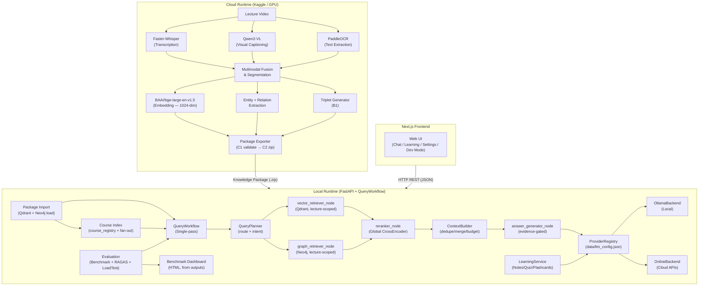

# ARCHITECTURE.md

> **Purpose:** How LectureMIND is built — the Cloud/Local split, major subsystems, runtime flow, and production design.
> **Audience:** Engineers onboarding to the codebase · evaluators evaluating system design.
> **Last updated:** 2026-08-15 · reflects the current codebase. Every assertion is traced to verified implementation artifacts.
> **Companion docs:** [FOLDER_STRUCTURE.md](./FOLDER_STRUCTURE.md) (layout) · [PIPELINE.md](./PIPELINE.md) (execution flows) · [DESIGN_DECISIONS.md](./DESIGN_DECISIONS.md) (why)

---

## Table of Contents

- [1. Project Overview](#1-project-overview)
- [2. Foundational Constraint: Cloud / Local Split](#2-foundational-architectural-constraint-cloud--local-split)
- [3. High-Level Architecture Diagram](#3-high-level-architecture-diagram)
- [4. Major Subsystems](#4-major-subsystems)
- [5. Folder Responsibilities](#5-folder-responsibilities)
- [6. Runtime Architecture Overview](#6-runtime-architecture-overview)
- [7. Entry Points](#7-entry-points)
- [8. Design Patterns Identified](#8-design-patterns-identified)
- [9. Production Reliability & Scalability](#9-production-reliability--scalability)

---

## 1. Project Overview

**LectureMIND** is a modular, AI-powered learning platform that transforms lecture videos into
interactive, queryable knowledge bases. The system is organized around a core principle:
**expensive AI processing happens once, in the cloud; lightweight AI-assisted learning happens
continuously, locally**.

The core AI capability is **GraphRAG** (Graph-augmented Retrieval-Augmented Generation),
combining:
- **Semantic vector search** (Qdrant) for finding conceptually relevant passages.
- **Knowledge graph traversal** (Neo4j) for reasoning over entity relationships extracted from lectures.

These two retrieval modes are unified through a single-pass orchestration pipeline
(`agent/langgraph/workflow.py`) that generates grounded, citation-backed answers to student
questions, running entirely on a laptop.

---

## 2. Foundational Architectural Constraint: Cloud / Local Split

The defining constraint of the entire architecture is a **strict separation of execution
environments**:

| Execution Environment | Location | Purpose |
|---|---|---|
| **Cloud Runtime** | Kaggle / GPU infrastructure | Heavy ingestion: transcription, OCR, visual captioning, chunking, embedding, graph extraction, triplet generation |
| **Local Runtime** | Student's laptop | Lightweight inference: chat, quizzes, flashcards, notes |

This split is enabled by **Knowledge Packages** — portable, self-contained directories (or ZIP
archives) produced by the cloud pipeline. The local server loads these packages directly,
reconstituting the AI's knowledge store (Qdrant + Neo4j) without re-running any expensive
computation.

---

## 3. High-Level Architecture Diagram



---

## 4. Major Subsystems

### 4.1 Cloud Ingestion Pipeline (`cloud/`)
Processes raw lecture media into Knowledge Packages (`cloud/orchestration/run_ingestion_pipeline.py`).
Runs on GPU-equipped infrastructure (Kaggle). Stages (A1–C2):

- **A1 Metadata** — FFprobe → `metadata.json` (duration, fps, etc.)
- **A2+A3 Transcription + Frame Extraction** (concurrent) — Faster-Whisper → `transcript.json`;
  keyframe extraction → `frames/`
- **A4 Visual Captioning** — Qwen2-VL → `vlm_output.jsonl` (slide descriptions)
- **A5 OCR** — PaddleOCR (CPU subprocess, to avoid CUDA-context contamination) → `ocr_output.jsonl`
- **A6 Multimodal Fusion** — rule-based attachment of visual/OCR to transcript chunks within
  ±2 s of keyframes → `multimodal_chunks.json`
- **A7 Segmentation** — Qwen2.5-7B-Instruct → `segments.json`, `chunk_segment_map.json`
- **A8/A9 Entity + Relation Extraction** — Qwen2.5-7B-Instruct → `entities.json`, `relations.json`
- **B0 Embeddings** — `BAAI/bge-large-en-v1.5` (1024-dim) → `embeddings.npy`, `embedding_ids.json`
- **B1 Triplet Generation** — `triplets.json` (reranker training data)
- **B2 Reranker Fine-tune** *(optional, off by default)* — `reranker_model/`, `training_metrics.json`
- **C1/C2 Validation + Export** — validate → ZIP the Knowledge Package

### 4.2 Local Inference Server (`serving/fastapi/`)
Lightweight FastAPI application. Responsibilities:
- Importing and activating Knowledge Packages (`local/loaders/`, `local/storage/lecture_registry.py`).
- Serving conversational queries through the single-pass workflow (JSON responses with
  timestamped sources + an additive `debug` trace for Developer Mode).
- Managing LLM provider configuration (Ollama + cloud APIs via `ProviderRegistry`).
- Exposing active-learning endpoints (flashcards, notes, quizzes) via `learning_service.py`.
- Course index endpoints (metadata-only fan-out across lectures).

**Key Routes:**
| Route | Purpose |
|---|---|
| `POST /upload` | Imports a Knowledge Package ZIP |
| `GET /lectures` / `POST /lectures/{id}/load` | Lists / activates packages |
| `POST /query` | Conversational query → JSON `{answer, sources[], graph_path[], debug{}}` |
| `POST /courses/query` | Course fan-out query |
| `GET/POST /settings/...` | Provider config, status, model management |
| `POST /api/reranker/upload` | Global reranker upload → atomic replace → hot reload |

### 4.3 Agent / Query Orchestration (`agent/`)
The core reasoning engine. `QueryWorkflow` is a **single-pass** orchestrator
(`agent/langgraph/workflow.py`) — no memory, no tool calls, no autonomous loops.

| Component | Responsibility |
|---|---|
| `QueryPlanner` (`agent/dspy/planner.py`) | Classifies query → route (`vector_only` / `graph_only` / `graph_and_vector`) + `plan_full()` intent, lecture-wide flag, `need_visual`, budgets |
| `vector_retriever_node` | Qdrant ANN (lecture-scoped; raises without `lecture_id`) |
| `graph_retriever_node` | Neo4j bounded 1–3-hop traversal (lecture-scoped) |
| `reranker_node` | Cross-encoder rerank + ContextBuilder assembly |
| `answer_generator_node` | Evidence-gated generation via the active LLM backend; builds `sources` only from retrieved chunks |

### 4.4 Retrieval System (`retrieval/`)
- **Vector Retrieval** (`retrieval/vector_retriever/qdrant_retriever.py`) — Qdrant semantic
  nearest-neighbor search (1024-dim) + lecture-wide timeline sampling.
- **Hybrid BM25 + RRF** (`retrieval/hybrid/bm25_retriever.py`) — lazy per-lecture BM25 index
  over Qdrant payloads, fused with dense candidates via Reciprocal Rank Fusion before
  reranking (default-on).
- **Graph Retrieval** (`retrieval/graph_retriever/neo4j_retriever.py`) — bounded Cypher
  traversal, all 6 relation types, exact→partial match.
- **Fusion + Rerank** (`retrieval/reranker/rerank_service.py`) — merges fused + graph results,
  dedupes by `chunk_id`, scores with the global cross-encoder (optional int8 quantization).
- **Context Assembly** (`retrieval/context_builder.py`) — dedupe, chronological sort,
  adjacent-merge, OCR-noise sanitization, priority Transcript > OCR > Visual, budget
  enforcement; selects evidence by rerank score and renders it chronologically.
- **Course fan-out** (`retrieval/course_retriever.py`) — queries member lectures only,
  dedupes on `(lecture_id, chunk_id)`.

### 4.5 LLM Provider Layer (`local/llm/`)
Implements the **Strategy Pattern** with Dependency Inversion via the `LLMBackend` ABC:
- `OllamaBackend` — local Ollama daemon (offline, privacy-first; optionally GPU-accelerated).
- `OnlineBackend` — unified wrapper for OpenAI / Gemini / Groq / OpenRouter / Anthropic /
  any OpenAI-compatible endpoint.
- `ProviderRegistry` — JSON-backed factory (`data/llm_config.json`); auto-falls back to Ollama
  if the active online provider fails.
- `RateLimiter` (`local/llm/rate_limiter.py`) — per-provider token/request budgets shared
  across all callers; `OnlineBackend` retries 429/transient errors with `Retry-After`-aware
  exponential backoff.
- `ProviderManager` — runtime health checker mapping SDK errors to `ProviderStatus`.

### 4.6 Evaluation Framework (`evaluation/`)
Offline benchmark system that directly invokes `QueryWorkflow` (bypassing HTTP):
- `BenchmarkRunner` — dataset iteration + workflow invocation + state extraction; injectable
  Qdrant / embedding / reranker / Neo4j / LLM dependencies.
- Metric modules: planner (routing + visual routing), retrieval, reranker, answer, citation,
  latency.
- `ReportGenerator` — mean/p95/min/max/n per metric + per-type/difficulty breakdowns →
  CSV / JSON / Markdown.
- `Dashboard` — self-contained HTML renderer over existing outputs (never re-runs evals).
- Real dataset: `evaluation/datasets/cs162_lecture1_qa_50.json` (curated 50 questions).

### 4.7 Frontend (`frontend/`)
Next.js 14 + React 18 + TypeScript web UI. Communicates with the FastAPI server over HTTP
(JSON). Supports chat, active-learning tools, provider settings, knowledge-graph visualization
(reactflow), and a Developer Mode that renders the per-query pipeline trace.

---

## 5. Folder Responsibilities

| Folder | Role |
|---|---|
| `cloud/` | Cloud-side ingestion pipeline (orchestration, extraction, fusion, packaging, reranker training) |
| `agent/` | Query orchestration: `dspy/planner.py`, `langgraph/workflow.py`, `langgraph/nodes/` |
| `retrieval/` | Vector / graph / course retrievers, reranker service, context builder |
| `local/` | LLM backends + provider registry, loaders, storage registries, services, docker compose |
| `serving/` | FastAPI app, routes, learning service |
| `evaluation/` | Benchmark runner, metrics, reports, dashboard, datasets, load testing, RAGAS |
| `frontend/` | Next.js web UI |
| `schemas/` | Shared Pydantic models + closed enums |
| `scripts/` | `train_global_reranker.py`, `trace_query.py`, validators |
| `data/` | Runtime data: `llm_config.json`, `lecture_registry.json`, `courses.json`, `packages/` |
| `config.py` | Settings classes: `SharedSettings`, `CloudSettings`, `LocalSettings` |

---

## 6. Runtime Architecture Overview

### 6.1 Startup Sequence (Local Server)

```
uvicorn serving.fastapi.app:app
    ├── _run_startup_audit()
    │       └── Validates the Knowledge Package registry on the filesystem
    ├── _run_model_recovery()
    │       └── Eagerly loads the Global Reranker (BAAI/bge-reranker-base)
    │           ← zero LLM provider validation; zero Ollama contact
    └── _try_restore_active_lecture()
            └── Reconnects to Qdrant + Neo4j if a lecture was previously active
```

> **Design Note:** The startup sequence performs zero LLM provider initialization. Provider
> status is deferred to runtime actions via `/settings`. The server starts cleanly even with no
> API keys and no local models installed.

### 6.2 Query Execution Path

```
POST /query (HTTP Request)
    └── routes/query.py
            ├── Validates the active lecture
            ├── Builds QueryWorkflow (planner, retrievers, reranker, LLM)
            └── Returns JSON {answer, sources[], graph_path[], debug{}}
                    │
                    └── workflow.run(query, lecture_id):
                            [1] QueryPlanner.plan → retrieval route
                            [2] Conditional retrieval:
                                  graph_retriever_node (Neo4j, if graph route)
                                  vector_retriever_node (Qdrant — ALWAYS runs,
                                      graph_only included, so answers stay grounded)
                            [3] reranker_node → ContextBuilder → final_context
                            [4] answer_generator_node → active LLM backend
                                  → evidence-gated answer + sources + graph_path
```

### 6.3 Inter-Module Communication

| From | To | Mechanism |
|---|---|---|
| Frontend | FastAPI | HTTP REST (JSON) |
| `routes/query.py` | `QueryWorkflow` | Direct Python instantiation |
| `QueryWorkflow` | `ProviderRegistry` | Singleton accessor function call |
| `ProviderRegistry` | `LLMBackend` | Factory instantiation (lazy, ephemeral) |
| `vector_retriever_node` | Qdrant | `qdrant_client` Python SDK |
| `graph_retriever_node` | Neo4j | `neo4j` Python driver (Cypher queries) |
| `reranker_node` | Reranker model | `sentence_transformers` in-process |
| `LearningService` | `ProviderRegistry` | Same path as query pipeline |
| Cloud → Local | Knowledge Package | ZIP / directory transfer |
| `BenchmarkRunner` | `QueryWorkflow` | Direct Python instantiation (no HTTP) |

---

## 7. Entry Points

| Entry Point | Path / Command | Purpose |
|---|---|---|
| Local inference server | `uvicorn serving.fastapi.app:app` | Start local API |
| Cloud ingestion pipeline | `cloud/orchestration/run_ingestion_pipeline.py` | Run cloud processing on GPU (Kaggle) |
| Evaluation benchmark | `evaluation/benchmark_runner.py` | Offline RAG quality measurement |
| Dashboard | `python -m evaluation.dashboard.dashboard_generator` | Render eval outputs → HTML |

---

## 8. Design Patterns Identified

| Pattern | Where Applied |
|---|---|
| **Strategy** | `LLMBackend` ABC → `OllamaBackend` / `OnlineBackend` |
| **Factory Method** | `ProviderRegistry._resolve_backend()` |
| **Singleton** | `ProviderRegistry` (global accessor), `rerank_service` (app-level global) |
| **Dependency Inversion** | Workflow nodes depend on `LLMBackend` abstraction, not concrete backends |
| **Pipeline / Chain-of-Responsibility** | Single-pass flow: planner → retrievers → reranker → generator |
| **Repository** | `ProviderRegistry` is the single source of truth for LLM configuration |
| **Template Method** | `BenchmarkRunner._evaluate_sample()` template for per-sample evaluation |
| **Injector** | `BenchmarkRunner` accepts Qdrant / embedding / reranker / Neo4j / LLM dependencies |

---

## 9. Production Reliability & Scalability

1. **Per-Provider Rate Limiting & Backoff:** The rate limiter (`local/llm/rate_limiter.py`) dynamically enforces token and request quotas with exponential jitter backoff, ensuring uninterrupted high-concurrency workloads.
2. **Hybrid Lexical & Semantic Retrieval:** Dense vector representations (`bge-large-en-v1.5`) combined with BM25 lexical indexing and Reciprocal Rank Fusion (RRF) capture both contextual semantics and exact numeric/entity tokens.
3. **Strict Scoping & Zero-Data Leakage:** Neo4j constraints and Qdrant payload filters strictly scope all operations by `(entity_id, lecture_id)`, ensuring complete multi-tenant isolation.
