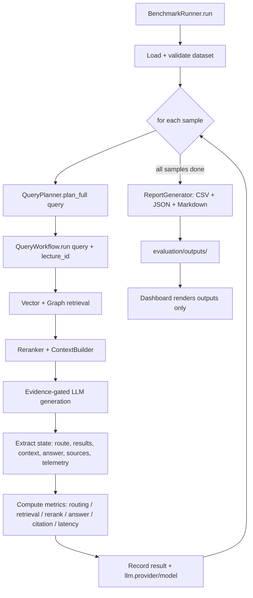

# EVALUATION.md

> **Purpose:** How LectureMIND is measured — dataset format, metric implementations, report generation, and the measured results.
> **Audience:** Engineers running benchmarks; interviewers checking the numbers behind the claims.
> **Last updated:** 2026-08-11 · reflects the current harness (real keyword recall, real rerank scores, citation verification, per-type/p95 reporting) and the measured run (curated 50-question set).
> **Companion docs:** [METRICS_MATRIX.md](../METRICS_MATRIX.md) (scorecard) · [RETRIEVAL_SYSTEM.md](./RETRIEVAL_SYSTEM.md) (what is being measured)

---

## Table of Contents

- [1. Framework Overview](#1-framework-overview)
- [2. Benchmark Dataset Format](#2-benchmark-dataset-format)
- [3. Benchmark Execution Flow](#3-benchmark-execution-flow)
- [4. Metric Module Implementations](#4-metric-module-implementations)
- [5. Report Generation](#5-report-generation)
- [6. Measured Results](#6-measured-results)
- [7. Benchmark Invocation](#7-benchmark-invocation)

---

## 1. Framework Overview

LectureMIND includes a dedicated offline evaluation framework for measuring the quality of the entire RAG pipeline. It is completely **decoupled from the FastAPI layer** — it invokes `QueryWorkflow` directly as a Python object, bypassing HTTP entirely.

**Why decoupled?**
- The HTTP layer adds latency, serialization overhead, and streaming complexity that obscures intermediate pipeline state.
- Direct instantiation lets the benchmark runner inspect internal state (like `vector_results`, `reranked_results`, `telemetry`) that is never exposed via the API.
- This makes metric collection exact and deterministic.

**Primary Files:**
| File | Role |
|---|---|
| `evaluation/benchmark_runner.py` | Main orchestrator (injectable deps: Qdrant, embeddings, reranker, Neo4j, LLM) |
| `evaluation/dataset_loader.py` | Loads and validates the benchmark dataset |
| `evaluation/metrics/planner_metrics.py` | Routing accuracy (+ visual routing accuracy) |
| `evaluation/metrics/retrieval_metrics.py` | Precision, Recall, Hit, MRR, NDCG |
| `evaluation/metrics/reranker_metrics.py` | Ranking quality, cross-encoder scores |
| `evaluation/metrics/answer_metrics.py` | Answer similarity, answer F1, keyword recall, context/answer lengths |
| `evaluation/metrics/citation_metrics.py` | Citation coverage, completeness, chunk coverage |
| `evaluation/metrics/latency_metrics.py` | Per-node and total latency |
| `evaluation/reports/report_generator.py` | Aggregation (mean/p95/min/max/n + per-type/difficulty breakdowns) and output generation |
| `evaluation/datasets/cs162_lecture1_qa_50.json` | Curated 50-question QA set (CS162 lecture) |
| `evaluation/datasets/sample_dataset.json` | Minimal format example |

---

## 2. Benchmark Dataset Format

**Files:** `evaluation/datasets/cs162_lecture1_qa_50.json` (curated 50 questions)  \
**Schema:** Array of `BenchmarkSample` objects

```json
{
  "lecture_id": "lecture_cs162_v17",
  "query": "What is the Global Data Plane project?",
  "ground_truth_answer": "The Global Data Plane is a project looking at hardened data containers — cryptographically hardened containers of data...",
  "expected_chunk_ids": [
    "CS162_Lecture_1_What_is_an_Operating_System_720P_chunk_000053"
  ],
  "expected_route": "vector_only",
  "question_type": "definition",
  "difficulty": "easy",
  "topic": "what-is-an-os",
  "keywords": ["definition", "kernel", "vendor", "universally accepted"],
  "need_visual": false
}
```

| Field | Type | Used By |
|---|---|---|
| `lecture_id` | `str` | Scopes every workflow call (isolation guards apply) |
| `query` | `str` | All metrics — the question sent to the pipeline |
| `ground_truth_answer` | `str` | `answer_metrics.calculate_answer_similarity` / `calculate_answer_f1` |
| `expected_chunk_ids` | `list[str]` | `retrieval_metrics.*`, `reranker_metrics.*`, `citation_metrics.*` |
| `expected_route` | `str` | `planner_metrics.calculate_routing_accuracy` (must match `RetrievalRoute` **enum names**: `vector_only` / `graph_only` / `graph_and_vector`) |
| `question_type` | `str` | Report breakdowns (e.g. `factual`, `conceptual`, `definition`, `summary`, `relationship`, `visual`) |
| `difficulty` | `str` | Report breakdowns (`easy` / `medium` / `hard`) |
| `topic` | `str` | Optional labeling |
| `keywords` | `list[str]` | `answer_metrics.calculate_keyword_recall` — must contain terms the answer should reproduce |
| `need_visual` | `bool` | `visual_routing_accuracy` — whether the planner must set `need_visual` |

> **Ground-truth integrity:** every `expected_chunk_id` in the CS162 set is verified by a
> content-containment script (the chunk's transcript/visual/OCR text must contain at least
> one of the sample's keywords) and confirmed present in Qdrant. Anchors are not hand-picked
> guesses — they are machine-verified answer chunks.

---

## 3. Benchmark Execution Flow



**Entry:**
```python
from evaluation.benchmark_runner import BenchmarkRunner

runner = BenchmarkRunner(
    dataset_path="evaluation/datasets/cs162_lecture1_qa_50.json",
    output_dir="evaluation/outputs",
    # Optional injections: qdrant_client, embedding_model, reranker_service,
    # neo4j_driver, ollama_client, use_provider_registry_llm=True
)
runner.setup()
runner.run()
```

When a dependency is omitted the runner builds it from the live local stack
(Qdrant at `localhost:6333`, preloaded `bge-large-en-v1.5`, the global cross-encoder
from `GLOBAL_RERANKER_DIR`, and the active LLM backend via `ProviderRegistry`).
`use_provider_registry_llm=False` + `ollama_client=<client>` forces the local Ollama backend.

**Per-sample flow:**
```
BenchmarkRunner._evaluate_sample(sample)
    ├── plan = QueryPlanner().plan_full(sample.query)      # route + need_visual
    ├── state = QueryWorkflow.run(query, lecture_id)        # real pipeline
    ├── actual_route     = state["retrieval_route"].name    # enum NAME (graph_and_vector)
    ├── actual_need_visual = plan.need_visual
    ├── retrieved_ids    = chunk_ids from graph_results + vector_results
    ├── reranked_results / final_context / answer / sources / telemetry
    ├── compute metrics (Section 4)
    └── record result + llm provenance {provider, model}
```

---

## 4. Metric Module Implementations

### 4.1 Planner Metrics (`planner_metrics.py`)

- **`routing_accuracy`** — `1.0` if `expected_route == actual_route` (case-insensitive), else `0.0`.
  The runner normalizes the actual route to the enum **name** (`graph_and_vector`), so dataset
  values and runtime values share one vocabulary.
- **`visual_routing_accuracy`** — same binary comparison between the sample's `need_visual`
  and the planner's `plan_full().need_visual` (labels `need_visual` / `no_visual`).

### 4.2 Retrieval Metrics (`retrieval_metrics.py`)

All retrieval metrics compare `expected_ids` vs `retrieved_ids` (the pre-rerank pool — the
hybrid-fused dense + BM25 candidates plus graph results, deduped by `chunk_id`). Relevance is
binary: a chunk is relevant iff its `chunk_id` is in `expected_chunk_ids`.

- `precision@5` — of the top-5 retrieved, the fraction that are relevant.
- `recall@5` — of all relevant chunks, the fraction in the top-5.
- `hit@5` — 1.0 if any relevant chunk appears in the top-5.
- `mrr` — reciprocal rank of the first relevant chunk.
- `ndcg_at_5` — position-weighted gain, normalized.

### 4.3 Reranker Metrics (`reranker_metrics.py`)

- **`ranking_quality`** — MRR of the **reranked** list against `expected_ids`.
- **`avg_cross_encoder_score`** — mean of `rerank_score` across reranked results
  (reads `rerank_score`, with a `score` fallback for legacy callers). Returns `0.0` on empty input.

### 4.4 Answer Metrics (`answer_metrics.py`)

- **`answer_similarity`** — Jaccard token overlap vs the ground truth (no semantic awareness).
- **`answer_f1`** — SQuAD-style token-level F1 vs the ground truth (more forgiving than Jaccard;
  rewards partial overlap, penalizes length mismatch; `0.0` if either side is empty).
- **`keyword_recall`** — fraction of `sample.keywords` found in the answer. Returns **`0.0`**
  on an empty keyword list (an empty list must never report perfect recall).
- `context_length` / `answer_length` — character counts.

### 4.5 Citation Metrics (`citation_metrics.py`)

- `citation_count` — unique `chunk_id`s in `state["sources"]`.
- `citation_coverage` — fraction of expected chunks cited in the answer.
- **`citation_completeness`** — verifies each cited source is actually present in the
  reranked retrieved set (i.e. no hallucinated citations). `1.0` means every citation is real.
- `chunk_coverage` — fraction of reranked chunks cited.

### 4.6 Latency Metrics (`latency_metrics.py`)

Reads `state["telemetry"]` recorded by `workflow.py` with `time.perf_counter()` around each
stage: `planner_latency`, `retrieval_latency`, `reranker_latency`, `generation_latency`,
`total_latency`.

---

## 5. Report Generation

`evaluation/reports/report_generator.py` writes three files per run:

1. `evaluation_report_{timestamp}.csv` — one row per sample, all metrics as columns.
2. `evaluation_report_{timestamp}.json` — per-sample results + `aggregated_metrics`
   (`{mean, p95, min, max, n}` per metric) + `breakdowns` by `question_type` and `difficulty`
   + `total_samples` / `successful_samples` / `failed_samples`.
3. `evaluation_report_{timestamp}.md` — markdown tables of the aggregated metrics.

`p95` uses nearest-rank over the sorted per-sample values (with `n < 20`, p95 is close to the
second-worst value — read it with that caveat in mind).

---

## 6. Measured Results

Source: `evaluation/outputs/evaluation_report_20260811_105621.*` — **50/50 on a single backend
(Groq `openai/gpt-oss-120b`), 0 errors**, run through the real `QueryWorkflow` (Qdrant → Neo4j →
reranker → LLM). The stack combines semantic chunk merging (97 chunks), hybrid BM25+RRF
retrieval, score-ordered context selection, OCR noise sanitization, and the per-provider rate
limiter. Dataset: `evaluation/datasets/cs162_lecture1_qa_50.json` (23 factual / 17 conceptual /
5 visual / 4 definition / 1 summary).

| Metric | Mean | p95 |
|---|---|---|
| Routing accuracy | 0.980 (49/50) | 1.000 |
| Visual routing accuracy | 1.000 | 1.000 |
| MRR@5 | **0.788** | 1.000 |
| Hit@5 | **0.980** | 1.000 |
| NDCG@5 | **0.767** | 1.000 |
| Recall@5 | **0.862** | 1.000 |
| Precision@5 | 0.280 | 0.400 |
| Ranking quality | **0.918** | 1.000 |
| Answer F1 | **0.459** | 0.714 |
| Keyword recall | **0.545** | 1.000 |
| Citation completeness | 1.000 | 1.000 |
| Citation coverage | **0.927** | 1.000 |
| Chunk coverage | 1.000 | 1.000 |
| Mean end-to-end latency | 20.5 s | 22.8 s |

**How the stack achieves these numbers:**
- Semantic chunk merging gives answer chunks complete passages instead of fragments.
- Hybrid BM25 lexical retrieval (RRF fusion, default-on) recovers exact entity names and numeric
  facts dense-only misses (the "Linux lines of code" evidence sits at BM25 rank 0).
- Score-ordered context selection prevents a top-ranked chunk late in the timeline from being
  dropped by the budget.
- The rate limiter keeps all calls on one backend with retry/backoff — no quota fallback.

Graph paths are rendered into the LLM context (`[Graph] EntityA -RELATION-> EntityB`), so relationship answers are explicitly grounded in the knowledge graph structure.

---

## 7. Benchmark Invocation

```bash
# From the project root, with .venv activated:
.venv/bin/python -c "
from evaluation.benchmark_runner import BenchmarkRunner
runner = BenchmarkRunner(
    dataset_path='evaluation/datasets/cs162_lecture1_qa_50.json',
    output_dir='evaluation/outputs'
)
runner.setup()
runner.run()
"
```

Output appears in `evaluation/outputs/`. The dashboard is a pure renderer over those files:

```bash
.venv/bin/python -m evaluation.dashboard.dashboard_generator
# → evaluation/dashboard/index.html
```
