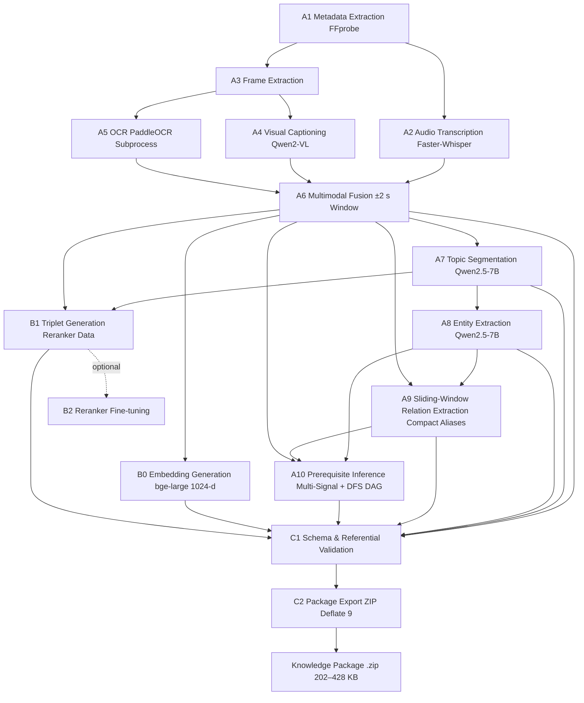

# PIPELINE.md

> **Purpose:** Step-by-step execution flows for every major pipeline — ingestion (A1–A11), server startup, package import, query, active learning, and LLM switching.
> **Audience:** Engineers tracing how data moves through the system.
> **Last updated:** 2026-08-11 · every step is traced from the current source. Complements ARCHITECTURE.md (design) — this file is about flow.
> **Companion docs:** [ARCHITECTURE.md](./ARCHITECTURE.md) (design) · [RETRIEVAL_SYSTEM.md](./RETRIEVAL_SYSTEM.md) (retrieval deep dive)

---

## Table of Contents

- [1. Cloud Ingestion Pipeline](#1-cloud-ingestion-pipeline)
- [2. Local Server Startup Pipeline](#2-local-server-startup-pipeline)
- [3. Knowledge Package Import Pipeline](#3-knowledge-package-import-pipeline)
- [4. Knowledge Package Activation Pipeline](#4-knowledge-package-activation-pipeline)
- [5. Conversational Query Pipeline](#5-conversational-query-pipeline)
- [6. Socratic Prerequisite Back-Tracking Pipeline](#6-socratic-prerequisite-back-tracking-pipeline)
- [7. Knowledge Graph Quality & Prerequisite Audit Pipeline](#7-knowledge-graph-quality--prerequisite-audit-pipeline)
- [8. Active Learning Pipeline](#8-active-learning-pipeline-flashcards-notes-quizzes)
- [9. LLM Provider Switching Pipeline](#9-llm-provider-switching-pipeline)
- [10. Provider Status Check Pipeline](#10-provider-status-check-pipeline)
- [11. Configuration Loading Pipeline](#11-configuration-loading-pipeline)

---

## 1. Cloud Ingestion Pipeline

**Entry point:** `cloud/orchestration/run_ingestion_pipeline.py`

**Input:** Raw lecture video file (`.mp4`) or PDF slides  
**Final output:** A ZIP archive — the Knowledge Package



The cloud orchestrator runs the pipeline in the following sequential stages:

---

### Stage A1 — Metadata Extraction
**Module:** `cloud/ingestion/metadata/metadata_extractor.py`  
**Input:** Video file path  
**Output:** `metadata.json`  
**Algorithm:** Extracts video duration, title, resolution, and codec information using FFprobe/OpenCV header reading. Writes a structured JSON with lecture metadata.

---

### Stage A2 — Audio Transcription (runs concurrently with A3)
**Module:** `cloud/ingestion/whisper_pipeline/transcriber.py`  
**Input:** Audio track extracted from video (FFmpeg)  
**Output:** `transcript.json` — array of `{ text, start, end }` timestamp segments  
**Algorithm:**
1. FFmpeg strips the audio channel from the video into a WAV/PCM stream.
2. Faster-Whisper (GPU-accelerated CTranslate2 backend) runs beam-search ASR on the audio.
3. The result is a list of timed segments with millisecond-accurate start/end timestamps.
4. The full `transcript.json` is written to the lecture output directory.

**Why it exists:** Timestamped transcripts allow the system to correlate spoken content with video frames and create temporally coherent chunks.

---

### Stage A3 — Video Frame Extraction (runs concurrently with A2)
**Module:** `cloud/ingestion/frame_extraction/frame_extractor.py`  
**Input:** Video file  
**Output:** `frames/` directory — extracted keyframes as JPEG images (`frame_0001.jpg`, etc.) + `frames.json` (timestamp-to-filename mapping)  
**Algorithm:**
1. FFmpeg decodes the video at scene-change boundaries and periodic intervals.
2. Frames are filtered for uniqueness (structural similarity threshold) to avoid redundant OCR on static slides.
3. Each extracted frame is stored with a timestamp that links it to the transcript.

**Why it exists:** Lecture slides contain critical information (equations, diagrams, labels) that is not present in the audio transcript. Frame extraction feeds the visual processing stages.

---

### Stage A4 — Visual Captioning (VLM)
**Module:** `cloud/ingestion/qwen_pipeline/visual_understanding.py` (`Qwen2-VL`)  
**Input:** Selected keyframes from `frames/`  
**Output:** `vlm_output.jsonl` — one JSON record per frame with generated caption  
**Algorithm:**
1. Each selected frame is passed to Qwen2-VL with a structured prompt.
2. Qwen2-VL generates a rich natural-language description of diagrams, charts, equations, and text visible on the slide.
3. Captions are written as JSONL, indexed by frame timestamp.

**Why it exists:** Qwen2-VL produces semantically rich descriptions of visual content — diagrams, formulas, flowcharts — that are impossible to capture through OCR alone.

---

### Stage A5 — OCR Extraction
**Module:** `cloud/ingestion/paddleocr_pipeline/ocr_engine.py` (`PaddleOCR`)  
**Input:** Selected keyframes from `frames/`  
**Output:** `ocr_output.jsonl` — one JSON record per frame with extracted raw text  
**Algorithm:**
1. PaddleOCR is invoked inside an isolated subprocess (preventing CUDA context contamination with HuggingFace/PyTorch models).
2. For each frame, PaddleOCR detects and recognizes text regions, returning bounding boxes and text strings.
3. The raw text strings are concatenated per frame and written to `ocr_output.jsonl`.

**Why it exists:** PaddleOCR excels at extracting structured text (bullet points, labels, numbers) that Qwen2-VL might paraphrase. The two sources are complementary.

---

### Stage A6 — Multimodal Fusion
**Module:** `cloud/ingestion/fusion/multimodal_fusion.py`  
**Input:** `transcript.json` + `vlm_output.jsonl` + `ocr_output.jsonl` + `frames.json`  
**Output:** `multimodal_chunks.json` — array of multimodal chunk objects  
**Algorithm:**
1. The transcript is segmented into time-bounded windows. For each window, the corresponding visual content (VLM caption + OCR text) is attached using a temporal alignment window (±2 s of keyframes).
2. Each fused unit becomes a **chunk**: a single text block combining spoken words + visual descriptions + slide OCR text.
3. Chunks are enriched with metadata: `chunk_id`, `start_time`, `end_time`, and modality flags.
4. Chunks are written to `multimodal_chunks.json`.

**Why it exists:** Multimodal fusion ensures that queries about visual content (e.g., "What did the diagram on slide 5 show?") can be answered from the vector index, even though the visual information was never spoken aloud.

---

### Stage A7 — Topic Segmentation
**Module:** `cloud/segmentation/segmenter.py` (Qwen2.5-7B-Instruct)  
**Input:** `multimodal_chunks.json`  
**Output:** `segments.json` — array of topic segments, each containing a list of chunk IDs  
**Algorithm:**
1. Chunks are grouped into coherent topic segments using semantic boundary detection.
2. Qwen2.5-7B-Instruct generates descriptive, human-readable segment titles.
3. Segment boundaries prevent context fragmentation during graph construction.

**Why it exists:** Segments provide the organizational structure for graph nodes and are the unit of analysis for the triplet generator.

---

### Stage A8 — Entity Extraction
**Module:** `cloud/extraction/entity_extractor.py` (Qwen2.5-7B-Instruct)  
**Input:** `segments.json` + `multimodal_chunks.json`  
**Output:** `entities.json` — array of typed named entities (concepts, architectures, algorithms, mechanisms)  
**Algorithm:**
1. For each segment, Qwen2.5-7B-Instruct extracts core domain concepts and entities.
2. Entities are assigned canonical names, definitions, entity types, and source chunk anchors.
3. Strict deduplication ensures entity names are unified across segments.

**Why it exists:** Entities form the nodes of the knowledge graph and anchor prerequisite dependencies.

---

### Stage A9 — Relation Extraction (Sliding-Window + Compact Aliases)
**Module:** `cloud/extraction/relation_extractor.py` (Qwen2.5-7B-Instruct)  
**Input:** `entities.json` + `multimodal_chunks.json`  
**Output:** `relations.json` — array of typed directed relations  
**Algorithm:**
1. **Sliding-Window Chunk Context:** Chunks are processed in sliding windows to capture both intra-chunk and inter-chunk relational context without exceeding LLM context limits.
2. **Compact Entity Alias Remapping:** Entities active in the window are mapped to compact aliases (`E1, E2, ... En`). This cuts prompt token usage by ~65%, allowing the LLM to process long 85-minute lectures without truncation.
3. **Structured Prompting with Schema Constraints:** The LLM outputs relation triples using compact aliases (`E1 -> REL -> E2`), which are dynamically remapped to canonical entity names.
4. **Pedagogical Exclusion Rules:** Strict filters reject low-signal or non-pedagogical relations (e.g., trivial mentions or physical slide layout).
5. **8192-Token Retry Budget:** Dynamic retry mechanism recovers valid relations even under dense extraction conditions.
6. **Referential Integrity Enforcement:** Every relation endpoint is verified against `entities.json`, ensuring a **0.0% dangling relation rate** (262 verified relations across benchmark lectures in `0-output/`).

**Why it exists:** The knowledge graph enables relationship-aware traversal — answering "How does concept A relate to concept C?" by traversing graph edges rather than relying on textual similarity alone.

---

### Stage A10 — Prerequisite Inference & DAG Enforcement
**Module:** `cloud/extraction/prerequisite_extractor.py` and `local/loaders/prerequisite_enricher.py`  
**Input:** `entities.json` + `relations.json` + `multimodal_chunks.json`  
**Output:** `prerequisites.json` — strictly acyclic directed prerequisite graph (`PREREQUISITE_OF`)  
**Algorithm:**
1. **Candidate Pair Generation & Search Space Pruning:** Entity pairs are generated where candidate $A$ precedes or co-occurs with $B$. Segment containment and temporal precedence gates filter out 60%+ unpromising pairs.
2. **Multi-Signal Scoring Function:** Computes a composite confidence score ($S \in [0, 1]$):
   - **Chronological Precedence ($W=0.30$):** Earlier first-introduction timestamp gives a directional bonus.
   - **Lexical Co-occurrence with Negative Lookbehinds ($W=0.30$):** Textual co-occurrence regex ensures candidate mentions are not mere substrings of larger terms.
   - **Segment Containment ($W=0.25$):** Concepts spanning prerequisite introductory segments score higher.
   - **Pedagogical Inversion Guard:** Enforces that fundamental foundational concepts are prerequisites to derived mechanisms, reversing inverted co-occurrence artifacts.
3. **Thresholding ($\ge 0.65$):** Pairs meeting or exceeding the calibrated threshold are retained.
4. **Deterministic DFS Cycle Resolution:** Evaluates the graph for cycles; any detected mutual cycle ($A \to B \to A$) or multi-hop loop has its lower-scoring edge pruned deterministically.
5. **Acyclicity Verification:** Guarantees **Strict DAG = True, 0 cycles, 0 self-loops**.

**Why it exists:** Provides the mathematical backbone for curriculum sequencing and Socratic back-tracking — enabling students who don't understand concept $B$ to traverse backward to its required foundational concepts $A$.

---

### Stage B0 — Embedding Generation
**Module:** `cloud/embeddings/embedding_generator.py` (`BAAI/bge-large-en-v1.5`)  
**Input:** `multimodal_chunks.json` (text fields of each chunk)  
**Output:**
- `embeddings.npy` — NumPy array of shape `[N, 1024]` (N = number of chunks)
- `embedding_ids.json` — ordered list of `chunk_id`s corresponding to each embedding row

**Algorithm:**
1. Each chunk's text is encoded by `bge-large-en-v1.5` into a 1024-dimensional dense vector.
2. Encoding is batched on GPU with FP16 precision.
3. The embedding matrix is saved as a NumPy `.npy` file; the corresponding `chunk_id` order is saved to `embedding_ids.json`.

**Dimension enforcement:** `SharedSettings.EMBEDDING_DIMENSION = 1024` with a Pydantic validator (`must_be_1024`) guarantees compatibility with local Qdrant collections.

---

### Stage B1 — Triplet Generation (for offline reranker training)
**Module:** `cloud/training/triplet_generator.py` (Qwen2.5-7B-Instruct)  
**Input:** `segments.json` + `multimodal_chunks.json`  
**Output:** `triplets.json` — array of `RerankerTriplet` objects  
**Algorithm:**
1. **Query synthesis:** Qwen2.5-7B-Instruct generates 3–5 realistic student questions for each segment.
2. **Positive pairing:** Each question is paired with a chunk from the same segment.
3. **Hard negative pairing:** A chunk from a sibling topic segment is selected as the hard negative — semantically related but factually distinct.
4. Triplet schema validation ensures `{ query, positive_chunk_id, negative_chunk_id }` integrity.

**Why it exists:** Triplets provide the contrastive training signal for fine-tuning the cross-encoder reranker.

---

### Stage B2 — Reranker Fine-tuning (optional)
**Module:** `cloud/training/reranker_trainer.py`  
**Input:** Accumulated `triplets.json`  
**Output:** Fine-tuned cross-encoder checkpoint (`reranker_model/`) + `training_metrics.json`  
**Algorithm:** Runs cross-entropy contrastive fine-tuning on `BAAI/bge-reranker-base`. Disabled by default in single-lecture runs to save compute.

---

### Stage C1 — Validation
**Module:** `cloud/packaging/validator.py`  
**Input:** All generated artifacts in the lecture output directory  
**Output:** Validation report (`status: "valid"`)  
**Algorithm:**
- Verifies that all required files exist and are non-empty.
- Validates JSON schemas for `manifest.json`, `segments.json`, `entities.json`, `relations.json`, `multimodal_chunks.json`.
- Validates embedding matrix shape `(N, 1024)` against `embedding_ids.json` count.
- Confirms referential integrity: 0.0% dangling relations.

---

### Stage C2 — Package Export
**Module:** `cloud/packaging/exporter.py`  
**Input:** Validated lecture output directory  
**Output:** `lecture_{id}_knowledge_package.zip` — compressed archive (**202–428 KB**, ~2,800× smaller than source video)  

**`PACKAGE_FILES` list (files included in the ZIP):**
```
manifest.json
segments.json
entities.json
relations.json
prerequisites.json     ← strictly acyclic prerequisite DAG
embeddings.npy         ← 1024-dim dense vectors
embedding_ids.json
multimodal_chunks.json
triplets.json          ← included for downstream fine-tuning
```

**`EXCLUDED_FILES` list (stripped from ZIP to reduce size):**
```
vlm_output.jsonl       ← intermediate VLM output
ocr_output.jsonl       ← intermediate OCR output
transcript.json        ← intermediate audio transcript
metadata.json          ← intermediate FFprobe metadata
frames.json            ← intermediate frame index
frames/                ← raw video keyframes (1+ GB)
```

**Package validation:** `cloud/packaging/validator.py` verifies that all `PACKAGE_FILES` exist and are non-empty before creating the ZIP.

**Manifest construction:** `cloud/packaging/manifest_builder.py` creates `manifest.json` with package version, lecture ID, pipeline configuration, and file checksums.

---

## 2. Local Server Startup Pipeline

**Entry point:** `uvicorn serving.fastapi.app:app`

```
[1] FastAPI lifespan() begins
        │
        ├── [2] _run_startup_audit()
        │       • Scans data/packages/ for directories
        │       • Cross-references against registry JSON
        │       • Logs warnings for "orphaned" packages (directory exists but no registry entry)
        │       • Logs warnings for "ghost" entries (registry entry but no directory)
        │
        ├── [3] _run_model_recovery()
        │       • Instantiates BAAI/bge-reranker-base via sentence_transformers.CrossEncoder
        │       • Stores the loaded model in the global rerank_service singleton
        │       • Logs "Reranker loaded successfully" or raises if model files missing
        │       • Does NOT contact Ollama. Does NOT validate any LLM API keys.
        │
        └── [4] _try_restore_active_lecture()
                • Reads persisted "active lecture" state (if any)
                • Attempts to reconnect to Qdrant (vector DB) and Neo4j (graph DB)
                • If successful: lecture_manager marks lecture as active
                • If databases unavailable: logs warning, starts with no active lecture
                • API becomes fully ready regardless of outcome
```

---

## 3. Knowledge Package Import Pipeline

**Trigger:** `POST /lectures/import` — frontend uploads a `.zip` file  
**Module:** `serving/fastapi/routes/lectures.py` → `import_knowledge_package()`

```
[Step 1] Receive ZIP upload
         • FastAPI receives multipart/form-data
         • Saves to a temp directory

[Step 2] Package validation
         • local/loaders/package_validator.py runs
         • REQUIRED_FILES check (manifest.json, segments.json, entities.json,
           relations.json, embeddings.npy, embedding_ids.json, multimodal_chunks.json)
         • Optional files (metadata.json, transcript.json, triplets.json) are noted
           but do NOT fail validation if absent
         • If validation fails → HTTP 400 with list of missing files

[Step 3] Extraction
         • ZIP is extracted to data/packages/lecture_{id}/
         • Lecture ID is derived from a UUID or hash in the manifest

[Step 4] Registry entry creation
         • A registry record is created in the packages JSON registry
         • Records: lecture_id, display_name, import timestamp, file paths

[Step 5] Graph import into Neo4j
         • local/loaders/neo4j_loader.py reads entities.json + relations.json
         • Parses nodes (entities) and edges (relations) from JSON
         • Executes Cypher MERGE/CREATE statements to populate Neo4j
         • Creates indexes on entity names for fast Cypher lookup
         • Nodes/edges are scoped by (entity_id, lecture_id) for isolation

[Step 5b] Prerequisite graph import & enrichment
         • Checks for prerequisites.json in the extracted package directory
         • If absent (legacy package): local/loaders/prerequisite_enricher.py infers
           prerequisites on the fly and saves prerequisites.json
         • neo4j_loader.py loads all PREREQUISITE_OF directed edges into Neo4j
         • Creates indexes on PREREQUISITE_OF relationship types for sub-millisecond
           back-tracking traversal

[Step 6] Read metadata.json (optional)
         • If metadata_path.exists(): reads JSON for title, duration, etc.
         • If absent: defaults to empty dict, uses display_name from upload form

[Step 7] Vector index loading into Qdrant
         • local/loaders/qdrant_loader.py reads embeddings.npy + embedding_ids.json
         • Loads multimodal_chunks.json to retrieve chunk text payloads
         • Creates a Qdrant collection named lecture_{id}
         • Upserts all vectors with their chunk_id and text as payload

[Step 8] Optional: load triplets.json
         • If present: stored in lecture directory for future offline training use
         • Not loaded into any database — remains on disk

[Step 9] Return success response
         • HTTP 200 with lecture metadata summary
```

---

## 4. Knowledge Package Activation Pipeline

**Trigger:** `POST /lectures/{id}/load`  
**Module:** `serving/fastapi/routes/lectures.py`

```
[1] Look up lecture_id in registry → get file paths
[2] Reconnect Qdrant client to collection lecture_{id}
[3] Reconnect Neo4j driver to graph (already populated from import)
[4] Initialize embedding model for query encoding
    • BAAI/bge-large-en-v1.5 loaded via sentence_transformers
    • Stored in lecture_manager for this active session
[5] Set lecture_manager.active_lecture = lecture_id
[6] Persist active lecture state for next server restart
[7] Return HTTP 200 — lecture is now queryable
```

---

## 5. Conversational Query Pipeline

**Trigger:** `POST /query` with `{ "question": "..." }`  
**Module:** `serving/fastapi/routes/query.py` → `QueryWorkflow`

### 5.1 HTTP Layer
```
POST /query
    → routes/query.py
        → Validates: is there an active lecture? (lecture_manager.active_lecture)
        → If no active lecture: HTTP 400
        → Instantiates QueryWorkflow(
              qdrant_client=...,
              neo4j_driver=...,
              reranker_service=...,
              ollama_client=...
          )
        → state = workflow.run(query=question, lecture_id=...)
        → Returns JSON {answer, sources[], graph_path[], debug{}}
```

### 5.2 QueryWorkflow Execution

The `QueryWorkflow` (`agent/langgraph/workflow.py`) is a **single-pass** orchestrator — a plain
Python class, no `langgraph` dependency (node functions are structured to be drop-in
LangGraph-compatible). Execution flows through stages in sequence:

```
State initialized:
{
  query, lecture_id,
  retrieval_route: None,
  graph_results: [],
  vector_results: [],
  reranked_results: [],
  final_context: "",
  answer: "",
  sources: [],
  graph_path: [],
  telemetry: {}
}
```

**Stage 1: `QueryPlanner`** (`agent/dspy/planner.py`)
```
Input:  query
Action: Heuristic keyword classification (no LLM call, no I/O):
        - GRAPH_PATTERNS (prerequisite/related/connected/depends/...)
        - VECTOR_PATTERNS (summarize/explain/describe/define/...)
        Route = graph_and_vector if both match, graph_only if graph only,
                vector_only otherwise.
        plan_full() additionally computes intent (factual_qa, summary,
        definition, comparison, quiz, ...), is_lecture_wide, top_k,
        context_budget, and need_visual (diagram/figure/image/slide/visual).

Output: state["retrieval_route"] = RetrievalRoute.{graph_only,vector_only,graph_and_vector}
Telemetry: records t_plan_start, t_plan_end
```

**Stage 2: Conditional retrieval**
```
Input:  state["query"], state["lecture_id"], state["retrieval_route"]
Action:

  IF route in (graph_only, graph_and_vector):
    → graph_retriever_node → retrieval/graph_retriever/neo4j_retriever.py
    → Extracts entity mentions from query; bounded 1–3-hop Cypher traversal
      (exact match, then partial/substring match); lecture-scoped (raises
      without lecture_id)
    → state["graph_results"] = [{start_name, related_name, rel_types, hops}]

  Vector retrieval ALWAYS runs (all routes, incl. graph_only — so answers
  stay grounded in lecture text):
    → vector_retriever_node → retrieval/vector_retriever/qdrant_retriever.py
    → Encodes query with bge-large-en-v1.5 → 1024-dim vector
    → Qdrant.search(collection, query_vector, top_k from plan)
    → state["vector_results"] = [{chunk_id, score, payload}]

  Hybrid lexical fusion (ENABLE_HYBRID_RETRIEVAL, default ON):
    → retrieval/hybrid/bm25_retriever.py builds/updates a lazy BM25 index
      per lecture from Qdrant payloads, searches the query, and fuses the
      dense + BM25 lists with Reciprocal Rank Fusion into the top_k pool
    → The reranker then sees dense + lexical + graph evidence together

Telemetry: records t_retrieve_start, t_retrieve_end
```

**Stage 3: `reranker_node`** (`agent/langgraph/nodes/reranker.py`)
```
Input:  state["query"], state["graph_results"], state["vector_results"]
Action:
  1. Merge + dedupe vector results by chunk_id (rerank_service._extract_passages)
  2. Render graph results (entity names + relation types) as labelled [Graph]
     paths via _build_graph_context, capped at half the context budget
     (graph relations reach final_context even without a chunk_id)
  3. Score (query, chunk_text) pairs with BAAI/bge-reranker-base in a batch
  4. Sort by score descending; attach rerank_score
  5. ContextBuilder assembles final_context (dedupe, chronological order,
     adjacent-merge, OCR-noise filter, priority Transcript > OCR > Visual >
     Graph, budget enforcement; need_visual gates [Visual] sections); the
     [Graph] section is prepended

Output: state["reranked_results"], state["final_context"]
Telemetry: records t_rerank_start, t_rerank_end
```

**Stage 4: `answer_generator_node`** (`agent/langgraph/nodes/answer_generator.py`)
```
Input:  state["query"], state["final_context"]
Action:
  1. If final_context is empty → answer = "Insufficient evidence found in lecture."
  2. Resolve backend: injected LLMBackend, else OllamaBackend(client), else
     ProviderRegistry.get_active_backend() (reads data/llm_config.json)
  3. Build messages (system prompt: evidence-grounded, language-pinned,
     refusal rule) + user prompt (context + question + style hint)
  4. backend.generate_with_metadata(messages) — non-streaming
  5. If backend returns empty (e.g. provider 429) → refusal fallback
  6. sources built ONLY from reranked_results (chunk_id + timestamp);
     graph_path built from graph_results names

Output: state["answer"], state["sources"], state["graph_path"], state["llm_metadata"]
Telemetry: records t_gen_start, t_gen_end
```

### 5.3 Response Delivery
```
The route returns JSON:
  { "answer": "...", "sources": [{chunk_id, timestamp, segment_id}],
    "graph_path": [...], "debug": {...} }
```

---

## 6. Socratic Prerequisite Back-Tracking Pipeline

**Trigger:** `GET /lectures/{lecture_id}/prerequisites/{concept_name}`  
**Module:** `serving/fastapi/routes/prerequisites.py`

### 6.1 Flow Overview
```
[1] GET /lectures/{lecture_id}/prerequisites/{concept_name}
        │
        ├── [2] Connect to Neo4j & query inbound PREREQUISITE_OF edges
        │       • MATCH (prereq:Entity)-[:PREREQUISITE_OF*1..4]->(target:Entity)
        │       • WHERE toLower(target.name) = toLower($concept_name)
        │       • Returns paths, distance (depth), confidence scores, and relation metadata
        │
        ├── [3] Fallback to prerequisites.json (if Neo4j unavailable)
        │       • Reads data/packages/lecture_{id}/prerequisites.json from disk
        │       • Runs in-memory reverse breadth-first traversal
        │
        ├── [4] Build Dependency Subgraph & Topological Ordering
        │       • Constructs directed acyclic dependency subgraph
        │       • Computes Kahn's topological sort (earliest prerequisite first)
        │       • Groups prerequisites by dependency depth (depth 1 = immediate, depth 2 = transitive)
        │
        ├── [5] Retrieve Chronological Anchor Chunks
        │       • Scans multimodal_chunks.json for earliest mention of each prerequisite concept
        │       • Extracts chunk_id, timestamp, text snippet, and slide visual context
        │
        └── [6] Return Structured Socratic Learning Response
                • JSON {
                    lecture_id,
                    target_concept,
                    total_prerequisites,
                    max_depth,
                    prerequisite_chain: [{ concept, depth, confidence, anchor_chunks[] }],
                    topological_order: ["Kernel", "Virtual Memory", "Operating System"],
                    learning_pathway: "To understand Operating System, first review Kernel, then Virtual Memory."
                  }
```

---

## 7. Knowledge Graph Quality & Prerequisite Audit Pipeline

**Trigger:** `evaluation/knowledge_graph/audit_package.py`  
**Purpose:** Comprehensive offline validation of knowledge graph integrity, prerequisite topological correctness, and GraphRAG downstream retrieval quality.

```bash
./.venv/bin/python evaluation/knowledge_graph/audit_package.py \
  --package 0-output/CS162_Lecture_1_What_is_an_Operating_System_720P_knowledge_package.zip \
  --output-dir outputs/kg_quality_cs162/
```

### 7.1 Pipeline Execution Stages
```
[Step 1] Package Extraction & Artifact Loading
         • Loads entities.json, relations.json, prerequisites.json, multimodal_chunks.json

[Step 2] Entity Fragment & Orphan Rate Audit
         • Computes average entity name length (excludes trivial stop-fragments)
         • Audits orphan rate: entities without at least one relation or prerequisite edge

[Step 3] Relation Referential Integrity Audit
         • Validates that source and target of every relation exist in entities.json
         • Measured: 0.0% dangling relation rate (262/262 valid across 3 benchmark lectures in `0-output/`)
         • Audits inverse consistency and schema type compliance

[Step 4] Bipartite Prerequisite Matching against Gold Labels
         • Normalizes entity names (case-insensitive, lemmatized, punctuation-stripped)
         • Bipartite maximum-weight matching against gold annotations (prerequisite_gold.json)
         • Computes Strict Precision (77.8%), Strict Recall (70.0%), and Strict F1 (73.7%)

[Step 5] Deterministic Graph Topology Audit
         • Builds directed NetworkX DiGraph from inferred edges
         • Checks acyclicity: strict DAG = True
         • Evaluates cycle count: 0 cycles, 0 self-loops
         • Verifies that mutual cycles were deterministically pruned

[Step 6] Downstream GraphRAG Retrieval Test
         • Simulates 1-hop and 2-hop entity neighbor retrieval for concept queries
         • Confirms chunks associated with graph neighbors improve context coverage
```

---

## 8. Active Learning Pipeline (Flashcards, Notes, Quizzes)

**Trigger:** learning endpoints under `serving/fastapi/learning_service.py`  
**Module:** `serving/fastapi/learning_service.py`

```
[1] Verify active lecture
[2] Query Qdrant for a broad sample of chunk embeddings
    (or use all chunks from multimodal_chunks.json)
[3] Assemble context from chunk texts
[4] Construct specialized prompt:
    For flashcards: "Generate N question-answer pairs from this lecture context..."
    For notes:      "Generate structured hierarchical markdown notes from this context..."
[5] Call ProviderRegistry.get_active_backend()  ← same path as query pipeline
[6] Generate response (non-streaming for structured output)
[7] Parse and return JSON (flashcards) or Markdown (notes)
```

**Key constraint:** Both services use `ProviderRegistry` — they automatically switch backends whenever the user changes provider settings.

---

## 9. LLM Provider Switching Pipeline

**Trigger:** `PATCH /settings` with `{ "inference_mode": "online", "active_provider_id": "gemini" }`

```
[1] SettingsRoute validates request body
[2] ProviderRegistry reads current data/llm_config.json
[3] ProviderRegistry.update_provider_config(new_config)
    → Writes updated JSON atomically to data/llm_config.json
[4] No server restart needed
[5] Next query to ProviderRegistry.get_active_backend() will read updated JSON
    → instantiates OnlineBackend with new provider credentials
[6] In-flight queries (if any) continue on the old LLMBackend instance
    → old instance is garbage collected when the query completes
```

---

## 10. Provider Status Check Pipeline

**Trigger:** `GET /settings/status`

```
[1] SettingsRoute calls ProviderManager.get_status()
[2] ProviderManager reads ProviderRegistry to determine active mode
[3] IF offline mode:
        → Calls OllamaLoader.check_model_ready(model_name)
        → Queries Ollama daemon: GET localhost:11434/api/tags
        → Checks if configured model is in available models list
        → Maps result to ProviderStatus enum:
            AVAILABLE / MODEL_MISSING / NOT_INSTALLED
[4] IF online mode:
        → Calls OnlineBackend.test_connection(provider_id, api_key, model)
        → Makes a minimal test API call to the provider
        → Catches SDK errors → maps to ProviderStatus:
            AVAILABLE / MISSING_API_KEY / INVALID_API_KEY / NETWORK_ERROR
[5] Returns { status: "Available", message: "..." }
```

---

## 11. Configuration Loading Pipeline

**Module:** `config.py`  
**Triggered:** At Python module import time (once per process)

```
[1] Python imports config.py
[2] SharedSettings() is instantiated:
    → pydantic-settings reads .env file
    → Validates EMBEDDING_DIMENSION == 1024 (field_validator)
    → extra="ignore" → silently drops unknown env vars
[3] LocalSettings() is instantiated (local server only):
    → Reads NEO4J_URI, QDRANT_URL, cache dirs from .env
    → OLLAMA_MODEL (fallback string if llm_config.json absent)
[4] CloudSettings() is instantiated (cloud pipeline only):
    → Reads Kaggle output paths, ENABLE_PADDLEOCR, Kafka broker URL
    → extra="ignore" → silently drops local-only vars
[5] Singleton instances exported:
    shared_settings = SharedSettings()
    local_settings = LocalSettings()   ← only safe to import in local/ and serving/
    cloud_settings = CloudSettings()   ← only safe to import in cloud/
```

**Isolation guarantee:** The `extra="ignore"` setting prevents cross-environment failures (e.g., a cloud-only env var like `KAFKA_BROKER` in `.env` will not crash `LocalSettings` initialization).

---

*Phase 2 documentation. Additional pipeline details for evaluation are in EVALUATION.md.*
