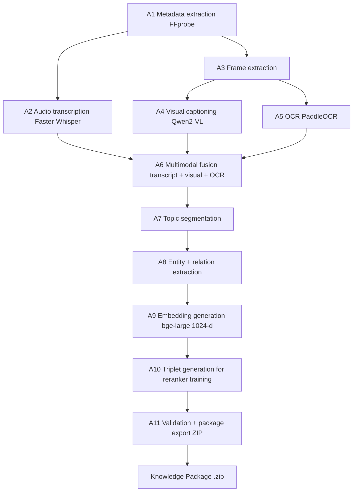

# PIPELINE.md

> **Purpose:** Step-by-step execution flows for every major pipeline — ingestion (A1–A11), server startup, package import, query, active learning, and LLM switching.
> **Audience:** Engineers tracing how data moves through the system.
> **Last updated:** 2026-08-11 · every step is traced from the current source. Complements ARCHITECTURE.md (design) — this file is about flow.
> **Companion docs:** [ARCHITECTURE.md](./ARCHITECTURE.md) (design) · [RETRIEVAL_SYSTEM.md](./RETRIEVAL_SYSTEM.md) (retrieval deep dive)

---

## Table of Contents

- [1. Cloud Ingestion Pipeline](#1-cloud-ingestion-pipeline)
- [2. Local Server Startup Pipeline](#2-local-server-startup-pipeline)
- [3. Knowledge Package Import Pipeline](#3-knowledge-package-import-pipeline)
- [4. Knowledge Package Activation Pipeline](#4-knowledge-package-activation-pipeline)
- [5. Conversational Query Pipeline](#5-conversational-query-pipeline)
- [6. Active Learning Pipeline](#6-active-learning-pipeline-flashcards-notes-quizzes)
- [7. LLM Provider Switching Pipeline](#7-llm-provider-switching-pipeline)
- [8. Provider Status Check Pipeline](#8-provider-status-check-pipeline)
- [9. Configuration Loading Pipeline](#9-configuration-loading-pipeline)

---

## 1. Cloud Ingestion Pipeline

**Entry point:** `cloud/orchestration/run_ingestion_pipeline.py`

**Input:** Raw lecture video file (`.mp4`) or PDF slides  
**Final output:** A ZIP archive — the Knowledge Package



The cloud orchestrator runs the pipeline in the following sequential stages:

---

### Stage A1 — Metadata Extraction
**Module:** Cloud orchestrator initial step  
**Input:** Video file path  
**Output:** `metadata.json`  
**Algorithm:** Extracts video duration, title, resolution, and codec information using FFprobe/OpenCV header reading. Writes a structured JSON with lecture metadata.

---

### Stage A2 — Audio Transcription (runs concurrently with A3)
**Module:** Faster-Whisper ASR  
**Input:** Audio track extracted from video (FFmpeg)  
**Output:** `transcript.json` — array of `{ text, start, end }` timestamp segments  
**Algorithm:**
1. FFmpeg strips the audio channel from the video into a WAV/PCM stream.
2. Faster-Whisper (GPU-accelerated CTranslate2 backend) runs beam-search ASR on the audio.
3. The result is a list of timed segments. Each segment contains the spoken text and precise start/end timestamps in seconds.
4. The full `transcript.json` is written to the lecture output directory.

**Why it exists:** Timestamped transcripts allow the system to correlate spoken content with video frames and create temporally coherent chunks.

---

### Stage A3 — Video Frame Extraction (runs concurrently with A2)
**Module:** OpenCV / FFmpeg frame extractor  
**Input:** Video file  
**Output:** `frames/` directory — extracted keyframes as JPEG images (`frame_0001.jpg`, etc.) + `frames.json` (timestamp-to-filename mapping)  
**Algorithm:**
1. FFmpeg decodes the video at a configurable FPS (e.g., 1 frame per second, or at scene-change boundaries).
2. Frames are filtered for uniqueness (scene-change detection) to avoid redundant OCR on static slides.
3. Each extracted frame is stored with a timestamp that links it to the transcript.

**Why it exists:** Lecture slides contain critical information (equations, diagrams, labels) that is not present in the audio transcript. Frame extraction feeds the visual processing stages.

---

### Stage A4 — Visual Captioning (VLM)
**Module:** `Qwen2-VL` (Vision-Language Model)  
**Input:** Selected keyframes from `frames/`  
**Output:** `vlm_output.jsonl` — one JSON record per frame with generated caption  
**Algorithm:**
1. Each selected frame is passed to Qwen2-VL with a structured prompt (e.g., "Describe the content of this lecture slide in detail").
2. Qwen2-VL generates a rich natural-language description of diagrams, charts, equations, and text visible on the slide.
3. Captions are written as JSONL (one JSON object per line), indexed by frame timestamp.

**Why it exists:** Qwen2-VL produces semantically rich descriptions of visual content — diagrams, formulas, flowcharts — that are impossible to capture through OCR alone.

---

### Stage A5 — OCR Extraction
**Module:** `PaddleOCR` (runs in a subprocess for GPU isolation)  
**Input:** Selected keyframes from `frames/`  
**Output:** `ocr_output.jsonl` — one JSON record per frame with extracted raw text  
**Algorithm:**
1. PaddleOCR is invoked as a subprocess (to prevent CUDA context contamination with other models).
2. For each frame, PaddleOCR detects and recognizes text regions, returning bounding boxes and text strings.
3. The raw text strings are concatenated per frame and written to `ocr_output.jsonl`.

**Why it exists:** PaddleOCR excels at extracting structured text (bullet points, labels, numbers) that Qwen2-VL might paraphrase. The two sources are complementary.

---

### Stage A6 — Multimodal Fusion
**Module:** `cloud/ingestion/fusion.py` (inferred)  
**Input:** `transcript.json` + `vlm_output.jsonl` + `ocr_output.jsonl` + `frames.json`  
**Output:** `multimodal_chunks.json` — array of chunk objects  
**Algorithm:**
1. The transcript is split into time-bounded windows. For each window, the corresponding visual content (VLM caption + OCR text) is identified by matching timestamps.
2. Each fused unit becomes a **chunk**: a single text block combining spoken words + visual descriptions for that time window.
3. Chunks are enriched with metadata: `chunk_id`, `start_time`, `end_time`, `source` (transcript/visual), and the raw text.
4. Chunks are written to `multimodal_chunks.json`.

**Why it exists:** Multimodal fusion ensures that queries about visual content (e.g., "What did the diagram on slide 5 show?") can be answered from the vector index, even though the visual information was never spoken aloud.

---

### Stage A7 — Topic Segmentation
**Module:** Cloud segmenter  
**Input:** `multimodal_chunks.json`  
**Output:** `segments.json` — array of topic segments, each containing a list of chunk IDs  
**Algorithm:**
1. Chunks are grouped into coherent topic segments using semantic similarity or sliding-window topic detection.
2. Each segment represents a logical section of the lecture (e.g., "Introduction to Photosynthesis", "Light-Dependent Reactions").
3. Segment boundaries are determined to prevent context fragmentation during graph construction.

**Why it exists:** Segments provide the organizational structure for graph nodes and are the unit of analysis for the triplet generator.

---

### Stage A8 — Knowledge Graph Construction
**Module:** Cloud graph extractor  
**Input:** `segments.json` + `multimodal_chunks.json`  
**Output:**
- `entities.json` — named entities (concepts, terms, people)
- `relations.json` — directed relationships between entities

**Algorithm:**
1. For each segment, Qwen2.5-7B-Instruct extracts named entities (A8).
2. Relation extraction (A9) identifies directed relationships between entities within and across segments (e.g., `[Operating System] --EXPLAINS--> [Kernel]`).
3. Entities and relations are serialized as JSON; the local importer (`neo4j_loader.py`) loads them into Neo4j as nodes/edges on package import.

**Why it exists:** The knowledge graph enables relationship-aware retrieval — answering "How does concept A relate to concept C?" by traversing graph edges rather than relying on textual similarity alone.

---

### Stage A9 — Embedding Generation
**Module:** `BAAI/bge-large-en-v1.5` via HuggingFace  
**Input:** `multimodal_chunks.json` (text fields of each chunk)  
**Output:**
- `embeddings.npy` — NumPy array of shape `[N, 1024]` (N = number of chunks)
- `embedding_ids.json` — ordered list of `chunk_id`s corresponding to each embedding row

**Algorithm:**
1. Each chunk's text is encoded by `bge-large-en-v1.5` into a 1024-dimensional dense vector.
2. Encoding is done in batches for GPU efficiency.
3. The embedding matrix is saved as a NumPy `.npy` file; the corresponding `chunk_id` order is saved to `embedding_ids.json`.

**Dimension enforcement:** `SharedSettings.EMBEDDING_DIMENSION = 1024` with a Pydantic validator (`must_be_1024`) ensures this dimension is never accidentally changed to an incompatible value (768 from an older `bge-base` model would cause silent mismatches at query time).

---

### Stage A10 — Triplet Generation (for offline reranker training)
**Module:** `cloud/training/triplet_generator.py`  
**Input:** `segments.json` + `multimodal_chunks.json`  
**Output:** `triplets.json` — array of `RerankerTriplet` objects  
**Algorithm:**
1. For each segment, `generate_triplets()` is called.
2. **Query synthesis:** `Qwen2.5-7B-Instruct` generates 3–5 realistic student questions that a student might ask about the content in that segment.
3. **Positive pairing:** Each synthesized question is paired with a chunk from the same segment (the positive example).
4. **Hard negative pairing:** A chunk from a *different* segment (a sibling in the topic hierarchy) is selected as the hard negative — semantically related but not the correct answer.
5. Each triplet `{ query, positive_chunk_id, negative_chunk_id }` is validated against the `RerankerTriplet` Pydantic schema (no empty strings, valid chunk IDs).
6. Valid triplets are written to `triplets.json`.

**Why it exists:** Triplets are the training signal for fine-tuning the cross-encoder reranker offline. Collecting them per-lecture allows the system to accumulate a lecture-specific training set over time.

---

### Stage A11 — Package Export
**Module:** `cloud/packaging/exporter.py`  
**Input:** All output files in the lecture output directory  
**Output:** `lecture_{id}.zip` — the Knowledge Package archive  

**`PACKAGE_FILES` list (files included in the ZIP):**
```
manifest.json
segments.json
entities.json
relations.json
embeddings.npy
embedding_ids.json
multimodal_chunks.json
triplets.json          ← optional, included if generated
```

**`EXCLUDED_FILES` list (stripped from ZIP to reduce size):**
```
vlm_output.jsonl       ← intermediate VLM output (not needed at runtime)
ocr_output.jsonl       ← intermediate OCR output (not needed at runtime)
transcript.json        ← legacy; optional at load time
metadata.json          ← legacy; optional at load time
frames.json            ← intermediate frame index
frames/                ← raw video keyframes (large, not needed)
```

**Package validation:** `cloud/packaging/validator.py` verifies that all `PACKAGE_FILES` exist and are non-empty before creating the ZIP.

**Manifest construction:** `cloud/packaging/manifest_builder.py` creates `manifest.json` with package version, lecture ID, pipeline configuration, and file checksums.

---

## 2. Local Server Startup Pipeline

**Entry point:** `uvicorn serving.fastapi.app:app`

```
[1] FastAPI lifespan() begins
        │
        ├── [2] _run_startup_audit()
        │       • Scans data/packages/ for directories
        │       • Cross-references against registry JSON
        │       • Logs warnings for "orphaned" packages (directory exists but no registry entry)
        │       • Logs warnings for "ghost" entries (registry entry but no directory)
        │
        ├── [3] _run_model_recovery()
        │       • Instantiates BAAI/bge-reranker-base via sentence_transformers.CrossEncoder
        │       • Stores the loaded model in the global rerank_service singleton
        │       • Logs "Reranker loaded successfully" or raises if model files missing
        │       • Does NOT contact Ollama. Does NOT validate any LLM API keys.
        │
        └── [4] _try_restore_active_lecture()
                • Reads persisted "active lecture" state (if any)
                • Attempts to reconnect to Qdrant (vector DB) and Neo4j (graph DB)
                • If successful: lecture_manager marks lecture as active
                • If databases unavailable: logs warning, starts with no active lecture
                • API becomes fully ready regardless of outcome
```

---

## 3. Knowledge Package Import Pipeline

**Trigger:** `POST /lectures/import` — frontend uploads a `.zip` file  
**Module:** `serving/fastapi/routes/lectures.py` → `import_knowledge_package()`

```
[Step 1] Receive ZIP upload
         • FastAPI receives multipart/form-data
         • Saves to a temp directory

[Step 2] Package validation
         • local/loaders/package_validator.py runs
         • REQUIRED_FILES check (manifest.json, segments.json, entities.json,
           relations.json, embeddings.npy, embedding_ids.json, multimodal_chunks.json)
         • Optional files (metadata.json, transcript.json, triplets.json) are noted
           but do NOT fail validation if absent
         • If validation fails → HTTP 400 with list of missing files

[Step 3] Extraction
         • ZIP is extracted to data/packages/lecture_{id}/
         • Lecture ID is derived from a UUID or hash in the manifest

[Step 4] Registry entry creation
         • A registry record is created in the packages JSON registry
         • Records: lecture_id, display_name, import timestamp, file paths

[Step 5] Graph import into Neo4j
         • local/loaders/neo4j_loader.py reads entities.json + relations.json
         • Parses nodes (entities) and edges (relations) from JSON
         • Executes Cypher MERGE/CREATE statements to populate Neo4j
         • Creates indexes on entity names for fast Cypher lookup
         • Nodes/edges are scoped by (entity_id, lecture_id) for isolation

[Step 6] Read metadata.json (optional)
         • If metadata_path.exists(): reads JSON for title, duration, etc.
         • If absent: defaults to empty dict, uses display_name from upload form

[Step 7] Vector index loading into Qdrant
         • local/loaders/qdrant_loader.py reads embeddings.npy + embedding_ids.json
         • Loads multimodal_chunks.json to retrieve chunk text payloads
         • Creates a Qdrant collection named lecture_{id}
         • Upserts all vectors with their chunk_id and text as payload

[Step 8] Optional: load triplets.json
         • If present: stored in lecture directory for future offline training use
         • Not loaded into any database — remains on disk

[Step 9] Return success response
         • HTTP 200 with lecture metadata summary
```

---

## 4. Knowledge Package Activation Pipeline

**Trigger:** `POST /lectures/{id}/load`  
**Module:** `serving/fastapi/routes/lectures.py`

```
[1] Look up lecture_id in registry → get file paths
[2] Reconnect Qdrant client to collection lecture_{id}
[3] Reconnect Neo4j driver to graph (already populated from import)
[4] Initialize embedding model for query encoding
    • BAAI/bge-large-en-v1.5 loaded via sentence_transformers
    • Stored in lecture_manager for this active session
[5] Set lecture_manager.active_lecture = lecture_id
[6] Persist active lecture state for next server restart
[7] Return HTTP 200 — lecture is now queryable
```

---

## 5. Conversational Query Pipeline

**Trigger:** `POST /query` with `{ "question": "..." }`  
**Module:** `serving/fastapi/routes/query.py` → `QueryWorkflow`

### 5.1 HTTP Layer
```
POST /query
    → routes/query.py
        → Validates: is there an active lecture? (lecture_manager.active_lecture)
        → If no active lecture: HTTP 400
        → Instantiates QueryWorkflow(
              qdrant_client=...,
              neo4j_driver=...,
              reranker_service=...,
              ollama_client=...
          )
        → state = workflow.run(query=question, lecture_id=...)
        → Returns JSON {answer, sources[], graph_path[], debug{}}
```

### 5.2 QueryWorkflow Execution

The `QueryWorkflow` (`agent/langgraph/workflow.py`) is a **single-pass** orchestrator — a plain
Python class, no `langgraph` dependency (node functions are structured to be drop-in
LangGraph-compatible). Execution flows through stages in sequence:

```
State initialized:
{
  query, lecture_id,
  retrieval_route: None,
  graph_results: [],
  vector_results: [],
  reranked_results: [],
  final_context: "",
  answer: "",
  sources: [],
  graph_path: [],
  telemetry: {}
}
```

**Stage 1: `QueryPlanner`** (`agent/dspy/planner.py`)
```
Input:  query
Action: Heuristic keyword classification (no LLM call, no I/O):
        - GRAPH_PATTERNS (prerequisite/related/connected/depends/...)
        - VECTOR_PATTERNS (summarize/explain/describe/define/...)
        Route = graph_and_vector if both match, graph_only if graph only,
                vector_only otherwise.
        plan_full() additionally computes intent (factual_qa, summary,
        definition, comparison, quiz, ...), is_lecture_wide, top_k,
        context_budget, and need_visual (diagram/figure/image/slide/visual).

Output: state["retrieval_route"] = RetrievalRoute.{graph_only,vector_only,graph_and_vector}
Telemetry: records t_plan_start, t_plan_end
```

**Stage 2: Conditional retrieval**
```
Input:  state["query"], state["lecture_id"], state["retrieval_route"]
Action:

  IF route in (graph_only, graph_and_vector):
    → graph_retriever_node → retrieval/graph_retriever/neo4j_retriever.py
    → Extracts entity mentions from query; bounded 1–3-hop Cypher traversal
      (exact match, then partial/substring match); lecture-scoped (raises
      without lecture_id)
    → state["graph_results"] = [{start_name, related_name, rel_types, hops}]

  Vector retrieval ALWAYS runs (all routes, incl. graph_only — so answers
  stay grounded in lecture text):
    → vector_retriever_node → retrieval/vector_retriever/qdrant_retriever.py
    → Encodes query with bge-large-en-v1.5 → 1024-dim vector
    → Qdrant.search(collection, query_vector, top_k from plan)
    → state["vector_results"] = [{chunk_id, score, payload}]

  Hybrid lexical fusion (ENABLE_HYBRID_RETRIEVAL, default ON):
    → retrieval/hybrid/bm25_retriever.py builds/updates a lazy BM25 index
      per lecture from Qdrant payloads, searches the query, and fuses the
      dense + BM25 lists with Reciprocal Rank Fusion into the top_k pool
    → The reranker then sees dense + lexical + graph evidence together

Telemetry: records t_retrieve_start, t_retrieve_end
```

**Stage 3: `reranker_node`** (`agent/langgraph/nodes/reranker.py`)
```
Input:  state["query"], state["graph_results"], state["vector_results"]
Action:
  1. Merge + dedupe vector results by chunk_id (rerank_service._extract_passages)
  2. Render graph results (entity names + relation types) as labelled [Graph]
     paths via _build_graph_context, capped at half the context budget
     (graph relations reach final_context even without a chunk_id)
  3. Score (query, chunk_text) pairs with BAAI/bge-reranker-base in a batch
  4. Sort by score descending; attach rerank_score
  5. ContextBuilder assembles final_context (dedupe, chronological order,
     adjacent-merge, OCR-noise filter, priority Transcript > OCR > Visual >
     Graph, budget enforcement; need_visual gates [Visual] sections); the
     [Graph] section is prepended

Output: state["reranked_results"], state["final_context"]
Telemetry: records t_rerank_start, t_rerank_end
```

**Stage 4: `answer_generator_node`** (`agent/langgraph/nodes/answer_generator.py`)
```
Input:  state["query"], state["final_context"]
Action:
  1. If final_context is empty → answer = "Insufficient evidence found in lecture."
  2. Resolve backend: injected LLMBackend, else OllamaBackend(client), else
     ProviderRegistry.get_active_backend() (reads data/llm_config.json)
  3. Build messages (system prompt: evidence-grounded, language-pinned,
     refusal rule) + user prompt (context + question + style hint)
  4. backend.generate_with_metadata(messages) — non-streaming
  5. If backend returns empty (e.g. provider 429) → refusal fallback
  6. sources built ONLY from reranked_results (chunk_id + timestamp);
     graph_path built from graph_results names

Output: state["answer"], state["sources"], state["graph_path"], state["llm_metadata"]
Telemetry: records t_gen_start, t_gen_end
```

### 5.3 Response Delivery
```
The route returns JSON:
  { "answer": "...", "sources": [{chunk_id, timestamp, segment_id}],
    "graph_path": [...], "debug": {...} }
```

---

## 6. Active Learning Pipeline (Flashcards, Notes, Quizzes)

**Trigger:** learning endpoints under `serving/fastapi/learning_service.py`  
**Module:** `serving/fastapi/learning_service.py`

```
[1] Verify active lecture
[2] Query Qdrant for a broad sample of chunk embeddings
    (or use all chunks from multimodal_chunks.json)
[3] Assemble context from chunk texts
[4] Construct specialized prompt:
    For flashcards: "Generate N question-answer pairs from this lecture context..."
    For notes:      "Generate structured hierarchical markdown notes from this context..."
[5] Call ProviderRegistry.get_active_backend()  ← same path as query pipeline
[6] Generate response (non-streaming for structured output)
[7] Parse and return JSON (flashcards) or Markdown (notes)
```

**Key constraint:** Both services use `ProviderRegistry` — they automatically switch backends whenever the user changes provider settings.

---

## 7. LLM Provider Switching Pipeline

**Trigger:** `PATCH /settings` with `{ "inference_mode": "online", "active_provider_id": "gemini" }`

```
[1] SettingsRoute validates request body
[2] ProviderRegistry reads current data/llm_config.json
[3] ProviderRegistry.update_provider_config(new_config)
    → Writes updated JSON atomically to data/llm_config.json
[4] No server restart needed
[5] Next query to ProviderRegistry.get_active_backend() will read updated JSON
    → instantiates OnlineBackend with new provider credentials
[6] In-flight queries (if any) continue on the old LLMBackend instance
    → old instance is garbage collected when the query completes
```

---

## 8. Provider Status Check Pipeline

**Trigger:** `GET /settings/status`

```
[1] SettingsRoute calls ProviderManager.get_status()
[2] ProviderManager reads ProviderRegistry to determine active mode
[3] IF offline mode:
        → Calls OllamaLoader.check_model_ready(model_name)
        → Queries Ollama daemon: GET localhost:11434/api/tags
        → Checks if configured model is in available models list
        → Maps result to ProviderStatus enum:
            AVAILABLE / MODEL_MISSING / NOT_INSTALLED
[4] IF online mode:
        → Calls OnlineBackend.test_connection(provider_id, api_key, model)
        → Makes a minimal test API call to the provider
        → Catches SDK errors → maps to ProviderStatus:
            AVAILABLE / MISSING_API_KEY / INVALID_API_KEY / NETWORK_ERROR
[5] Returns { status: "Available", message: "..." }
```

---

## 9. Configuration Loading Pipeline

**Module:** `config.py`  
**Triggered:** At Python module import time (once per process)

```
[1] Python imports config.py
[2] SharedSettings() is instantiated:
    → pydantic-settings reads .env file
    → Validates EMBEDDING_DIMENSION == 1024 (field_validator)
    → extra="ignore" → silently drops unknown env vars
[3] LocalSettings() is instantiated (local server only):
    → Reads NEO4J_URI, QDRANT_URL, cache dirs from .env
    → OLLAMA_MODEL (fallback string if llm_config.json absent)
[4] CloudSettings() is instantiated (cloud pipeline only):
    → Reads Kaggle output paths, ENABLE_PADDLEOCR, Kafka broker URL
    → extra="ignore" → silently drops local-only vars
[5] Singleton instances exported:
    shared_settings = SharedSettings()
    local_settings = LocalSettings()   ← only safe to import in local/ and serving/
    cloud_settings = CloudSettings()   ← only safe to import in cloud/
```

**Isolation guarantee:** The `extra="ignore"` setting prevents cross-environment failures (e.g., a cloud-only env var like `KAFKA_BROKER` in `.env` will not crash `LocalSettings` initialization).

---

*Phase 2 documentation. Additional pipeline details for evaluation are in EVALUATION.md.*
