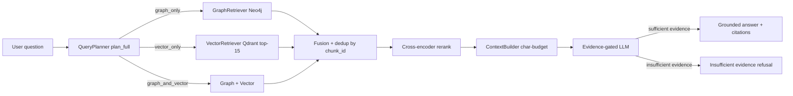

# RETRIEVAL_SYSTEM.md

> **Purpose:** The complete retrieval algorithm — planning, vector + graph retrieval, fusion, reranking, context assembly, and generation.
> **Audience:** Engineers and interviewers who want the retrieval internals with current constants (top-k, budgets, filters).
> **Last updated:** 2026-08-11 · traced from the current source; constants match the live code (`NORMAL_TOP_K = 15`, filler filter, budget-capped context).
> **Companion docs:** [PIPELINE.md](./PIPELINE.md) (overall query flow) · [EVALUATION.md](./EVALUATION.md) (how it's measured)

---

## Table of Contents

- [1. Query Lifecycle Overview](#1-query-lifecycle-overview)
- [2. Query Planning (Routing)](#2-query-planning-routing)
- [3. Vector Retrieval](#3-vector-retrieval)
- [4. Graph Retrieval](#4-graph-retrieval)
- [5. Hybrid Fusion and Deduplication](#5-hybrid-fusion-and-deduplication)
- [6. Reranking (Cross-Encoder)](#6-reranking-cross-encoder)
- [7. Context Assembly](#7-context-assembly)
- [8. Prompt Construction](#8-prompt-construction)
- [9. Response Generation and Streaming](#9-response-generation-and-streaming)
- [10. Retrieval Quality Considerations](#10-retrieval-quality-considerations)

---

## 1. Query Lifecycle Overview



A single user question passes through six distinct stages before an answer is generated:

```
User Question (text string)
        ↓
[Stage 1] Query Planning       → route selection
        ↓
[Stage 2] Retrieval            → raw candidate chunks
        ↓
[Stage 3] Fusion & Dedup       → merged candidate pool
        ↓
[Stage 4] Reranking            → scored, filtered top-K chunks
        ↓
[Stage 5] Context Assembly     → structured prompt context
        ↓
[Stage 6] Response Generation  → grounded streamed answer
```

---

## 2. Query Planning (Routing)

**Where:** `agent/langgraph/nodes/query_planner.py`  
**Why it exists:** Not every question requires both search modalities. Using only the relevant retrieval path reduces latency and noise.

### Routing Algorithm

The `query_planner_node` sends the user query to the active LLM with a classification prompt:

```
System: "You are a retrieval router. Classify this question into exactly one category:
- vector_only: Can be answered by finding semantically similar lecture text.
- graph_only: Requires understanding relationships between concepts.
- hybrid: Requires both semantic search and relationship traversal."

User: "{query}"
Expected response: "vector_only" | "graph_only" | "hybrid"
```

### Route Semantics

| Route | When Used | Example Question |
|---|---|---|
| `vector_only` | Factual questions, definitions, explanations | "What is mitochondria?" |
| `graph_only` | Relationship questions, causal chains | "How does ATP relate to cellular respiration?" |
| `hybrid` | Complex multi-concept queries | "Explain the connection between the light reactions and the Calvin cycle and how their products interact" |

### Output
The planner writes `state["route"]` as a `RetrievalRoute` enum value and `state["plan"]` as a dict containing the routing decision and any supporting metadata from the LLM response.

---

## 3. Vector Retrieval

**Where:** `retrieval/vector_retriever/qdrant_retriever.py`  
**Why it exists:** Dense vector similarity search is the primary tool for finding semantically relevant text — it handles paraphrase, synonyms, and conceptual proximity that keyword search cannot.

### Algorithm: Dense Nearest-Neighbor Search

```
Step 1: Query Encoding
    → The user's question is passed to BAAI/bge-large-en-v1.5
    → Output: 1024-dimensional float32 vector (query embedding)
    → The embedding model is loaded once at lecture activation and reused

Step 2: Approximate Nearest-Neighbor Search (ANN)
    → Qdrant.search(
          collection_name = "lecturemind_chunks",   # single collection, scoped by lecture_id
          query_vector    = query_embedding,          # shape [1024]
          query_filter    = Filter(lecture_id = ...), # hard isolation guard
          limit           = top_k + RETRIEVAL_FETCH_SLACK,  # 15 + 15 = 30 fetched
          with_payload    = True
      )
    → Qdrant uses HNSW (Hierarchical Navigable Small World) index for ANN
    → Returns results sorted by cosine similarity score (0.0 to 1.0)

Step 3: Filler Filtering (query-time, non-destructive)
    → _is_transcript_filler(payload): transcript length < 15 chars AND no OCR / visual content
      (e.g. "OK?", "Okay.", "Yeah.") — measured 6.8% of candidates are filler
    → Filler candidates are dropped from the pool; the fetch slack (15) ensures the
      externally requested top_k = 15 semantics are preserved
    → Visual-only chunks are never dropped (the filter requires a short transcript AND
      no visual/OCR content)

Step 4: Result Formatting
    → Each result is formatted as:
      { "chunk_id": "...", "score": 0.87, "text": "...", "source": "vector" }
    → Written to state["vector_results"]
```

> **Candidate pool size:** `NORMAL_TOP_K = 15` (`agent/dspy/planner.py`) for standard questions;
> lecture-wide summary queries use `LECTURE_WIDE_TOP_K = 15` over temporal buckets. The wide
> pool exists so relevant chunks ranked just outside the top-k (the diagnostic found correct
> chunks at cosine ranks 6–46) still reach the reranker; hybrid BM25 fusion widens it further for
> lexical evidence. The final LLM context is unchanged (budget-capped, see §7).

### Embedding Consistency Guarantee
`SharedSettings.EMBEDDING_DIMENSION = 1024` with a hard Pydantic validator (`must_be_1024`) ensures that both the cloud-side embedding model (which created the Qdrant index) and the local-side query encoder (which produces query vectors) are always the same model (`BAAI/bge-large-en-v1.5`). A mismatch would produce silently wrong results without this guard.

---

## 4. Graph Retrieval

**Where:** `retrieval/graph_retriever/neo4j_retriever.py`  
**Why it exists:** Vector similarity cannot reason about entity relationships. If the lecture graph contains `[ATP] --PRODUCED_BY--> [Krebs Cycle]`, a vector search for "ATP production" might not surface the connection to Krebs Cycle unless the text explicitly contains both terms together. Graph traversal follows the edge directly.

### Algorithm: Entity-Guided Cypher Traversal

```
Step 1: Key Entity Extraction
    → Extract named entities from the query
    → Strategy (inferred): keyword matching against entities.json,
      or a lightweight NER pass using the LLM or spaCy
    → Example: "How does photosynthesis produce oxygen?"
      → entities = ["photosynthesis", "oxygen"]

Step 2: Graph Traversal Query (Cypher) — `retrieval/graph_retriever/neo4j_retriever.py`
    → Entity names are matched case-insensitively; if exact matching returns
      nothing, a partial (substring) match retry resolves natural-language
      queries ("relation", "table") to title-case node names.
    → Bounded traversal with an optional lecture_id isolation filter:
      MATCH (start)
      WHERE toLower(start.name) IN $entity_names
      OPTIONAL MATCH path = (start)-[:<ALL_RELATION_TYPES>*1..N]->(related)
      WHERE related IS NULL OR related.lecture_id = $lecture_id
      RETURN start.entity_id AS start_id, start.name AS start_name,
             start.type AS start_type,
             related.entity_id AS related_id, related.name AS related_name,
             related.type AS related_type,
             [r IN relationships(path) | type(r)] AS rel_types,
             length(path) AS hops

    → Max traversal depth defaults to 3 hops; a missing lecture_id raises
      E2a (cross-lecture data leak guard).

Step 3: Result Conversion
    → Records are normalised into entity-path dicts, NOT chunk references:
      { "start_id": ..., "start_name": "Operating System Diagram",
        "start_type": ..., "related_name": "Network Diagram",
        "rel_types": ["DERIVED_FROM"], "hops": 1 }
    → There is no chunk_id on graph results; the graph answers with
      entity names + relationship types.
    → rerank() renders these entity paths into final_context as labelled
      [Graph] lines (capped at half the context budget), so relationship
      questions are grounded in the relation structure (see METRICS_MATRIX.md
      §2.4).
    → Written to graph_results in the workflow state.
```

### How the Graph Is Persisted
The knowledge graph is exported per lecture as **`entities.json`** and **`relations.json`** inside the knowledge package (`cloud/packaging/exporter.py`), plus `embeddings.npy` for entity vectors. These JSON files are loaded into Neo4j at import time (`serving/` importer) for live traversal; GraphML is not used.

---

## 5. Hybrid Fusion and Deduplication

**Where:** `retrieval/reranker/rerank_service.py::_extract_passages` (invoked by `agent/langgraph/nodes/reranker.py`)  
**Why it exists:** Two problems are solved before reranking: (1) dense embeddings miss exact
lexical evidence (entity names, numeric facts) that BM25 catches, so hybrid fusion widens the
candidate pool; (2) both retrievers may return the same chunk, so duplicates must be removed to
avoid counting the same evidence twice.

### Algorithm

```
Step 0: Lexical candidates (hybrid, ENABLE_HYBRID_RETRIEVAL, default ON)
    → retrieval/hybrid/bm25_retriever.py builds a lazy BM25 index per lecture from
      Qdrant payloads on first query, then fuses dense + BM25 lists with Reciprocal
      Rank Fusion (RRF) into the top-k candidate pool
    → Catches exact-name / numeric evidence absent from the dense top-15 (measured:
      "Linux lines of code" evidence at BM25 rank 0, dense rank absent)

Step 1: Pool Candidates
    → candidates = fused_dense_bm25 + graph_results

Step 2: Deduplication by chunk_id
    → Vector results are added first (they carry full chunk payloads), then graph
      results; a chunk_id seen once is never added twice — the first (vector) entry wins

Step 3: Graph results without chunk payloads
    → Graph results carry entity names + relation types (not passage text) — they never
      enter the rerank pool; they are rendered as labelled [Graph] paths into final_context
      (see §6)

Step 4: Output merged pool
    → Up to 15 fused candidates (+ graph chunks with payloads) before reranking
    → Passed to reranker_node as a flat list
```

---

## 6. Reranking (Cross-Encoder)

**Where:** `agent/langgraph/nodes/reranker.py`  
**Model:** `BAAI/bge-reranker-base` (loaded eagerly at startup as a global singleton)

### Why Cross-Encoder vs. Bi-Encoder

| Aspect | Bi-Encoder (used in retrieval) | Cross-Encoder (used in reranking) |
|---|---|---|
| **How it works** | Encodes query and doc independently; similarity = dot product | Feeds (query, doc) *together* through a Transformer; produces a single relevance scalar |
| **Speed** | Fast (pre-computed doc vectors) | Slow (requires a forward pass per pair) |
| **Accuracy** | Good for broad candidate selection | Much higher for precise relevance scoring |
| **Use case** | Retrieve top-N from millions of chunks | Re-score top-N candidates (N is small) |

The two-stage design is intentional: retrieve broadly with a fast bi-encoder, then re-score precisely with a slow cross-encoder. This balances recall (getting the right chunks into the candidate pool) with precision (selecting only the most relevant for the LLM).

### Reranking Algorithm

```
Step 1: Prepare input pairs
    → pairs = [ (query_text, chunk_text) for each candidate chunk ]
    → Chunk text is extracted from the chunk payload (transcript + OCR + visual context)

Step 2: Batch cross-encoder inference
    → CrossEncoder.predict(pairs)
    → Model: BAAI/bge-reranker-base (dynamic int8 quantization when
      RERANKER_QUANTIZE is enabled, ~3.7x CPU speedup with identical ranking;
      automatic FP32 fallback if quantization fails)
    → Returns: list of float relevance scores, one per pair
    → Scores are raw cross-encoder logits (not probabilities)

Step 3: Sort
    → Sort candidates by score descending
    → No hard score threshold and no fixed trim: every candidate stays in the reranked
      list; the ContextBuilder selects within the character budget (§7)

Step 4: Graph context rendering
    → Graph results (entity paths) are appended as labelled [Graph] context, capped at
      half the context budget so broad graph hits cannot starve transcript evidence

Step 5: Attach scores
    → Each chunk keeps score = cross_encoder_score
    → Written to state["reranked_results"]; final_context is assembled by ContextBuilder
```

### Singleton Design
The cross-encoder model is loaded **once** at server startup into `rerank_service` (global singleton in `serving/fastapi/rerank_service.py`). This prevents:
- Repeated model loading overhead on every query (model is ~560 MB).
- Re-loading on every lecture switch (the reranker is lecture-agnostic).

The `reranker_node` receives `reranker_service` as a constructor argument, injected by `QueryWorkflow`.

---

## 7. Context Assembly

**Where:** `agent/langgraph/nodes/answer_generator.py`  
**Why it exists:** The LLM has a finite context window. Context must be assembled carefully to maximize information density while staying within limits.

### Algorithm

```
Step 1: Order chunks
    → reranked_results is already sorted by cross-encoder score (best first)
    → Use this order: highest-confidence evidence first

Step 2: Concatenate with separators
    → final_context = ""
    → For each chunk in reranked_results:
          final_context += f"[Source: {chunk_id}]\n{chunk['text']}\n\n"

Step 3: Store in state
    → state["final_context"] = final_context
    → state["sources"] = [{ "chunk_id": ..., "text": ..., "score": ... }
                           for chunk in reranked_results]
```

---

## 8. Prompt Construction

**Where:** `agent/langgraph/nodes/answer_generator.py`

The prompt is structured as a standard `messages` list (compatible with all provider APIs):

```python
messages = [
    {
        "role": "system",
        "content": (
            "You are an educational assistant. "
            "Answer the student's question ONLY based on the provided lecture context. "
            "Do not add information from outside the context. "
            "If the context does not contain enough information to answer, say so explicitly. "
            "Cite the source chunk IDs where relevant."
        )
    },
    {
        "role": "user",
        "content": f"Context:\n{final_context}\n\nQuestion: {query}"
    }
]
```

This `messages` list is passed directly to `LLMBackend.stream(messages)` or `LLMBackend.generate(messages)`, making it compatible with both Ollama (which uses a similar chat format) and all online providers (OpenAI, Gemini, Anthropic all accept this format, with minor SDK adaptation in `OnlineBackend`).

---

## 9. Response Generation and Streaming

**Where:** `local/llm/ollama_backend.py` and `local/llm/online_backend.py`

### OllamaBackend (Offline)
```python
# Pseudo-code from confirmed architecture
client = ollama.Client(host="localhost:11434")
for chunk in client.chat(model="qwen2.5:3b", messages=messages, stream=True):
    token = chunk["message"]["content"]
    yield token
```

### OnlineBackend (Cloud)
Each provider SDK is wrapped in a unified streaming interface:
```python
# OpenAI example
for event in openai_client.chat.completions.create(
    model=self._model, messages=messages, stream=True
):
    token = event.choices[0].delta.content or ""
    yield token
```

The `answer_generator` node calls the LLM backend and stores the complete generated text in the workflow result. **Responses are returned as plain JSON** (`{"answer": ...}`) — there is no SSE streaming in the current implementation. The frontend renders the complete answer once generation finishes.

### Why Not Streaming (current trade-off)
Generation latency is fully masked by using a fast cloud LLM backend (e.g. Groq `llama-3.3-70b-versatile` measured at ~1.3–2.5 s per answer). Streaming would reduce first-token latency but adds SSE plumbing for marginal UX gain at current response times.

---

## 10. Retrieval Quality Considerations

| Design Choice | Rationale |
|---|---|
| `top_k = 15` candidate retrieval before reranking | `NORMAL_TOP_K`; +15 fetch slack so query-time filler filtering never shrinks the pool. The wide pool ensures correct chunks ranked just outside the top-k still reach the reranker |
| Filler filtering (< 15 chars, transcript-only) | Removes "OK?" / "Okay." filler that steals retrieval slots (6.8% of candidates) without touching visual/OCR chunks |
| Budget-capped ContextBuilder selection | The final LLM context is capped by character budget (4,000 normal / 6,000 lecture-wide), not by a fixed k — high-precision evidence reaches the generator without context bloat |
| Hybrid retrieval (dense + BM25/RRF + graph) | Dense vectors miss exact lexical evidence (names, numbers); BM25 misses semantics — RRF fusion plus graph traversal covers all three; enabled by default |
| Chunk-level citations in `sources` | Enables factual grounding; the evaluation framework uses these to compute `citation_coverage` |

---

*Phase 2 documentation. Metric-level detail for evaluating retrieval quality is in EVALUATION.md.*
